[](https://github.com/lankahsu520/CrossCompilationX)
[![GitHub license][license-image]][license-url]
[![GitHub stars][stars-image]][stars-url]
[![GitHub forks][forks-image]][forks-url]
[![GitHub issues][issues-image]][issues-image]


[license-image]: https://img.shields.io/github/license/lankahsu520/CrossCompilationX.svg
[license-url]: https://github.com/lankahsu520/CrossCompilationX/blob/master/LICENSE
[stars-image]: https://img.shields.io/github/stars/lankahsu520/CrossCompilationX.svg
[stars-url]: https://github.com/lankahsu520/CrossCompilationX/stargazers
[forks-image]: https://img.shields.io/github/forks/lankahsu520/CrossCompilationX.svg
[forks-url]: https://github.com/lankahsu520/CrossCompilationX/network
[issues-image]: https://img.shields.io/github/issues/lankahsu520/CrossCompilationX.svg
[issues-url]: https://github.com/lankahsu520/CrossCompilationX/issues

# 1. Overview

> 基本上會討論到 Cross-Compilation ，就是因為開發的平台和實際運行的平台不同，所造成的結果。
>
> [ChatGPT] 為什麼要 Cross-Compilation
>
> 交叉編譯（Cross-Compilation）是指在一個平台上生成目標平台上可執行的二進制代碼。這個過程涉及到兩個不同的體系結構或平台之間的編譯。以下是一些使用交叉編譯的主要原因：
>
> 1. **目標平台不同：** 在某些情況下，你可能需要在一個平台上開發軟件，但是要在另一個不同的平台上運行。這可以是因為目標設備的體系結構不同，例如在開發機器上編譯 ARM 架構的二進制文件，以在嵌入式系統上運行。
> 2. **資源受限：** 在一些嵌入式系統或嵌入式設備上，資源可能非常有限，無法支持直接在目標設備上進行編譯。通過交叉編譯，你可以在更強大的開發機器上進行編譯，然後將生成的二進制文件傳輸到目標設備上運行。
> 3. **開發效率：** 在一些情況下，直接在目標平台上進行編譯可能會很慢，因為目標設備可能不具備強大的處理能力。通過在更快速的開發機器上進行交叉編譯，可以提高開發效率。
> 4. **不同的操作系統：** 有時，你可能在一個操作系統上進行開發，但是目標設備運行另一個操作系統。例如，在 Windows 上開發並交叉編譯為在嵌入式 Linux 系統上運行的應用程序。
> 5. **版本和依賴：** 在某些情況下，目標設備上可能缺少必要的開發工具、庫和依賴項。通過在開發機器上進行交叉編譯，可以確保所需的所有組件都包含在生成的二進制文件中。
>
> 總的來說，交叉編譯允許開發人員在一個平台上進行開發和構建，同時將生成的二進制文件傳輸到目標平台上執行。這在嵌入式系統、嵌入式設備和一些特殊情況下非常常見。

## 1.1. Target Platform

> 先確定將在什麼環境上執行

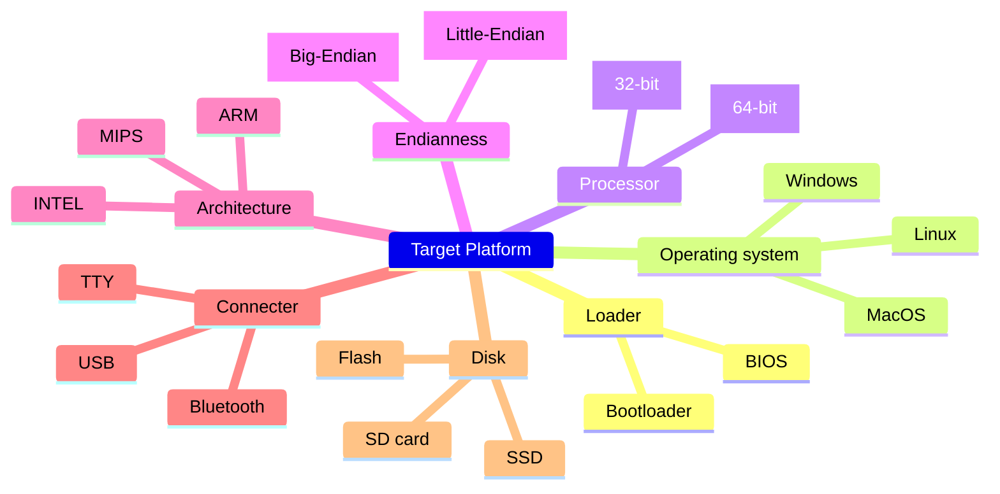

## 1.2. Development Platform

> 決定開發的環境和可用之工具

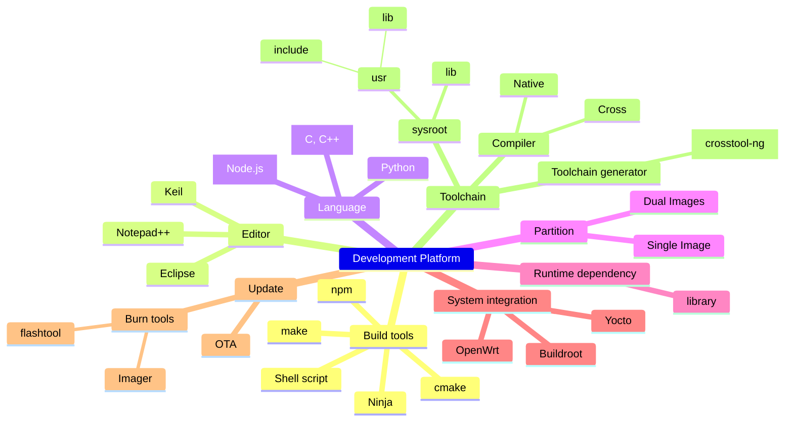

# 2. Native-Compilation vs Cross-Compilation

## 2.1. Host (Ubuntu 20.04.4 LTS) and Target (Raspberry Pi 3 B+)

### 2.1.1. Native compiler

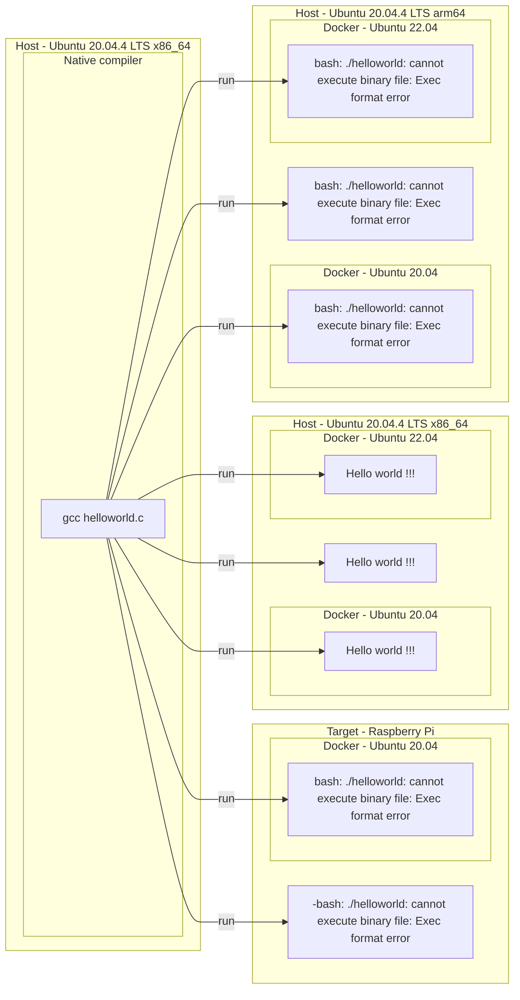
```bash
$ file helloworld
helloworld: ELF 64-bit LSB shared object, x86-64, version 1 (SYSV), dynamically linked, interpreter /lib64/ld-linux-x86-64.so.2, BuildID[sha1]=18d2f341bfac8c548cedce30a01e9a865ba383f8, for GNU/Linux 3.2.0, not stripped

```

### 2.1.2. Cross compiler

> 這邊取決於 Toolchain 裏的內容物（專門為了 Pi 製作），因些有可能 Raspberry Pi  (arm64) 可行，而 Ubuntu (arm64) 會有問題。

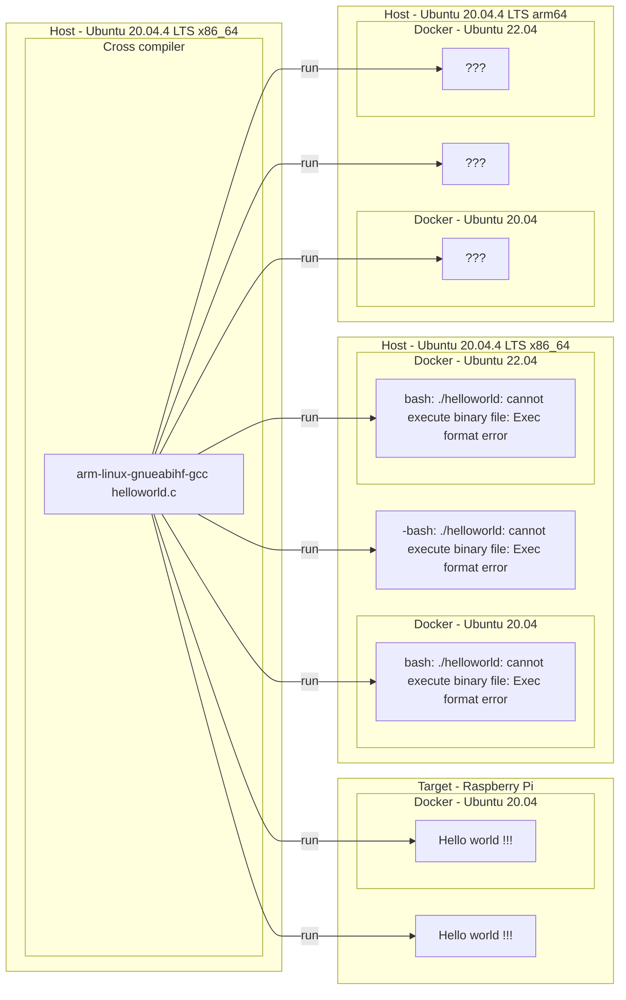
```bash
$ sudo apt install crossbuild-essential-armhf
$ arm-linux-gnueabihf-gcc --version
arm-linux-gnueabihf-gcc (Ubuntu 9.4.0-1ubuntu1~20.04.1) 9.4.0
Copyright (C) 2019 Free Software Foundation, Inc.
This is free software; see the source for copying conditions.  There is NO
warranty; not even for MERCHANTABILITY or FITNESS FOR A PARTICULAR PURPOSE.

or

$ mkdir /opt/pi; cd /opt/pi; 
$ git clone https://github.com/raspberrypi/tools
$ cd /opt/pi/tools; mv arm-bcm2708 /opt; cd opt
$ ll arm-bcm2708/
total 28
drwxrwxr-x  7 lanka lanka 4096  八  20 21:45 ./
drwxrwxrwx 16 root  root  4096  八  20 21:50 ../
drwxrwxr-x  7 lanka lanka 4096  八  20 21:45 arm-bcm2708hardfp-linux-gnueabi/
drwxrwxr-x  7 lanka lanka 4096  八  20 21:44 arm-bcm2708-linux-gnueabi/
lrwxrwxrwx  1 lanka lanka   29  八  20 21:45 arm-linux-gnueabihf -> arm-rpi-4.9.3-linux-gnueabihf/
drwxrwxr-x  8 lanka lanka 4096  八  20 21:45 arm-rpi-4.9.3-linux-gnueabihf/
drwxrwxr-x  7 lanka lanka 4096  八  20 21:45 gcc-linaro-arm-linux-gnueabihf-raspbian/
drwxrwxr-x  7 lanka lanka 4096  八  20 21:45 gcc-linaro-arm-linux-gnue
$ ./gcc-linaro-arm-linux-gnueabihf-raspbian/bin/arm-linux-gnueabihf-gcc --version
arm-linux-gnueabihf-gcc (crosstool-NG linaro-1.13.1-4.8-2014.01 - Linaro GCC 2013.11) 4.8.3 20140106 (prerelease)
Copyright (C) 2013 Free Software Foundation, Inc.
This is free software; see the source for copying conditions.  There is NO
warranty; not even for MERCHANTABILITY or FITNESS FOR A PARTICULAR PURPOSE.

```

```bash
$ file helloworld
helloworld: ELF 32-bit LSB shared object, ARM, EABI5 version 1 (SYSV), dynamically linked, interpreter /lib/ld-linux-armhf.so.3, BuildID[sha1]=6fb61694cee3b1f7fc227de834d182e4388a9b09, for GNU/Linux 3.2.0, with debug_info, not stripped

```

## 2.2. Host (Raspberry Pi 3 B+) and Target (Ubuntu 20.04.4 LTS)

### 2.2.1. Native compiler

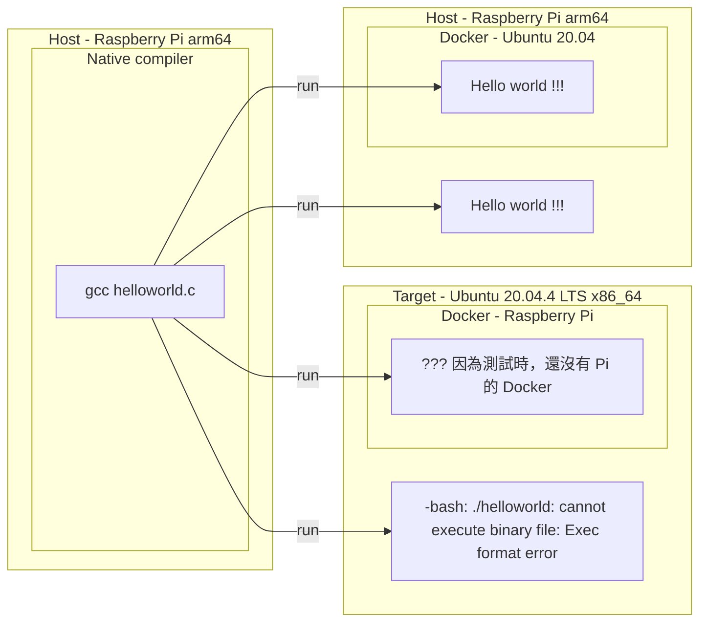
### 2.2.2. Cross compiler

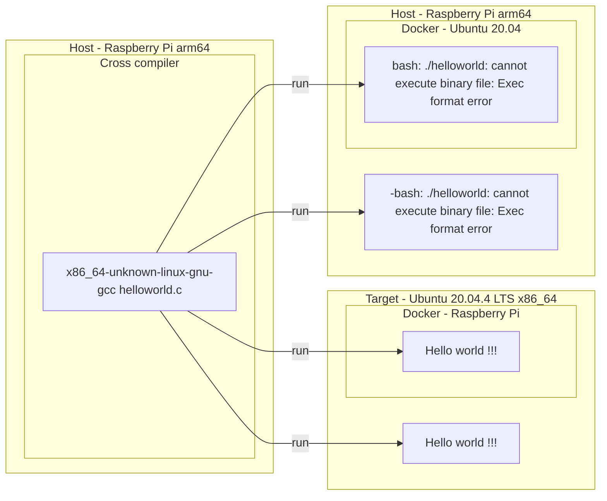

# 3. Native-Compilation on the same Releases

> 這邊只是要告訴大家，就算都是在 ubuntu 上編譯和執行，只要其中引用的 libraries 不同，也會有無法執行的狀況。
>
> [The GNU C Library (glibc)](https://www.gnu.org/software/libc/)，The GNU C Library project provides *the* core libraries for the GNU system and GNU/Linux systems, as well as many other systems that use Linux as the kernel. 
>
> 知道 libc 的嚴重性吧！
>
> 當然 OpenSSL 1.1.1 和 3.0  也會衍其它相依的 libraries 出錯。

## 3.1. Host (Ubuntu 20.04.4 LTS) and Target (Ubuntu 22.04.2 LTS)
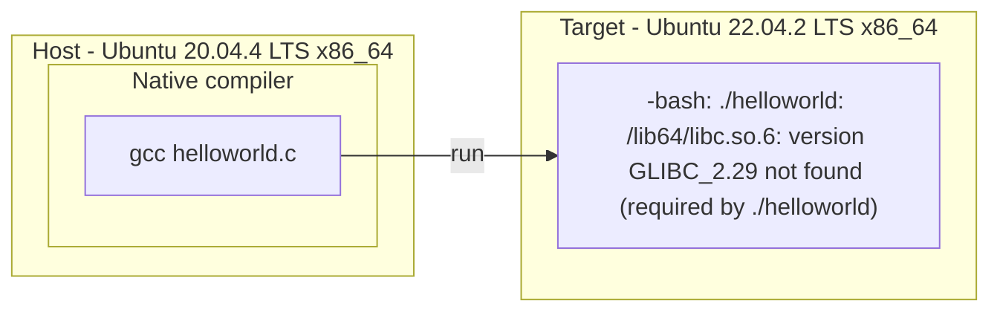

## 3.2. Host (Ubuntu 22.04.2 LTS) and Target (Ubuntu 20.04.4 LTS)
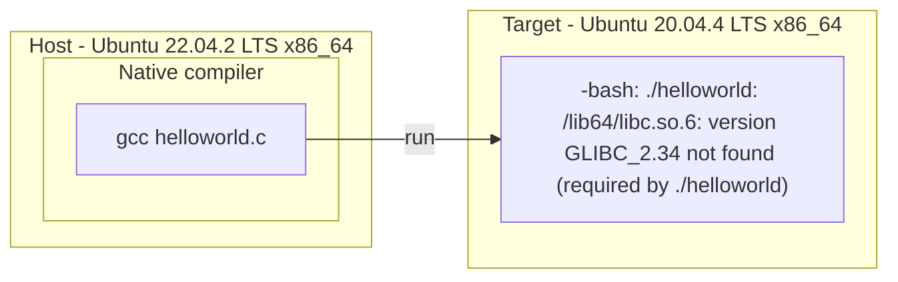

# 4. Setup Cross-Compilation Environment

> 因為手邊都是用 ubuntu 當 Host，$PJ_ARCH 代表選擇的 Target

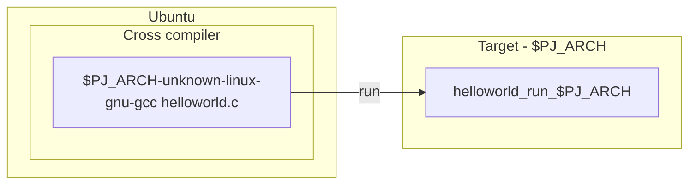

> <font color="red">Toolchain ! Toolchain ! Toolchain !</font>
>
> 因為要進行 Cross-Compilation，沒有編譯工具，什麼事都不能做。而 Toolchain 就是這個救命稻草。

## 4.1. System integration

> 如果你本身就是要從事新平台（嵌入式系統）的開發，基本上會使用此種方法。
>
> 使用此方法，時間冗長，因為就連 linux kernel 都會進行編譯，因為不只是 Toolchain，就連 Target  的 Image 都會產生。
>
> 以下是市面常使用的

#### A. [Buildroot](https://buildroot.org)

#### B. [OpenWrt](https://openwrt.org)

#### C. [Yocto](https://www.yoctoproject.org)

## 4.2. Toolchain generator

>使用一些 Toolchain 的產生器。
>
><font color="red">但是會有些 Toolchain 裏的 lib 版本 會與 Target 的 lib 版本有所不同！</font>

#### A. [Crosstool-NG](https://crosstool-ng.github.io/)

> 自行建立 toolchain，不過要對系統本身有了解，才不會浪費時間做了白工，

##### A.1. [helper_crosstool-ng.md](https://github.com/lankahsu520/CrossCompilationX/blob/master/helper_crosstool-ng.md) - Crosstool-NG helper

#### B. crossbuild-essential-XXX

> 只適用通用的平台。相對的 sysroot 也比較不完整。

```bash
$ sudo apt install crossbuild-essential-
crossbuild-essential-amd64
crossbuild-essential-arm64
crossbuild-essential-armel
crossbuild-essential-armhf
crossbuild-essential-i386
crossbuild-essential-powerpc
crossbuild-essential-ppc64el
crossbuild-essential-riscv64
crossbuild-essential-s390x
```

## 4.3. Get from XXX

> 此方法最快，也比較一致性

#### A. 可以從 FAE 取得舊舊的版本，

#### B. 從你的同事取得目前使用的版本。

#### C. 從官網取得“有可能不能用”的版本。

#### D. 其它網路上的資源

- [gcc-linaro-5.5.0-2017.10-x86_64_aarch64-linux-gnu](https://releases.linaro.org/components/toolchain/binaries/5.5-2017.10/aarch64-linux-gnu/)

```bash
ELF 64-bit LSB executable, ARM aarch64, version 1 (SYSV), dynamically linked, interpreter /lib/ld-linux-aarch64.so.1, for GNU/Linux 3.7.0, BuildID[sha1]=fd5a00b5d3d663e302e7d45cdd21009e0375e3f8, with debug_info, not stripped
```

- [gcc-linaro-5.5.0-2017.10-x86_64_arm-linux-gnueabihf](https://releases.linaro.org/components/toolchain/binaries/5.5-2017.10/arm-linux-gnueabihf/)

```bash
ELF 32-bit LSB executable, ARM, EABI5 version 1 (SYSV), dynamically linked, interpreter /lib/ld-linux-armhf.so.3, for GNU/Linux 2.6.32, BuildID[sha1]=feeeb83f160a3b40fb81cf4854dc480be916ea36, with debug_info, not stripped
```

## 4.4. <font color="red">sysroot</font>

> 之所以把 sysroot 當成一個章節來說明，就代表它的重要性。
>
> 從這幾個章節中，你就會知道所謂的 Toolchain 包含了工具（如 XXX-gcc、XXX-ld 等）和 sysroot。當 sysroot 越是完整複製 Target  裏的環境，之後所需要的功夫也就越少。
>
> 一個簡的例子，如果你的 sysroot 中沒有 libssl.so 時，你就得依以下動作擇一處理
>
> - 從 Target 中複製出 libssl.so，並且併入 到 sysroot。
> - 自行編譯出 libssl.so
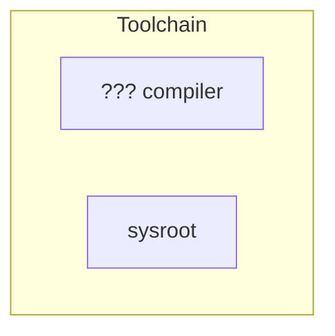


# 5. Setup Native-Compilation Environment on Architecture-XXX

## 5.1. Directly Compile on Physical Hardware

>能使用此方式的條件，取決於平台上能不能安裝 gcc、make、 Python 等工具。
>
>另外就是硬碟空間 （SSD、SD、CF or Flash 等）

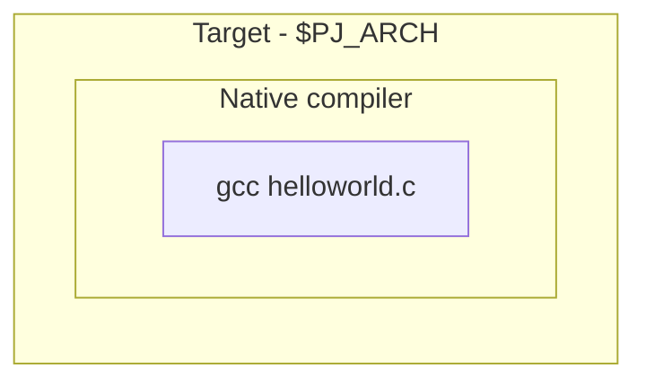

## 5.2. Only Copy Sources (Architecture-XXX) -> Compile and Run on x86_64

>利用 x86_64 的取得方便，將原有的程式（無硬體相依性）移入，進行編譯、執行和測試。

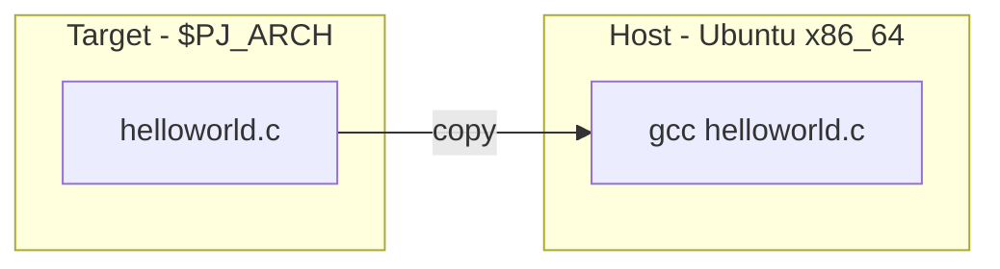

# 6. file - determine file type

> [ChatGPT]
>
> 這個輸出表明你有一個 ELF 格式的二進制文件，這是一種在類 Unix 操作系統中常見的可執行文件格式。下面是輸出中的一些信息的解釋：
>
> - **ELF 64-bit LSB shared object:** 說明這是一個 64 位的 ELF（Executable and Linkable Format）二進制文件，LSB（Least Significant Byte）表示它是按照小端序（低位字節序）進行存儲的。
> - **ARM aarch64:** 表示該二進制文件是為 ARM 架構的 64 位版本（aarch64）編譯的。
> - **version 1 (SYSV):** 指定了二進制文件使用的 ELF 文件格式的版本，這里是 SYSV（System V）格式。
> - **dynamically linked:** 表示這是一個動態鏈接的二進制文件，它依賴於系統上存在的共享庫。
> - **interpreter /lib/ld-linux-aarch64.so.1:** 這是動態鏈接器的路徑，用於在運行時解析和加載共享庫。
> - **for GNU/Linux 3.14.0:** 表示這個二進制文件是為 GNU/Linux 內核版本 3.14.0 構建的。
> - **BuildID[xxHash]=ebddec09ace4f611:** 這是二進制文件的構建標識符，通常用於唯一標識二進制文件的特定版本。
> - **with debug_info:** 表示該二進制文件包含調試信息。
> - **not stripped:** 表示該二進制文件沒有被剝離（stripped），即保留了符號信息，這對調試很有幫助。
>
> 綜合起來，這是一個針對 ARM 64 位架構的共享對象文件，用於在 GNU/Linux 系統上執行，包含調試信息。

```bash
$ file helloworld
helloworld: ELF 64-bit LSB shared object, ARM aarch64, version 1 (SYSV), dynamically linked, interpreter /lib/ld-linux-aarch64.so.1, for GNU/Linux 3.14.0, BuildID[xxHash]=ebddec09ace4f611, with debug_info, not stripped

```

# 7. CPU emulator on x86

> 利用 x86 平台的方便性，在上面執行 CPU 模擬器。
>
> 此處有一定的難度，網路參考的文件參差不齊！

## ~~7.1. Virtual Machine~~

#### ~~A. VirtualBox is not a CPU emulator~~

#### ~~B. VMware is not a CPU emulator~~

## ~~7.2. Container~~

#### ~~A. Docker~~

## 7.3. ARM CPU

#### A. QEMU（Quick Emulator）

#### B. RM DS-5 Community Edition

#### C. Microsoft Visual Studio Emulator for Android

#### D. MIPSsim

#### E. Bochs

#### F. PearPC

# Appendix

# I. Study

-  [Raspberry PI + cross compile & build kernel](https://hackmd.io/@0p3Xnj8xQ66lEl0EHA_2RQ/HJRXge9FO)

# II. Debug

# III. Glossary

# IV. Tool Usage

# Author

Created and designed by [Lanka Hsu](lankahsu@gmail.com).

# License

[CrossCompilationX](https://github.com/lankahsu520/CrossCompilationX) is available under the BSD-3-Clause license. See the LICENSE file for more info.

