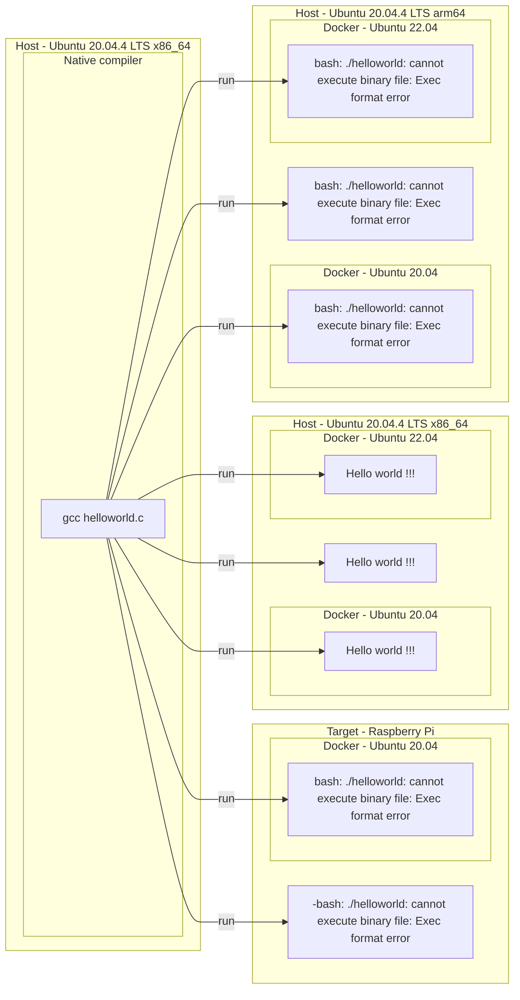
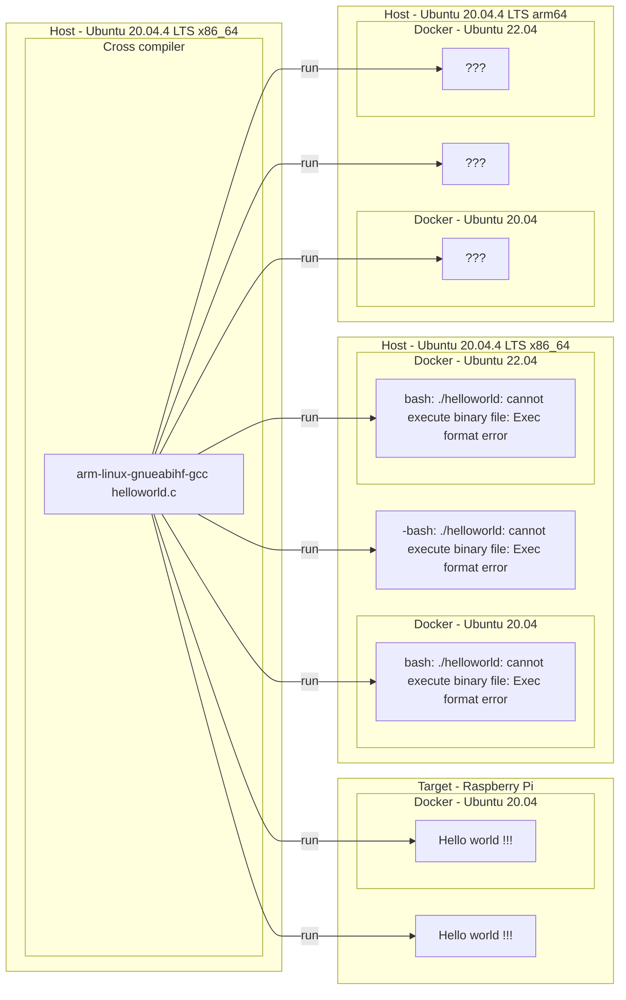
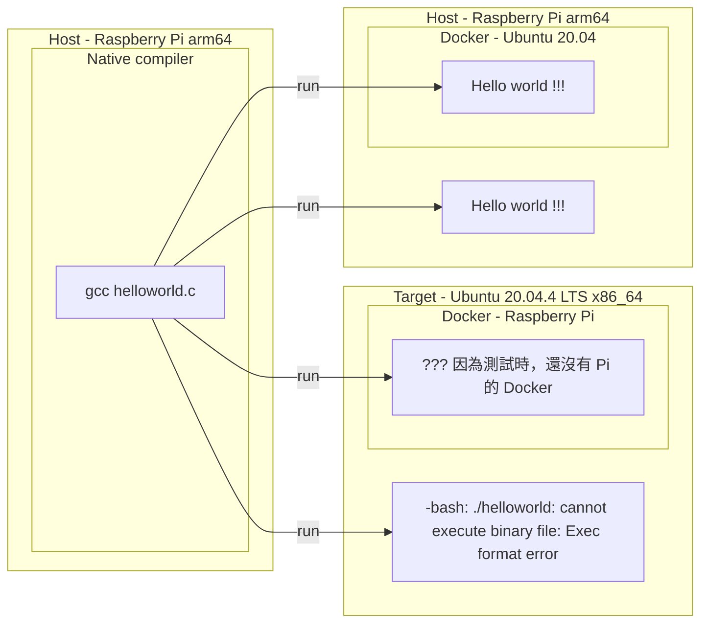
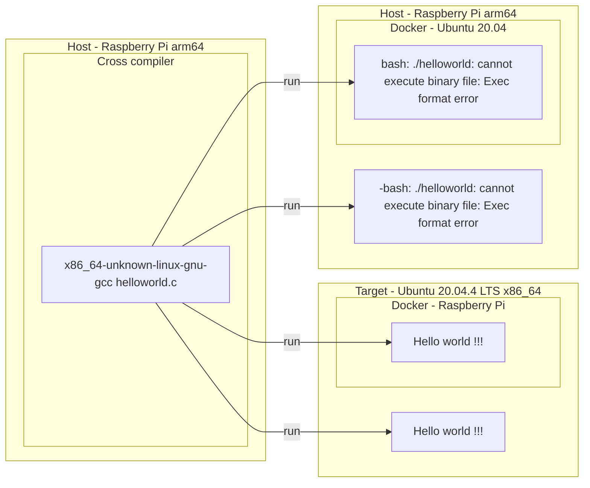
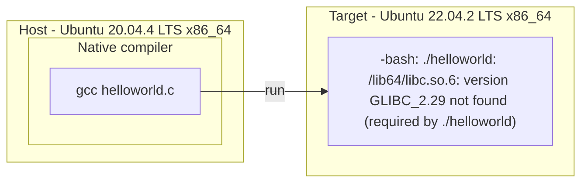
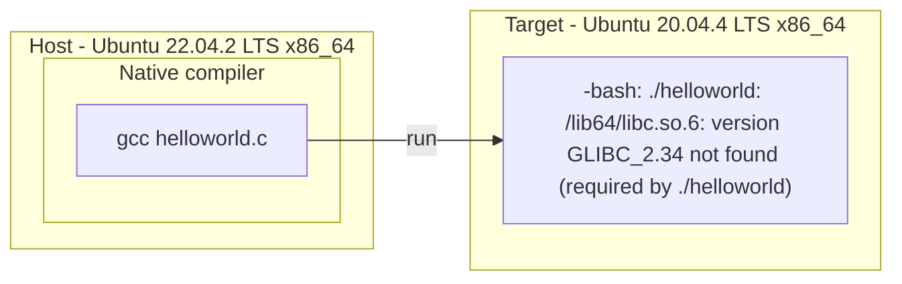
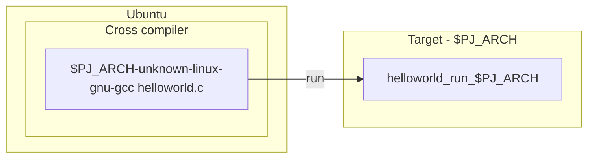
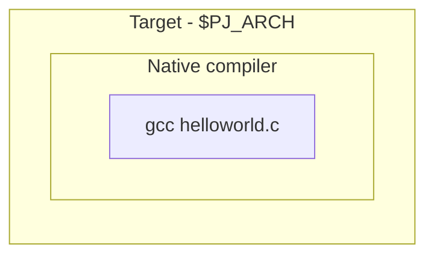
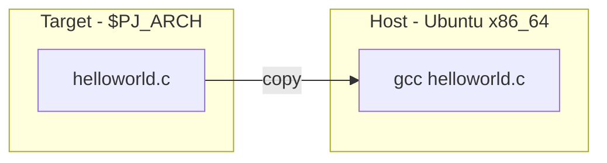

[](https://github.com/lankahsu520/CrossCompilationX)
[![GitHub license][license-image]][license-url]
[![GitHub stars][stars-image]][stars-url]
[![GitHub forks][forks-image]][forks-url]
[![GitHub issues][issues-image]][issues-image]


[license-image]: https://img.shields.io/github/license/lankahsu520/CrossCompilationX.svg
[license-url]: https://github.com/lankahsu520/CrossCompilationX/blob/master/LICENSE
[stars-image]: https://img.shields.io/github/stars/lankahsu520/CrossCompilationX.svg
[stars-url]: https://github.com/lankahsu520/CrossCompilationX/stargazers
[forks-image]: https://img.shields.io/github/forks/lankahsu520/CrossCompilationX.svg
[forks-url]: https://github.com/lankahsu520/CrossCompilationX/network
[issues-image]: https://img.shields.io/github/issues/lankahsu520/CrossCompilationX.svg
[issues-url]: https://github.com/lankahsu520/CrossCompilationX/issues

# 1. Native-Compilation vs Cross-Compilation

## 1.1. Host (Ubuntu 20.04.4 LTS) and Target (Raspberry Pi 3 B+)

### 1.1.1. Native compiler


```bash
$ file helloworld
helloworld: ELF 64-bit LSB shared object, x86-64, version 1 (SYSV), dynamically linked, interpreter /lib64/ld-linux-x86-64.so.2, BuildID[sha1]=18d2f341bfac8c548cedce30a01e9a865ba383f8, for GNU/Linux 3.2.0, not stripped

```

### 1.1.2. Cross compiler

> 這邊取決於 Toolchain 裏的內容物（專門為了 Pi 製作），因些有可能 Raspberry Pi  (arm64) 可行，而 Ubuntu (arm64) 會有問題。


```bash
$ sudo apt install crossbuild-essential-armhf
$ arm-linux-gnueabihf-gcc --version
arm-linux-gnueabihf-gcc (Ubuntu 9.4.0-1ubuntu1~20.04.1) 9.4.0
Copyright (C) 2019 Free Software Foundation, Inc.
This is free software; see the source for copying conditions.  There is NO
warranty; not even for MERCHANTABILITY or FITNESS FOR A PARTICULAR PURPOSE.

or

$ mkdir /opt/pi; cd /opt/pi; 
$ git clone https://github.com/raspberrypi/tools
$ cd /opt/pi/tools; mv arm-bcm2708 /opt; cd opt
$ ll arm-bcm2708/
total 28
drwxrwxr-x  7 lanka lanka 4096  八  20 21:45 ./
drwxrwxrwx 16 root  root  4096  八  20 21:50 ../
drwxrwxr-x  7 lanka lanka 4096  八  20 21:45 arm-bcm2708hardfp-linux-gnueabi/
drwxrwxr-x  7 lanka lanka 4096  八  20 21:44 arm-bcm2708-linux-gnueabi/
lrwxrwxrwx  1 lanka lanka   29  八  20 21:45 arm-linux-gnueabihf -> arm-rpi-4.9.3-linux-gnueabihf/
drwxrwxr-x  8 lanka lanka 4096  八  20 21:45 arm-rpi-4.9.3-linux-gnueabihf/
drwxrwxr-x  7 lanka lanka 4096  八  20 21:45 gcc-linaro-arm-linux-gnueabihf-raspbian/
drwxrwxr-x  7 lanka lanka 4096  八  20 21:45 gcc-linaro-arm-linux-gnue
$ ./gcc-linaro-arm-linux-gnueabihf-raspbian/bin/arm-linux-gnueabihf-gcc --version
arm-linux-gnueabihf-gcc (crosstool-NG linaro-1.13.1-4.8-2014.01 - Linaro GCC 2013.11) 4.8.3 20140106 (prerelease)
Copyright (C) 2013 Free Software Foundation, Inc.
This is free software; see the source for copying conditions.  There is NO
warranty; not even for MERCHANTABILITY or FITNESS FOR A PARTICULAR PURPOSE.

```

```bash
$ file helloworld
helloworld: ELF 32-bit LSB shared object, ARM, EABI5 version 1 (SYSV), dynamically linked, interpreter /lib/ld-linux-armhf.so.3, BuildID[sha1]=6fb61694cee3b1f7fc227de834d182e4388a9b09, for GNU/Linux 3.2.0, with debug_info, not stripped

```

## 1.2. Host (Raspberry Pi 3 B+) and Target (Ubuntu 20.04.4 LTS)

### 1.2.1. Native compiler


### 1.2.2. Cross compiler



# 2. Native-Compilation on the same Releases

> 這邊只是要告訴大家，就算都是在 ubuntu 上編譯和執行，只要其中引用的 libraries 不同，也會有無法執行的狀況。
>
> [The GNU C Library (glibc)](https://www.gnu.org/software/libc/)，The GNU C Library project provides *the* core libraries for the GNU system and GNU/Linux systems, as well as many other systems that use Linux as the kernel. 
>
> 知道 libc 的嚴重性吧！
>
> 當然 OpenSSL 1.1.1 和 3.0  也會衍其它相依的 libraries 出錯。

## 2.1. Host (Ubuntu 20.04.4 LTS) and Target (Ubuntu 22.04.2 LTS)


## 2.2. Host (Ubuntu 22.04.2 LTS) and Target (Ubuntu 20.04.4 LTS)


# 3. SDK and Codebase

## 3.1. [helper_SDKAndCodebase.md](https://github.com/lankahsu520/HelperX/blob/master/helper_SDKAndCodebase.md) - SDK and Codebase helper

> 在建立 Cross compiler 的環境前，希望每個人對 Codebase 有基本概念，並且對<font color="red">建立 Codebase 的人</font>有著感恩的心，

# 4. Setup Cross-Compilation Environment

> 因為手邊都是用 ubuntu 當 Host，$PJ_ARCH 代表選擇的 Target



> <font color="red">Toolchain ! Toolchain ! Toolchain !</font>
>
> 因為要進行 Cross-Compilation，沒有編譯工具，什麼事都不能做。而 Toolchain 就是這個救命稻草。

## 4.1. System integration

> 如果你本身就是要從事新平台（嵌入式系統）的開發，基本上會使用此種方法。
>
> 使用此方法，時間冗長，因為就連 linux kernel 都會進行編譯。以下是市面常使的

#### A. [Buildroot](https://buildroot.org)

#### B. [OpenWrt](https://openwrt.org)

#### C. [Yocto](https://www.yoctoproject.org)

## 4.2. Toolchain generator

>使用一些 Toolchain 的產生器。
>
><font color="red">但是會有 Toolchain 裏的 lib 會與 Target 的 lib 不同！</font>

#### A. [Crosstool-NG](https://crosstool-ng.github.io/)

> 自行建立 toolchain，不過要對系統本身有了解，才不會浪費時間做了白工，

#### A.1. [helper_crosstool-ng.md](https://github.com/lankahsu520/CrossCompilationX/blob/master/helper_crosstool-ng.md) - Crosstool-NG helper

#### B. crossbuild-essential-XXX

> 只適用通用的平台，客製化過多的平台可能會出錯。

```bash
$ sudo apt install crossbuild-essential-
crossbuild-essential-amd64
crossbuild-essential-arm64
crossbuild-essential-armel
crossbuild-essential-armhf
crossbuild-essential-i386
crossbuild-essential-powerpc
crossbuild-essential-ppc64el
crossbuild-essential-riscv64
crossbuild-essential-s390x
```

## 4.3. Get from XXX

> 此方法最快，也比較一致性

#### A. 可以從 FAE 取得舊舊的版本，

#### B. 從你的同事取得目前使用的版本。

#### C. 從官網取得“有可能不能用”的版本。

# 5. Setup Native-Compilation Environment on Architecture-XXX

## 5.1. Directly Compile on Physical Hardware

>能使用此方式的條件，取決於平台上能不能安裝 gcc、make、 Python 等工具。
>
>另外就是硬碟空間 （SSD、SD、CF or Flash 等）



## 5.2. Only Copy Sources (Architecture-XXX) -> Compile and Run on x86_64

>利用 x86_64 的取得方便，將原有的程式（無硬體相依性）移入，進行編譯、執行和測試。



# 6. CPU emulator on x86

> 利用 x86 平台的方便性，在上面執行 CPU 模擬器。
>
> 此處有一定的難度，網路參考的文件參差不齊！

## ~~6.1. Virtual Machine~~

#### ~~A. VirtualBox is not a CPU emulator~~

#### ~~B. VMware is not a CPU emulator~~

## ~~6.2. Container~~

#### ~~A. Docker~~

## 6.3. ARM CPU

#### A. QEMU（Quick Emulator）

#### B. RM DS-5 Community Edition

#### C. Microsoft Visual Studio Emulator for Android

#### D. MIPSsim

#### E. Bochs

#### F. PearPC

# Appendix

# I. Study

-  [Raspberry PI + cross compile & build kernel](https://hackmd.io/@0p3Xnj8xQ66lEl0EHA_2RQ/HJRXge9FO)

# II. Debug


# Author

Created and designed by [Lanka Hsu](lankahsu@gmail.com).

# License

[CrossCompilationX](https://github.com/lankahsu520/CrossCompilationX) is available under the BSD-3-Clause license. See the LICENSE file for more info.

