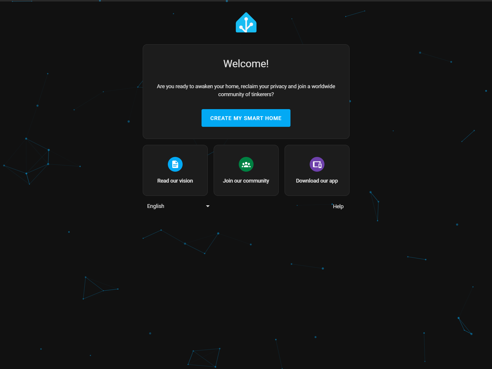

# [Yocto](https://www.yoctoproject.org) [Home Assistant](https://www.home-assistant.io)

[](https://github.com/lankahsu520/CrossCompilationX)
[![GitHub license][license-image]][license-url]
[![GitHub stars][stars-image]][stars-url]
[![GitHub forks][forks-image]][forks-url]
[![GitHub issues][issues-image]][issues-image]


[license-image]: https://img.shields.io/github/license/lankahsu520/CrossCompilationX.svg
[license-url]: https://github.com/lankahsu520/CrossCompilationX/blob/master/LICENSE
[stars-image]: https://img.shields.io/github/stars/lankahsu520/CrossCompilationX.svg
[stars-url]: https://github.com/lankahsu520/CrossCompilationX/stargazers
[forks-image]: https://img.shields.io/github/forks/lankahsu520/CrossCompilationX.svg
[forks-url]: https://github.com/lankahsu520/CrossCompilationX/network
[issues-image]: https://img.shields.io/github/issues/lankahsu520/CrossCompilationX.svg
[issues-url]: https://github.com/lankahsu520/CrossCompilationX/issues

# 1. Overview

> Home Assistant 是一款開源的家庭自動化平台，強調本地控制與隱私保護。由全球熱衷創客與 DIY 愛好者所推動與維護，非常適合在 Raspberry Pi 或本地伺服器上執行。
>
> 它是一個輔助工具，是讓現有的環境下，整合成一個方便的 UI 環境，讓您能夠輕鬆地管理和控制各種智慧設備，讓它們可以協同作業。

> [ChatGPT] Home Assistant 是什麼
>
> Home Assistant 是一個開源的**家庭自動化平台**，用來整合並控制你家中所有的智慧裝置。它可以安裝在像是 Raspberry Pi 或其他電腦上，讓你把燈光、溫度、感測器、相機、安全系統等智慧設備統一管理，甚至可以設定自動化規則。
>
> ###  Home Assistant 的核心特色：
>
> 1. **完全本地執行（Local Control）**：
>    - 資料存在你自己的裝置，不必依賴雲端，保障隱私與安全。
> 2. **支援上千種設備與平台**：
>    - 包括 Google Nest、Philips Hue、Xiaomi、Zigbee/Z-Wave 裝置、智慧插座、感測器等。
>    - 透過整合（Integration）方式與設備連接。
> 3. **自動化（Automation）**：
>    - 你可以寫條件，例如「當日落時自動開燈」、「當門打開時發送通知」、「溫度高於30度時啟動冷氣」等。
> 4. **Web 界面控制**：
>    - 用瀏覽器或手機 App（iOS / Android）就可以控制家中所有裝置。
>    - 可以自訂儀表板（Dashboard）介面。
> 5. **強大的社群與開發資源**：
>    - 大量現成的元件（Component）、Blueprints（自動化模板）、HACS（社群商店）可用。

# 2. Build and Target

> 請善用 [cookerX](https://github.com/lankahsu520/CrossCompilationX/tree/master/Yocto/cookerX)，這是本作者包裝後的整合平台。以下內容都將採用此開發。

## 2.1. Environment

| ITEM        | VERSION         |
| ----------- | --------------- |
| Hardware    | 8MMINILPD4‑EVKB |
| Yocto       | 5.0 Scarthgap   |
| Building OS | Ubuntu 20.04    |
| Python      | 3.10.18         |

## 2.2. Build

| ITEM         | FILE                                |
| ------------ | ----------------------------------- |
| configure    | confs/imx8mm-scarthgap-home.conf    |
| cooker-menu: | imx8mm-evk-scarthgap-home-menu.json |

```bash
$ git clone https://github.com/lankahsu520/CrossCompilationX.git
$ cd CrossCompilationX/Yocto/cookerX/
$ . confs/imx8mm-scarthgap-home.conf
$ make
```

## 2.3. Target

| ITEM            | FILE                                            |
| --------------- | ----------------------------------------------- |
| u-boot          | imx-boot-imx8mm-lpddr4-evk-sd.bin-flash_evk     |
| u-boot-env      | u-boot-imx-initial-env-sd                       |
| Image           | imx-image-core-imx8mm-lpddr4-evk.rootfs.wic.zst |
| ~~RAUC Bundle~~ | ~~update-bundle-imx8mm-lpddr4-evk.raucb~~       |

## 2.4. Burn

### 2.4.1. uuu

```bash
$ cd /drives/d/WINAPPS/Worker/uuu
$ uuu -lsusb
$ uuu -b emmc_all \
 ./evkb/imx-boot-imx8mm-lpddr4-evk-sd.bin-flash_evk \
 ./evkb/imx-image-core-imx8mm-lpddr4-evk.rootfs.wic.zst
```

### ~~2.4.2. rauc install~~

```bash
root@imx8mm-lpddr4-evk:~# rauc install /tmp/update-bundle-imx8mm-lpddr4-evk.raucb
```

# 2. [meta-homeassistant](https://github.com/meta-homeassistant/meta-homeassistant)

## 2.1. Add layer

> 因為 homeassistant 相依很多套件，這邊就不列出所有的。

### 2.1.1. imx8mm-evk-scarthgap-home-menu.json

>  IMAGE_INSTALL: python3-homeassistant
>
>  LICENSE_FLAGS_ACCEPTED: commercial

```bash
$ echo $PJ_COOKER_MENU
imx8mm-evk-scarthgap-home-menu.json

# 更新 $PJ_COOKER_MENU
$ vi cooker-menu/$PJ_COOKER_MENU
  ...
  "sources": [
    {
      "url": "https://github.com/meta-homeassistant/meta-homeassistant",
      "branch": "main",
      "dir": "meta-homeassistant",
      "rev": "5ee63318c53bec1bfc2e56221783c23c61b32a1e"
    },
  ],
  "layers": [
    "meta-homeassistant",
  ],
  "builds": {
    "imx8mm-evk-scarthgap-home": {
      "local.conf": [
        "IMAGE_INSTALL:append = ' python3-homeassistant'",
        "LICENSE_FLAGS_ACCEPTED += 'commercial'"
      ]
    }
  }

# 更新完記得執行
$ cooker generate

$ cat $PJ_YOCTO_BUILD_DIR/conf/local.conf
$ cat $PJ_YOCTO_BUILD_DIR/conf/bblayers.conf

$ bitbake-layers show-recipes python3-homeassistant
NOTE: Starting bitbake server...
Loading cache: 100% |############################################################| Time: 0:00:01
Loaded 5813 entries from dependency cache.
Parsing recipes: 100% |##########################################################| Time: 0:00:00
Parsing of 3734 .bb files complete (3731 cached, 3 parsed). 5811 targets, 586 skipped, 3 masked, 0 errors.
WARNING: preferred version 4.18.imx+stable of xen not available
WARNING: versions of xen available: 4.17+stable 4.18+stable 4.19+git 4.19.0+stable
WARNING: preferred version 1.24.0.imx of gst-devtools not available
WARNING: versions of gst-devtools available: 1.22.12 1.22.5.imx
=== Matching recipes: ===
python3-homeassistant:
  meta-homeassistant   2023.12.0
```

> 因為 python3-ha-av dependency ffmpeg，但是 ffmpeg LICENSE = "commercial"

```bash
$ find -name ffmpeg*.bb
./layers-scarthgap/poky/meta/recipes-multimedia/ffmpeg/ffmpeg_6.1.1.bb
./layers-scarthgap/meta-freescale/recipes-multimedia/ffmpeg/ffmpeg_4.4.1.bb

$ cat $PJ_YOCTO_LAYERS_DIR/meta-freescale/recipes-multimedia/ffmpeg/ffmpeg_4.4.1.bb | grep LICENSE_FLAGS
LICENSE_FLAGS = "commercial"
```

## 2.2. Recipes

### 2.2.1. python3-homeassistant

```bash
$ oe-pkgdata-util list-pkg-files python3-homeassistant
```

```bash
$ bb-info python3-homeassistant

python3-homeassistant                           :2023.12.0-r0                                          

./bb-lnk/python3-homeassistant_2023.12.0.bb
./layers-scarthgap/meta-homeassistant/recipes-homeassistant/homeassistant/python3-homeassistant_2023.12.0.bb

SRC_URI="https://files.pythonhosted.org/packages/source/h/homeassistant/homeassistant-2023.12.0.tar.gz;downloadfilename=homeassistant-2023.12.0.tar.gz      file://homeassistant.service     file://0001-Update-pyproject.toml-to-allow-compilation.patch "

S="/yocto/cookerX-home/builds/build-imx8mm-evk-scarthgap-home/tmp/work/armv8a-poky-linux/python3-homeassistant/2023.12.0/homeassistant-2023.12.0"

WORKDIR="/yocto/cookerX-home/builds/build-imx8mm-evk-scarthgap-home/tmp/work/armv8a-poky-linux/python3-homeassistant/2023.12.0"

DEPENDS="virtual/aarch64-poky-linux-gcc virtual/aarch64-poky-linux-compilerlibs virtual/libc  python3-setuptools-native python3-wheel-native  python3-native python3 python3-native  python3 python3-build-native python3-installer-native base-files shadow-native shadow-sysroot shadow base-passwd systemd-systemctl-native"

RDEPENDS:${KERNEL_PACKAGE_NAME}-image:imx8dx-mek=""
RDEPENDS:${KERNEL_PACKAGE_NAME}-image:imx8dxl-a1-ddr3l-evk=""
RDEPENDS:${KERNEL_PACKAGE_NAME}-image:imx8dxl-a1-lpddr4-evk=""
RDEPENDS:${KERNEL_PACKAGE_NAME}-image:imx8dxl-b0-ddr3l-evk=""
RDEPENDS:${KERNEL_PACKAGE_NAME}-image:imx8dxl-b0-lpddr4-evk=""
RDEPENDS:${KERNEL_PACKAGE_NAME}-image:imx8qm-mek=""
RDEPENDS:${KERNEL_PACKAGE_NAME}-image:imx8qxp-mek=""
RDEPENDS:python3-homeassistant="       python3-homeassistant-recorder       python3-homeassistant-ffmpeg       python3-homeassistant-dhcp     python3-homeassistant-zeroconf      python3-homeassistant-frontend     python3-homeassistant-hardware     python3-homeassistant-http     python3-homeassistant-image-upload     python3-homeassistant-mobile-app     python3-homeassistant-stream         python3-homeassistant-google-translate      python3-homeassistant-bluetooth     python3-homeassistant-usb      python3-homeassistant-assist-pipeline     python3-homeassistant-conversation       python3-homeassistant-cloud     python3-homeassistant-matter     python3-homeassistant-radio-browser      python3-homeassistant-file-upload      python3-aiohttp (>=3.9.1)     python3-aiohttp-cors (=0.7.0)     python3-aiohttp-fast-url-dispatcher (=0.3.0)     python3-aiohttp-zlib-ng (=0.1.1)     python3-astral (=2.2)     python3-attrs (>=23.1.0)     python3-atomicwrites-homeassistant (=1.4.1)     python3-awesomeversion (>=23.11.0)     python3-bcrypt (>=4.0.1)     python3-certifi (>=2021.5.30)     python3-ciso8601 (=2.3.0)     python3-httpx (=0.25.0)     python3-home-assistant-bluetooth (=1.10.4)     python3-ifaddr (=0.2.0)     python3-jinja2 (>=3.1.2)     python3-lru-dict (>=1.2.0)     python3-pyjwt (=2.8.0)     python3-cryptography (>=41.0.7)     python3-pyopenssl (>=23.2.0)     python3-orjson (=3.9.9)     python3-packaging (>=23.1)     python3-pip (>=21.3.1)     python3-python-slugify (=4.0.1)     python3-pyyaml (=6.0.1)     python3-requests (=2.31.0)     python3-typing-extensions (>=4.8.0)     python3-ulid-transform (=0.9.0)     python3-voluptuous (=0.13.1)     python3-voluptuous-serialize (=2.6.0)     python3-yarl (>=1.9.2)         python3-statistics     python3-core (>=3.11.0)  python3-core"
RDEPENDS:python3-homeassistant-amazon-polly="    python3-boto3 (>=1.28.17) "
RDEPENDS:python3-homeassistant-assist-pipeline="    python3-webrtc-noise-gain (>=1.2.3) "
RDEPENDS:python3-homeassistant-axis="    python3-axis (=48) "
RDEPENDS:python3-homeassistant-backup="    python3-securetar (=2023.3.0) "
RDEPENDS:python3-homeassistant-bluetooth="    python3-bleak (=0.21.1)     python3-bleak-retry-connector (=3.3.0)     python3-bluetooth-adapters (=0.16.1)     python3-bluetooth-auto-recovery (=1.2.3)     python3-bluetooth-data-tools (=1.15.0)     python3-dbus-fast (>=2.12.0) "
RDEPENDS:python3-homeassistant-cast="    python3-pychromecast (>=13.0.8) "
RDEPENDS:python3-homeassistant-cloud="    python3-hass-nabucasa (=0.74.0) "
RDEPENDS:python3-homeassistant-conversation="    python3-hassil (>=1.2.5)     python3-home-assistant-intents (>=2023.12.5) "
RDEPENDS:python3-homeassistant-dhcp="    python3-aiodiscover (=1.5.1)     python3-scapy (=2.5.0) "
RDEPENDS:python3-homeassistant-ffmpeg="    python3-ha-ffmpeg (=3.1.0) "
RDEPENDS:python3-homeassistant-file-upload="    python3-janus (=1.0.0) "
RDEPENDS:python3-homeassistant-fritz="    python3-fritzconnection (=1.13.2)     python3-xmltodict (=0.13.0) "
RDEPENDS:python3-homeassistant-fritzbox="    python3-pyfritzhome (=0.6.9) "
RDEPENDS:python3-homeassistant-frontend="    python3-home-assistant-frontend (=20231206.0) "
RDEPENDS:python3-homeassistant-google-translate="    python3-gtts (=2.2.4) "
RDEPENDS:python3-homeassistant-hacs="    python3-aiogithubapi (=22.10.1) "
RDEPENDS:python3-homeassistant-hardware="    python3-psutil-home-assistant (=0.0.1) "
RDEPENDS:python3-homeassistant-http="    python3-aiohttp-cors (=0.7.0) "
RDEPENDS:python3-homeassistant-hue="    python3-aiohue (=4.7.0) "
RDEPENDS:python3-homeassistant-image-upload="    python3-pillow (>=10.1.0) "
RDEPENDS:python3-homeassistant-ipp="    python3-pyipp (=0.14.4) "
RDEPENDS:python3-homeassistant-keyboard-remote="    python3-evdev (>=1.6.1)     python3-asyncinotify (>=4.0.2) "
RDEPENDS:python3-homeassistant-matter="    python3-matter-server (=5.0.0) "
RDEPENDS:python3-homeassistant-met="    python3-pymetno (>=0.11.0) "
RDEPENDS:python3-homeassistant-mobile-app="    python3-pynacl (=1.5.0) "
RDEPENDS:python3-homeassistant-modbus="    python3-pymodbus (>=3.5.4) "
RDEPENDS:python3-homeassistant-octoprint="    python3-pyoctoprintapi (=0.1.12) "
RDEPENDS:python3-homeassistant-pulseaudio-loopback="    python3-pulsectl (>=23.5.2) "
RDEPENDS:python3-homeassistant-radio-browser="    python3-radios (=0.2.0) "
RDEPENDS:python3-homeassistant-recorder="    python3-sqlite3     python3-fnv-hash-fast (=0.5.0)     python3-sqlalchemy (>=2.0.22)     python3-psutil-home-assistant (=0.0.1) "
RDEPENDS:python3-homeassistant-route53="    python3-boto3 (>=1.28.17) "
RDEPENDS:python3-homeassistant-scrape="    python3-beautifulsoup4 (>=4.12.2)     python3-lxml (>=4.9.3) "
RDEPENDS:python3-homeassistant-sentry="    python3-sentry-sdk (>=1.31.0) "
RDEPENDS:python3-homeassistant-shelly="    python3-aioshelly (=6.1.0) "
RDEPENDS:python3-homeassistant-ssdp="    python3-async-upnp-client (=0.36.2) "
RDEPENDS:python3-homeassistant-staticdev="python3-homeassistant-dev (= 2023.12.0-r0)"
RDEPENDS:python3-homeassistant-stream="    python3-pyturbojpeg (=1.7.1)     python3-ha-av (=10.1.1)     python3-numpy (>=1.26.0) "
RDEPENDS:python3-homeassistant-systemmonitor="    python3-psutil (>=5.9.6) "
RDEPENDS:python3-homeassistant-tts="    python3-mutagen (=1.47.0) "
RDEPENDS:python3-homeassistant-upnp="    python3-async-upnp-client (=0.36.2)     python3-getmac (=0.8.2) "
RDEPENDS:python3-homeassistant-usb="    python3-pyserial (=3.5)     python3-pyudev (>=0.23.2) "
RDEPENDS:python3-homeassistant-vlc="    python3-python-vlc (>=3.0.18122) "
RDEPENDS:python3-homeassistant-zeroconf="    python3-zeroconf (>=0.119.0) "
```

#### A. homeassistant.service

> HOMEASSISTANT_CONFIG_DIR : /var/lib/homeassistant

```bash
$ vi $PJ_YOCTO_LAYERS_DIR/meta-homeassistant/recipes-homeassistant/homeassistant/python3-homeassistant/homeassistant.service
[Unit]
Description=Home Assistant
After=network.target

[Service]
Type=simple
User=@HOMEASSISTANT_USER@
ExecStart=/usr/bin/hass --skip-pip -c "@HOMEASSISTANT_CONFIG_DIR@"
Restart=on-failure

[Install]
WantedBy=multi-user.target

$ vi builds-lnk/$PJ_YOCTO_BUILD-rootfs/usr/lib/systemd/system/homeassistant.service
```

### 2.2.2. python3-ha-av

```bash
$ oe-pkgdata-util list-pkg-files python3-ha-av
```

```bash
$ bb-info python3-ha-av

python3-ha-av                                      :10.1.1-r0                                          

./bb-lnk/python3-ha-av_10.1.1.bb
./layers-scarthgap/meta-homeassistant/recipes-devtools/python/python3-ha-av_10.1.1.bb

SRC_URI="https://files.pythonhosted.org/packages/source/h/ha-av/ha-av-10.1.1.tar.gz;downloadfilename=ha-av-10.1.1.tar.gz "

S="/yocto/cookerX-home/builds/build-imx8mm-evk-scarthgap-home/tmp/work/armv8a-poky-linux/python3-ha-av/10.1.1/ha-av-10.1.1"

WORKDIR="/yocto/cookerX-home/builds/build-imx8mm-evk-scarthgap-home/tmp/work/armv8a-poky-linux/python3-ha-av/10.1.1"

DEPENDS="pkgconfig-native virtual/aarch64-poky-linux-gcc virtual/aarch64-poky-linux-compilerlibs virtual/libc  python3-setuptools-native python3-wheel-native     python3-cython-native     ffmpeg  python3-native python3 python3-native  python3 python3-build-native python3-installer-native"

RDEPENDS:${KERNEL_PACKAGE_NAME}-image:imx8dx-mek=""
RDEPENDS:${KERNEL_PACKAGE_NAME}-image:imx8dxl-a1-ddr3l-evk=""
RDEPENDS:${KERNEL_PACKAGE_NAME}-image:imx8dxl-a1-lpddr4-evk=""
RDEPENDS:${KERNEL_PACKAGE_NAME}-image:imx8dxl-b0-ddr3l-evk=""
RDEPENDS:${KERNEL_PACKAGE_NAME}-image:imx8dxl-b0-lpddr4-evk=""
RDEPENDS:${KERNEL_PACKAGE_NAME}-image:imx8qm-mek=""
RDEPENDS:${KERNEL_PACKAGE_NAME}-image:imx8qxp-mek=""
RDEPENDS:python3-ha-av="     python3-numpy     python3-pillow  python3-core"
RDEPENDS:python3-ha-av-staticdev="python3-ha-av-dev (= 10.1.1-r0)"
```

### 2.2.3. python3-ha-ffmpeg

```bash
$ oe-pkgdata-util list-pkg-files python3-ha-ffmpeg
```

```bash
$ bb-info python3-ha-ffmpeg

python3-ha-ffmpeg                                   :3.1.0-r0

./layers-scarthgap/meta-homeassistant/recipes-devtools/python/python3-ha-ffmpeg_3.1.0.bb

SRC_URI="https://files.pythonhosted.org/packages/source/h/ha-ffmpeg/ha-ffmpeg-3.1.0.tar.gz;downloadfilename=ha-ffmpeg-3.1.0.tar.gz "

S="/yocto/cookerX-home/builds/build-imx8mm-evk-scarthgap-home/tmp/work/armv8a-poky-linux/python3-ha-ffmpeg/3.1.0/ha-ffmpeg-3.1.0"

WORKDIR="/yocto/cookerX-home/builds/build-imx8mm-evk-scarthgap-home/tmp/work/armv8a-poky-linux/python3-ha-ffmpeg/3.1.0"

DEPENDS="virtual/aarch64-poky-linux-gcc virtual/aarch64-poky-linux-compilerlibs virtual/libc  python3-setuptools-native python3-wheel-native python3-native python3 python3-native  python3 python3-build-native python3-installer-native"

RDEPENDS:${KERNEL_PACKAGE_NAME}-image:imx8dx-mek=""
RDEPENDS:${KERNEL_PACKAGE_NAME}-image:imx8dxl-a1-ddr3l-evk=""
RDEPENDS:${KERNEL_PACKAGE_NAME}-image:imx8dxl-a1-lpddr4-evk=""
RDEPENDS:${KERNEL_PACKAGE_NAME}-image:imx8dxl-b0-ddr3l-evk=""
RDEPENDS:${KERNEL_PACKAGE_NAME}-image:imx8dxl-b0-lpddr4-evk=""
RDEPENDS:${KERNEL_PACKAGE_NAME}-image:imx8qm-mek=""
RDEPENDS:${KERNEL_PACKAGE_NAME}-image:imx8qxp-mek=""
RDEPENDS:python3-ha-ffmpeg="     python3-async-timeout     ffmpeg  python3-core"
RDEPENDS:python3-ha-ffmpeg-staticdev="python3-ha-ffmpeg-dev (= 3.1.0-r0)"
```

## 2.3. Check Image

> 請先編譯出 image

```bash
# 編譯
$ make
# or
$ bitbake imx-image-core
```

```bash
$ cd-rootfs
$ find123 ffmpeg pyav hass haffmpeg
```

## 2.4. Showtime

> You should now be able to access Home Assistant via web browser usually under the address: 
>
> http://<ip>:8123
>
> 預設的 Port: 8123

> 因為本篇不是研究 homeassistant，而是讓 homeassistant 在 NXP 8MMINILPD4‑EVKB 上執行。

> http://192.168.31.62:8123



### 2.4.1. Change listen port

> 這邊是 run time 就進行修改
>
> change default:8123 -> 12345

> http://192.168.31.62:12345

```bash
root@imx8mm-lpddr4-evk:~# ps -aux | grep hass
homeass+     400 50.3 13.6 2709920 262844 ?      Ssl  02:20   0:32 python3 /usr/bin/hass --skip-pip -c /var/lib/homeassistant
root         600  0.0  0.0   3508  1280 ttymxc1  S+   02:21   0:00 grep hass

root@imx8mm-lpddr4-evk:~# ls -al /var/lib/homeassistant
total 1008
drwxr-xr-x  7 homeassistant homeassistant   4096 Jul 14 02:20 .
drwxr-xr-x 15 root          root            4096 Feb 27  2024 ..
-rw-r--r--  1 homeassistant homeassistant      9 Feb 27  2024 .HA_VERSION
drwxr-xr-x  2 homeassistant homeassistant   4096 Jul 11 08:10 .cloud
drwxr-xr-x  2 homeassistant homeassistant   4096 Jul 14 02:20 .storage
-rw-r--r--  1 homeassistant homeassistant      2 Feb 27  2024 automations.yaml
drwxr-xr-x  4 homeassistant homeassistant   4096 Feb 27  2024 blueprints
-rw-r--r--  1 homeassistant homeassistant    295 Jul 14 02:20 configuration.yaml
drwxr-xr-x  2 homeassistant homeassistant   4096 Feb 27  2024 deps
-rw-r--r--  1 homeassistant homeassistant  18980 Jul 14 02:21 home-assistant.log
-rw-r--r--  1 homeassistant homeassistant  42081 Jul 14 02:19 home-assistant.log.1
-rw-r--r--  1 homeassistant homeassistant      0 Jul 14 02:20 home-assistant.log.fault
-rw-r--r--  1 homeassistant homeassistant 679936 Jul 14 02:20 home-assistant_v2.db
-rw-r--r--  1 homeassistant homeassistant  32768 Jul 14 02:21 home-assistant_v2.db-shm
-rw-r--r--  1 homeassistant homeassistant 206032 Jul 14 02:21 home-assistant_v2.db-wal
-rw-r--r--  1 homeassistant homeassistant      0 Feb 27  2024 scenes.yaml
-rw-r--r--  1 homeassistant homeassistant      0 Feb 27  2024 scripts.yaml
-rw-r--r--  1 homeassistant homeassistant    161 Feb 27  2024 secrets.yaml
drwxr-xr-x  2 homeassistant homeassistant   4096 Feb 27  2024 tts

root@imx8mm-lpddr4-evk:~# vi /var/lib/homeassistant/configuration.yaml
# 新增下面的設定
http:
  server_port: 12345

root@imx8mm-lpddr4-evk:/# systemctl restart homeassistant.service
# or
root@imx8mm-lpddr4-evk:~# reboot
```

## 2.5. Debug

> 比較有無 meta-homeassistant 後的狀況，方便評估是否

### 2.5.1. Usage of Disk / Memory

```bash
root@imx8mm-lpddr4-evk:~# free -h
               total        used        free      shared  buff/cache   available
Mem:           1.8Gi       567Mi       1.0Gi        10Mi       348Mi       1.3Gi
Swap:             0B          0B          0B

root@imx8mm-lpddr4-evk:~# df -h
Filesystem      Size  Used Avail Use% Mounted on
/dev/root       3.1G  1.8G  1.2G  61% /
devtmpfs        619M  4.0K  619M   1% /dev
tmpfs           941M     0  941M   0% /dev/shm
tmpfs           377M   10M  367M   3% /run
tmpfs           941M     0  941M   0% /tmp
tmpfs           941M   16K  941M   1% /var/volatile
/dev/mmcblk2p1  333M   36M  297M  11% /run/media/boot-mmcblk2p1
tmpfs           189M  4.0K  189M   1% /run/user/0

root@imx8mm-lpddr4-evk:~# cat /proc/partitions
major minor  #blocks  name

  31        0      32768 mtdblock0
 179        0   30535680 mmcblk2
 179        1     340787 mmcblk2p1
 179        2    3352394 mmcblk2p2
 179       32       4096 mmcblk2boot0
 179       64       4096 mmcblk2boot1

root@imx8mm-lpddr4-evk:~# fdisk -l /dev/mmcblk2
Disk /dev/mmcblk2: 29.12 GiB, 31268536320 bytes, 61071360 sectors
Units: sectors of 1 * 512 = 512 bytes
Sector size (logical/physical): 512 bytes / 512 bytes
I/O size (minimum/optimal): 512 bytes / 512 bytes
Disklabel type: dos
Disk identifier: 0x076c4a2a

Device         Boot  Start     End Sectors   Size Id Type
/dev/mmcblk2p1 *     16384  697957  681574 332.8M  c W95 FAT32 (LBA)
/dev/mmcblk2p2      704512 7409299 6704788   3.2G 83 Linux
```

### 2.5.2. homeassistant.service

```bash
root@imx8mm-lpddr4-evk:/# ps -aux | grep home
homeass+     429  3.4 13.8 2771104 266664 ?      Ssl  07:38   0:46 python3 /usr/bin/hass --skip-pip -c /var/lib/homeassistant
root         657  0.0  0.0   3508  1280 ttymxc1  S+   08:00   0:00 grep home

root@imx8mm-lpddr4-evk:~# vi /usr/lib/systemd/system/homeassistant.service
[Unit]
Description=Home Assistant
After=network.target

[Service]
Type=simple
User=homeassistant
ExecStart=/usr/bin/hass --skip-pip -c "/var/lib/homeassistant"
Restart=on-failure

[Install]
WantedBy=multi-user.target

root@imx8mm-lpddr4-evk:~# systemctl status homeassistant.service
root@imx8mm-lpddr4-evk:~# systemctl stop homeassistant.service
root@imx8mm-lpddr4-evk:~# systemctl start homeassistant.service
```

### 2.5.3. /var/lib/homeassistant

```bash
root@imx8mm-lpddr4-evk:/var/lib/homeassistant# ls -al
total 1432
drwxr-xr-x  6 homeassistant homeassistant    4096 Jul 23 02:52 .
drwxr-xr-x 15 root          root             4096 Jul 23 02:51 ..
-rw-r--r--  1 homeassistant homeassistant       9 Feb 27  2024 .HA_VERSION
drwxr-xr-x  2 homeassistant homeassistant    4096 Jul 23 02:51 .cloud
drwxr-xr-x  2 homeassistant homeassistant    4096 Jul 23 03:22 .storage
-rw-r--r--  1 root          root                2 Mar  9  2018 automations.yaml
drwxr-xr-x  4 homeassistant homeassistant    4096 Jul 23 02:52 blueprints
-rw-r--r--  1 root          root              294 Mar  9  2018 configuration.yaml
-rw-r--r--  1 homeassistant homeassistant     796 Jul 23 03:08 home-assistant.log
-rw-r--r--  1 homeassistant homeassistant       0 Feb 27  2024 home-assistant.log.1
-rw-r--r--  1 homeassistant homeassistant       0 Feb 27  2024 home-assistant.log.fault
-rw-r--r--  1 homeassistant homeassistant    4096 Jul 23 02:51 home-assistant_v2.db
-rw-r--r--  1 homeassistant homeassistant   32768 Jul 23 03:31 home-assistant_v2.db-shm
-rw-r--r--  1 homeassistant homeassistant 1384352 Jul 23 03:31 home-assistant_v2.db-wal
-rw-r--r--  1 root          root                0 Mar  9  2018 scenes.yaml
-rw-r--r--  1 root          root                0 Mar  9  2018 scripts.yaml
-rw-r--r--  1 root          root              161 Mar  9  2018 secrets.yaml
drwxr-xr-x  2 homeassistant homeassistant    4096 Jul 23 02:52 tts
```

# 3. meta-homeassistant-plus

> 這邊要先有一個重要的認知，homeassistant 算是整合各家的 IoT 系統，當要整入 embedded 時，就有可能會有`缺失`，而這`缺失`是不是剛好是自己需要的，而之後將是個很大的考驗。
>
> 或許聰明的人就會說，「pip 安裝就好了」、「rpm 安裝也行」、「最慘的用setup 」。
>
> 問題是不是這樣，這邊不多解釋，但是 embedded engineer 必須了解。

## 3.1. create-layer

```bash
$ echo $PJ_YOCTO_LAYERS_DIR
/yocto/cookerX-home/layers-scarthgap
$ cd $PJ_YOCTO_LAYERS_DIR
$ bitbake-layers create-layer meta-homeassistant-plus
NOTE: Starting bitbake server...
Add your new layer with 'bitbake-layers add-layer meta-homeassistant-plus'

$ mv meta-homeassistant-plus/recipes-example meta-homeassistant-plus/recipes-homeassistant-plus

$ cd meta-homeassistant-plus/recipes-homeassistant-plus
$ mv example homeassistant-plus

$ cd homeassistant-plus
$ mv example_0.1.bb homeassistant-plus_0.1.bb

$ echo $PJ_COOKER_MENU
imx8mm-evk-scarthgap-home-menu.json

$ cd-root; vi ./cooker-menu/$PJ_COOKER_MENU
# add "meta-homeassistant-plus" into "layers"
$ cooker generate
$ bitbake-layers show-layers | grep meta-homeassistant-plus
$ cat $PJ_YOCTO_BUILD_DIR/conf/bblayers.conf | grep meta-homeassistant-plus

# check homeassistant-plus
$ bitbake -s | grep homeassistant-plus
homeassistant-plus                                    :0.1-r0
```

### 3.1.1. imx8mm-evk-scarthgap-home-menu.json

> 其本上不用更動

### 3.1.2 show-recipes

```bash
$ bitbake-layers show-recipes homeassistant-plus
NOTE: Starting bitbake server...
Loading cache: 100% |############################################################| Time: 0:00:01
Loaded 5810 entries from dependency cache.
Parsing recipes: 100% |##########################################################| Time: 0:00:00
Parsing of 3735 .bb files complete (3733 cached, 2 parsed). 5812 targets, 586 skipped, 3 masked, 0 errors.
WARNING: preferred version 4.18.imx+stable of xen not available
WARNING: versions of xen available: 4.17+stable 4.18+stable 4.19+git 4.19.0+stable
WARNING: preferred version 1.24.0.imx of gst-devtools not available
WARNING: versions of gst-devtools available: 1.22.12 1.22.5.imx
=== Matching recipes: ===
homeassistant-plus:
  meta-homeassistant-plus 0.1
```

### 3.1.3. python3-homeassistant_%.bbappend

> 儘量不要去更改 python3-homeassistant.bb，而使用 *.bbappend

```bash
$ cd $PJ_YOCTO_LAYERS_DIR
$ vi $PJ_YOCTO_LAYERS_DIR/meta-homeassistant-plus/recipes-homeassistant-plus/homeassistant-plus/python3-homeassistant_%.bbappend

$ bitbake-layers show-appends | grep homeassistant

$ bitbake -c build python3-homeassistant
```

### 3.1.4. Files

```bash
$ tree -L 4 ${PJ_YOCTO_LAYERS_DIR}/meta-homeassistant-plus/recipes-homeassistant-plus/homeassistant-plus
/yocto/cookerX-home/layers-scarthgap/meta-homeassistant-plus/recipes-homeassistant-plus/homeassistant-plus
├── files
│   ├── automations.yaml
│   ├── configuration.yaml
│   ├── scenes.yaml
│   ├── scripts.yaml
│   └── secrets.yaml
├── homeassistant-plus_0.1.bb
└── python3-homeassistant_%.bbappend

1 directory, 7 files
```

#### A. configuration.yaml

> 這邊是 compile time 就進行修改
>
> change default:8123 -> 12345

> http://192.168.31.62:12345

```bash

# Loads default set of integrations. Do not remove.
default_config:

# Load frontend themes from the themes folder
frontend:
  themes: !include_dir_merge_named themes

automation: !include automations.yaml
script: !include scripts.yaml
scene: !include scenes.yaml

http:
  server_port: 12345

```

## 3.2. Add recipes - ONVIF

#### onvif-zeep

> pypi: [onvif-zeep 0.2.12](https://pypi.org/project/onvif-zeep)
>
> ONVIF Client Implementation in Python

```bash
$ bitbake -s | grep onvif-zeep
# yocto 未內建 python3-onvif-zeep
$ bb-info python3-onvif-zeep

python3-onvif-zeep                                 :0.2.12-r0

./layers-scarthgap/meta-homeassistant-plus/recipes-homeassistant-plus/homeassistant-plus/python3-onvif-zeep_0.2.12.bb

SRC_URI="https://files.pythonhosted.org/packages/source/o/onvif-zeep/onvif_zeep-0.2.12.tar.gz"

S="/yocto/cookerX-home/builds/build-imx8mm-evk-scarthgap-home/tmp/work/armv8a-poky-linux/python3-onvif-zeep/0.2.12/onvif_zeep-0.2.12"

WORKDIR="/yocto/cookerX-home/builds/build-imx8mm-evk-scarthgap-home/tmp/work/armv8a-poky-linux/python3-onvif-zeep/0.2.12"

DEPENDS="virtual/aarch64-poky-linux-gcc virtual/aarch64-poky-linux-compilerlibs virtual/libc  python3-setuptools-native python3-wheel-native python3-native python3 python3-native  python3 python3-build-native python3-installer-native"

RDEPENDS:${KERNEL_PACKAGE_NAME}-image:imx8dx-mek=""
RDEPENDS:${KERNEL_PACKAGE_NAME}-image:imx8dxl-a1-ddr3l-evk=""
RDEPENDS:${KERNEL_PACKAGE_NAME}-image:imx8dxl-a1-lpddr4-evk=""
RDEPENDS:${KERNEL_PACKAGE_NAME}-image:imx8dxl-b0-ddr3l-evk=""
RDEPENDS:${KERNEL_PACKAGE_NAME}-image:imx8dxl-b0-lpddr4-evk=""
RDEPENDS:${KERNEL_PACKAGE_NAME}-image:imx8qm-mek=""
RDEPENDS:${KERNEL_PACKAGE_NAME}-image:imx8qxp-mek=""
RDEPENDS:python3-onvif-zeep="      python3-zeep     python3-requests     python3-six     python3-lxml     python3-isodate  python3-core"
RDEPENDS:python3-onvif-zeep-staticdev="python3-onvif-zeep-dev (= 0.2.12-r0)"
```

```bash
$ bitbake -c build python3-onvif-zeep
```

#### onvif-zeep-async

> pypi: [onvif-zeep-async 4.0.1](https://pypi.org/project/onvif-zeep-async)
>
> ONVIF Client Implementation in Python 3

```bash
$ bitbake -s | onvif-zeep-async
# yocto 未內建 python3-onvif-zeep-async，這邊採用舊版 3.1.13
$ bb-info python3-onvif-zeep-async

python3-onvif-zeep-async                            :4.0.1-r0                                     

./layers-scarthgap/meta-homeassistant-plus/recipes-homeassistant-plus/homeassistant-plus/python3-onvif-zeep-async_4.0.1.bb

SRC_URI="https://files.pythonhosted.org/packages/source/o/onvif-zeep-async/onvif_zeep_async-4.0.1.tar.gz"

S="/yocto/cookerX-home/builds/build-imx8mm-evk-scarthgap-home/tmp/work/armv8a-poky-linux/python3-onvif-zeep-async/4.0.1/onvif_zeep_async-4.0.1"

WORKDIR="/yocto/cookerX-home/builds/build-imx8mm-evk-scarthgap-home/tmp/work/armv8a-poky-linux/python3-onvif-zeep-async/4.0.1"

DEPENDS="virtual/aarch64-poky-linux-gcc virtual/aarch64-poky-linux-compilerlibs virtual/libc  python3-setuptools-native python3-wheel-native python3-native python3 python3-native  python3 python3-build-native python3-installer-native"

RDEPENDS:${KERNEL_PACKAGE_NAME}-image:imx8dx-mek=""
RDEPENDS:${KERNEL_PACKAGE_NAME}-image:imx8dxl-a1-ddr3l-evk=""
RDEPENDS:${KERNEL_PACKAGE_NAME}-image:imx8dxl-a1-lpddr4-evk=""
RDEPENDS:${KERNEL_PACKAGE_NAME}-image:imx8dxl-b0-ddr3l-evk=""
RDEPENDS:${KERNEL_PACKAGE_NAME}-image:imx8dxl-b0-lpddr4-evk=""
RDEPENDS:${KERNEL_PACKAGE_NAME}-image:imx8qm-mek=""
RDEPENDS:${KERNEL_PACKAGE_NAME}-image:imx8qxp-mek=""
RDEPENDS:python3-onvif-zeep-async="      python3-aiohttp     python3-zeep     python3-xmltodict  python3-core"
RDEPENDS:python3-onvif-zeep-async-staticdev="python3-onvif-zeep-async-dev (= 4.0.1-r0)"
```

```bash
$ bitbake -c build python3-onvif-zeep-async
```

#### requests-file

> pypi: [requests-file 2.1.0](https://pypi.org/project/requests-file)
>
> Requests-File is a transport adapter for use with the [Requests](https://github.com/kennethreitz/requests) Python library to allow local filesystem access via file:// URLs.

```bash
$ bitbake -s | grep requests-file
# yocto 已經內建 python3-requests-file
$ bb-info python3-requests-file

meta-python-image-ptest-python3-requests-file                   :1.0-r0                                                 
python3-requests-file                               :1.5.1-r0

./layers-scarthgap/meta-openembedded/meta-python/recipes-devtools/python/python3-requests-file_1.5.1.bb

SRC_URI="https://files.pythonhosted.org/packages/source/r/requests-file/requests-file-1.5.1.tar.gz;downloadfilename=requests-file-1.5.1.tar.gz           file://run-ptest "

S="/yocto/cookerX-home/builds/build-imx8mm-evk-scarthgap-home/tmp/work/armv8a-poky-linux/python3-requests-file/1.5.1/requests-file-1.5.1"

WORKDIR="/yocto/cookerX-home/builds/build-imx8mm-evk-scarthgap-home/tmp/work/armv8a-poky-linux/python3-requests-file/1.5.1"

DEPENDS="virtual/aarch64-poky-linux-gcc virtual/aarch64-poky-linux-compilerlibs virtual/libc  python3-setuptools-native python3-wheel-native python3-native python3 python3-native  python3 python3-build-native python3-installer-native"

RDEPENDS:${KERNEL_PACKAGE_NAME}-image:imx8dx-mek=""
RDEPENDS:${KERNEL_PACKAGE_NAME}-image:imx8dxl-a1-ddr3l-evk=""
RDEPENDS:${KERNEL_PACKAGE_NAME}-image:imx8dxl-a1-lpddr4-evk=""
RDEPENDS:${KERNEL_PACKAGE_NAME}-image:imx8dxl-b0-ddr3l-evk=""
RDEPENDS:${KERNEL_PACKAGE_NAME}-image:imx8dxl-b0-lpddr4-evk=""
RDEPENDS:${KERNEL_PACKAGE_NAME}-image:imx8qm-mek=""
RDEPENDS:${KERNEL_PACKAGE_NAME}-image:imx8qxp-mek=""
RDEPENDS:python3-requests-file="      python3-requests  python3-core"
RDEPENDS:python3-requests-file-ptest=" python3-requests-file      python3-pytest     python3-unittest-automake-output "
RDEPENDS:python3-requests-file-ptest:class-native=""
RDEPENDS:python3-requests-file-ptest:class-nativesdk=""
RDEPENDS:python3-requests-file-staticdev="python3-requests-file-dev (= 1.5.1-r0)"
```

```bash
$ bitbake -c build python3-requests-file
```

#### wsdiscovery

> pypi: [WSDiscovery 2.1.2](https://pypi.org/project/WSDiscovery)
>
> This is WS-Discovery implementation for Python 3. It allows to both discover services and publish discoverable services. For Python 2 support, use the latest 1.x version of this package.

```bash
$ bitbake -s | grep wsdiscovery
# yocto 未內建 python3-onvif-zeep-async
$ bb-info python3-wsdiscovery

python3-wsdiscovery                                 :2.1.2-r0


SRC_URI="https://files.pythonhosted.org/packages/source/W/WSDiscovery/WSDiscovery-2.1.2.tar.gz;downloadfilename=WSDiscovery-2.1.2.tar.gz "

S="/yocto/cookerX-home/builds/build-imx8mm-evk-scarthgap-home/tmp/work/armv8a-poky-linux/python3-wsdiscovery/2.1.2/WSDiscovery-2.1.2"

WORKDIR="/yocto/cookerX-home/builds/build-imx8mm-evk-scarthgap-home/tmp/work/armv8a-poky-linux/python3-wsdiscovery/2.1.2"

DEPENDS="virtual/aarch64-poky-linux-gcc virtual/aarch64-poky-linux-compilerlibs virtual/libc  python3-setuptools-native python3-wheel-native python3-native python3 python3-native  python3 python3-build-native python3-installer-native"

RDEPENDS:${KERNEL_PACKAGE_NAME}-image:imx8dx-mek=""
RDEPENDS:${KERNEL_PACKAGE_NAME}-image:imx8dxl-a1-ddr3l-evk=""
RDEPENDS:${KERNEL_PACKAGE_NAME}-image:imx8dxl-a1-lpddr4-evk=""
RDEPENDS:${KERNEL_PACKAGE_NAME}-image:imx8dxl-b0-ddr3l-evk=""
RDEPENDS:${KERNEL_PACKAGE_NAME}-image:imx8dxl-b0-lpddr4-evk=""
RDEPENDS:${KERNEL_PACKAGE_NAME}-image:imx8qm-mek=""
RDEPENDS:${KERNEL_PACKAGE_NAME}-image:imx8qxp-mek=""
RDEPENDS:python3-wsdiscovery="      python3-xml  python3-core"
RDEPENDS:python3-wsdiscovery-staticdev="python3-wsdiscovery-dev (= 2.1.2-r0)"
```

```bash
$ bitbake -c build python3-wsdiscovery
```

#### zeep

> pypi: [zeep 4.3.1](https://pypi.org/project/zeep)
>
> a modern parsing library

```bash
$ bitbake -s | grep zeep
# yocto 未內建 python3-zeep
$ bb-info python3-zeep

python3-zeep                                        :4.3.1-r0

./layers-scarthgap/meta-homeassistant-plus/recipes-homeassistant-plus/homeassistant-plus/python3-zeep_4.3.1.bb

SRC_URI="https://files.pythonhosted.org/packages/source/z/zeep/zeep-4.3.1.tar.gz;downloadfilename=zeep-4.3.1.tar.gz "

S="/yocto/cookerX-home/builds/build-imx8mm-evk-scarthgap-home/tmp/work/armv8a-poky-linux/python3-zeep/4.3.1/zeep-4.3.1"

WORKDIR="/yocto/cookerX-home/builds/build-imx8mm-evk-scarthgap-home/tmp/work/armv8a-poky-linux/python3-zeep/4.3.1"

DEPENDS="virtual/aarch64-poky-linux-gcc virtual/aarch64-poky-linux-compilerlibs virtual/libc  python3-setuptools-native python3-wheel-native python3-native python3 python3-native  python3 python3-build-native python3-installer-native"

RDEPENDS:${KERNEL_PACKAGE_NAME}-image:imx8dx-mek=""
RDEPENDS:${KERNEL_PACKAGE_NAME}-image:imx8dxl-a1-ddr3l-evk=""
RDEPENDS:${KERNEL_PACKAGE_NAME}-image:imx8dxl-a1-lpddr4-evk=""
RDEPENDS:${KERNEL_PACKAGE_NAME}-image:imx8dxl-b0-ddr3l-evk=""
RDEPENDS:${KERNEL_PACKAGE_NAME}-image:imx8dxl-b0-lpddr4-evk=""
RDEPENDS:${KERNEL_PACKAGE_NAME}-image:imx8qm-mek=""
RDEPENDS:${KERNEL_PACKAGE_NAME}-image:imx8qxp-mek=""
RDEPENDS:python3-zeep=" python3-core"
RDEPENDS:python3-zeep-staticdev="python3-zeep-dev (= 4.3.1-r0)"
```

```bash
$ bitbake -c build python3-zeep
```

## 3.3. Add recipes - Homekit

#### aiohomekit

> pypi: [aiohomekit 3.2.15](https://pypi.org/project/aiohomekit/)
>
> This library implements the HomeKit protocol for controlling Homekit accessories using asyncio.
>
> It's primary use is for with Home Assistant. We target the same versions of python as them and try to follow their code standards.
>
> At the moment we don't offer any API guarantees. API stability and documentation will happen after we are happy with how things are working within Home Assistant.

```bash
$ bitbake -s | grep aiohomekit
# yocto 未內建 python3-aiohomekit，這邊採用舊版 3.2.7
$ bb-info python3-aiohomekit

python3-aiohomekit                                  :3.2.7-r0                                          


SRC_URI="https://files.pythonhosted.org/packages/source/a/aiohomekit/aiohomekit-3.2.7.tar.gz;downloadfilename=aiohomekit-3.2.7.tar.gz "

S="/yocto/cookerX-home/builds/build-imx8mm-evk-scarthgap-home/tmp/work/armv8a-poky-linux/python3-aiohomekit/3.2.7/aiohomekit-3.2.7"

WORKDIR="/yocto/cookerX-home/builds/build-imx8mm-evk-scarthgap-home/tmp/work/armv8a-poky-linux/python3-aiohomekit/3.2.7"

DEPENDS="virtual/aarch64-poky-linux-gcc virtual/aarch64-poky-linux-compilerlibs virtual/libc  python3-setuptools-native python3-wheel-native python3-hap-python python3-poetry-core-native python3-native python3 python3-native  python3 python3-build-native python3-installer-native"

RDEPENDS:${KERNEL_PACKAGE_NAME}-image:imx8dx-mek=""
RDEPENDS:${KERNEL_PACKAGE_NAME}-image:imx8dxl-a1-ddr3l-evk=""
RDEPENDS:${KERNEL_PACKAGE_NAME}-image:imx8dxl-a1-lpddr4-evk=""
RDEPENDS:${KERNEL_PACKAGE_NAME}-image:imx8dxl-b0-ddr3l-evk=""
RDEPENDS:${KERNEL_PACKAGE_NAME}-image:imx8dxl-b0-lpddr4-evk=""
RDEPENDS:${KERNEL_PACKAGE_NAME}-image:imx8qm-mek=""
RDEPENDS:${KERNEL_PACKAGE_NAME}-image:imx8qxp-mek=""
RDEPENDS:python3-aiohomekit="      python3-zeroconf     python3-cryptography     python3-poetry-core  python3-core"
RDEPENDS:python3-aiohomekit-staticdev="python3-aiohomekit-dev (= 3.2.7-r0)"
```

```bash
# 清除 bitbake cache
$ bitbake -p -f
$ bitbake -c cleansstate python3-aiohomekit
$ bitbake -c cleanall python3-aiohomekit
$ bitbake -c build python3-aiohomekit
```

#### commentjson

> pypi: [commentjson 0.9.0](https://pypi.org/project/commentjson)
>
> commentjson (Comment JSON) is a Python package that helps you create JSON files with Python and JavaScript style inline comments. Its API is very similar to the Python standard library’s [json](http://docs.python.org/2/library/json.html) module.

```bash
$ bitbake -s | grep commentjson
# yocto 未內建 python3-commentjson
$ bb-info python3-commentjson

python3-commentjson                                 :0.9.0-r0


SRC_URI="https://files.pythonhosted.org/packages/source/c/commentjson/commentjson-0.9.0.tar.gz;downloadfilename=commentjson-0.9.0.tar.gz "

S="/yocto/cookerX-home/builds/build-imx8mm-evk-scarthgap-home/tmp/work/armv8a-poky-linux/python3-commentjson/0.9.0/commentjson-0.9.0"

WORKDIR="/yocto/cookerX-home/builds/build-imx8mm-evk-scarthgap-home/tmp/work/armv8a-poky-linux/python3-commentjson/0.9.0"

DEPENDS="virtual/aarch64-poky-linux-gcc virtual/aarch64-poky-linux-compilerlibs virtual/libc  python3-setuptools-native python3-wheel-native python3-native python3 python3-native  python3 python3-build-native python3-installer-native"

RDEPENDS:${KERNEL_PACKAGE_NAME}-image:imx8dx-mek=""
RDEPENDS:${KERNEL_PACKAGE_NAME}-image:imx8dxl-a1-ddr3l-evk=""
RDEPENDS:${KERNEL_PACKAGE_NAME}-image:imx8dxl-a1-lpddr4-evk=""
RDEPENDS:${KERNEL_PACKAGE_NAME}-image:imx8dxl-b0-ddr3l-evk=""
RDEPENDS:${KERNEL_PACKAGE_NAME}-image:imx8dxl-b0-lpddr4-evk=""
RDEPENDS:${KERNEL_PACKAGE_NAME}-image:imx8qm-mek=""
RDEPENDS:${KERNEL_PACKAGE_NAME}-image:imx8qxp-mek=""
RDEPENDS:python3-commentjson=" python3-core"
RDEPENDS:python3-commentjson-staticdev="python3-commentjson-dev (= 0.9.0-r0)"
```

```bash
$ bitbake -c build python3-commentjson
```

#### hap-python

> pypi: [HAP-python 4.9.2](https://pypi.org/project/HAP-python)
>
> HomeKit Accessory Protocol implementation in python 3. With this project, you can integrate your own smart devices and add them to your iOS Home app. Since Siri is integrated with the Home app, you can start voice-control your accessories right away.

```bash
$ bitbake -s | grep hap
# yocto 未內建 python3-hap-python
$ bb-info python3-hap-python

python3-hap-python                                  :4.9.1-r0

./layers-scarthgap/meta-homeassistant-plus/recipes-homeassistant-plus/homeassistant-plus/python3-hap-python_4.9.1.bb

SRC_URI="https://files.pythonhosted.org/packages/source/H/HAP-python/HAP-python-4.9.1.tar.gz;downloadfilename=HAP-python-4.9.1.tar.gz "

S="/yocto/cookerX-home/builds/build-imx8mm-evk-scarthgap-home/tmp/work/armv8a-poky-linux/python3-hap-python/4.9.1/HAP-python-4.9.1"

WORKDIR="/yocto/cookerX-home/builds/build-imx8mm-evk-scarthgap-home/tmp/work/armv8a-poky-linux/python3-hap-python/4.9.1"

DEPENDS="virtual/aarch64-poky-linux-gcc virtual/aarch64-poky-linux-compilerlibs virtual/libc  python3-setuptools-native python3-wheel-native python3-native python3 python3-native  python3 python3-build-native python3-installer-native"

RDEPENDS:${KERNEL_PACKAGE_NAME}-image:imx8dx-mek=""
RDEPENDS:${KERNEL_PACKAGE_NAME}-image:imx8dxl-a1-ddr3l-evk=""
RDEPENDS:${KERNEL_PACKAGE_NAME}-image:imx8dxl-a1-lpddr4-evk=""
RDEPENDS:${KERNEL_PACKAGE_NAME}-image:imx8dxl-b0-ddr3l-evk=""
RDEPENDS:${KERNEL_PACKAGE_NAME}-image:imx8dxl-b0-lpddr4-evk=""
RDEPENDS:${KERNEL_PACKAGE_NAME}-image:imx8qm-mek=""
RDEPENDS:${KERNEL_PACKAGE_NAME}-image:imx8qxp-mek=""
RDEPENDS:python3-hap-python="      python3-zeroconf     python3-cryptography  python3-core"
RDEPENDS:python3-hap-python-staticdev="python3-hap-python-dev (= 4.9.1-r0)"
```

```bash
# 清除 bitbake cache
$ bitbake -p -f
$ bitbake -c cleansstate python3-hap-python
$ bitbake -c cleanall python3-hap-python
$ bitbake -c build python3-hap-python
```

#### lark

> pypi: [lark 1.2.2](https://pypi.org/project/lark)
>
> Lark is a modern general-purpose parsing library for Python. With Lark, you can parse any context-free grammar, efficiently, with very little code. 

```bash
$ bitbake -s | grep lark
# yocto 未內建 python3-lark
$ bb-info python3-lark

python3-lark                                        :1.2.2-r0                                                 

./layers-scarthgap/meta-homeassistant-plus/recipes-homeassistant-plus/homeassistant-plus/python3-lark_1.2.2.bb

SRC_URI="https://files.pythonhosted.org/packages/source/l/lark/lark-1.2.2.tar.gz;downloadfilename=lark-1.2.2.tar.gz "

S="/yocto/cookerX-home/builds/build-imx8mm-evk-scarthgap-home/tmp/work/armv8a-poky-linux/python3-lark/1.2.2/lark-1.2.2"

WORKDIR="/yocto/cookerX-home/builds/build-imx8mm-evk-scarthgap-home/tmp/work/armv8a-poky-linux/python3-lark/1.2.2"

DEPENDS="virtual/aarch64-poky-linux-gcc virtual/aarch64-poky-linux-compilerlibs virtual/libc  python3-setuptools-native python3-wheel-native python3-native python3 python3-native  python3 python3-build-native python3-installer-native"

RDEPENDS:${KERNEL_PACKAGE_NAME}-image:imx8dx-mek=""
RDEPENDS:${KERNEL_PACKAGE_NAME}-image:imx8dxl-a1-ddr3l-evk=""
RDEPENDS:${KERNEL_PACKAGE_NAME}-image:imx8dxl-a1-lpddr4-evk=""
RDEPENDS:${KERNEL_PACKAGE_NAME}-image:imx8dxl-b0-ddr3l-evk=""
RDEPENDS:${KERNEL_PACKAGE_NAME}-image:imx8dxl-b0-lpddr4-evk=""
RDEPENDS:${KERNEL_PACKAGE_NAME}-image:imx8qm-mek=""
RDEPENDS:${KERNEL_PACKAGE_NAME}-image:imx8qxp-mek=""
RDEPENDS:python3-lark=" python3-core"
RDEPENDS:python3-lark-staticdev="python3-lark-dev (= 1.2.2-r0)"
```

```bash
$ bitbake -c build python3-lark
```

## 3.4. Add recipes - Apple TV

#### chacha20poly1305

> pypi: [chacha20poly1305 0.0.3](https://pypi.org/project/chacha20poly1305)
>
> Simple pure-python chacha20-poly1305 implementation based on [tlslite-ng](https://github.com/tomato42/tlslite-ng) code. Designed to be compatible with Cryptography API.

```bash
$ bitbake -s | grep chacha20poly1305
# yocto 未內建 python3-chacha20poly1305
$ bb-info python3-chacha20poly1305

python3-chacha20poly1305                            :0.0.3-r0                                                                                                                                     
python3-chacha20poly1305-reuseable                 :0.13.2-r0                                                                                                                                     

./layers-scarthgap/meta-homeassistant-plus/recipes-homeassistant-plus/homeassistant-plus/python3-chacha20poly130                                                                                  5_0.0.3.bb
./layers-scarthgap/meta-homeassistant-plus/recipes-homeassistant-plus/homeassistant-plus/python3-chacha20poly130                                                                                  5-reuseable_0.13.2.bb

SRC_URI="https://files.pythonhosted.org/packages/source/c/chacha20poly1305/chacha20poly1305-0.0.3.tar.gz;downloa                                                                                  dfilename=chacha20poly1305-0.0.3.tar.gz "

S="/yocto/cookerX-home/builds/build-imx8mm-evk-scarthgap-home/tmp/work/armv8a-poky-linux/python3-chacha20poly130                                                                                  5/0.0.3/chacha20poly1305-0.0.3"

WORKDIR="/yocto/cookerX-home/builds/build-imx8mm-evk-scarthgap-home/tmp/work/armv8a-poky-linux/python3-chacha20p                                                                                  oly1305/0.0.3"

DEPENDS="virtual/aarch64-poky-linux-gcc virtual/aarch64-poky-linux-compilerlibs virtual/libc  python3-setuptools                                                                                  -native python3-wheel-native python3-native python3 python3-native  python3 python3-build-native python3-install                                                                                  er-native"

RDEPENDS:${KERNEL_PACKAGE_NAME}-image:imx8dx-mek=""
RDEPENDS:${KERNEL_PACKAGE_NAME}-image:imx8dxl-a1-ddr3l-evk=""
RDEPENDS:${KERNEL_PACKAGE_NAME}-image:imx8dxl-a1-lpddr4-evk=""
RDEPENDS:${KERNEL_PACKAGE_NAME}-image:imx8dxl-b0-ddr3l-evk=""
RDEPENDS:${KERNEL_PACKAGE_NAME}-image:imx8dxl-b0-lpddr4-evk=""
RDEPENDS:${KERNEL_PACKAGE_NAME}-image:imx8qm-mek=""
RDEPENDS:${KERNEL_PACKAGE_NAME}-image:imx8qxp-mek=""
RDEPENDS:python3-chacha20poly1305=" python3-core"
RDEPENDS:python3-chacha20poly1305-staticdev="python3-chacha20poly1305-dev (= 0.0.3-r0)"
```

```bash
$ bitbake -c build python3-chacha20poly1305
```

#### chacha20poly1305_reuseable

> pypi: [chacha20poly1305-reuseable 0.13.2](https://pypi.org/project/chacha20poly1305-reuseable/)
>
> ChaCha20Poly1305 that is reuseable for asyncio

```bash
$ bitbake -s | grep chacha20poly1305
# yocto 未內建 python3-chacha20poly1305_reuseable
$ bb-info python3-chacha20poly1305-reuseable

python3-chacha20poly1305-reuseable                 :0.13.2-r0

./layers-scarthgap/meta-homeassistant-plus/recipes-homeassistant-plus/homeassistant-plus/python3-chacha20poly1305-reuseable_0.13.2.bb

SRC_URI="https://files.pythonhosted.org/packages/source/c/chacha20poly1305_reuseable/chacha20poly1305_reuseable-0.13.2.tar.gz;downloadfilename=chacha20poly1305_reuseable-0.13.2.tar.gz "

S="/yocto/cookerX-home/builds/build-imx8mm-evk-scarthgap-home/tmp/work/armv8a-poky-linux/python3-chacha20poly1305-reuseable/0.13.2/chacha20poly1305_reuseable-0.13.2"

WORKDIR="/yocto/cookerX-home/builds/build-imx8mm-evk-scarthgap-home/tmp/work/armv8a-poky-linux/python3-chacha20poly1305-reuseable/0.13.2"

DEPENDS="virtual/aarch64-poky-linux-gcc virtual/aarch64-poky-linux-compilerlibs virtual/libc  python3-setuptools-native python3-wheel-native  python3-poetry-core-native python3-native python3 python3-native  python3 python3-build-native python3-installer-native"

RDEPENDS:${KERNEL_PACKAGE_NAME}-image:imx8dx-mek=""
RDEPENDS:${KERNEL_PACKAGE_NAME}-image:imx8dxl-a1-ddr3l-evk=""
RDEPENDS:${KERNEL_PACKAGE_NAME}-image:imx8dxl-a1-lpddr4-evk=""
RDEPENDS:${KERNEL_PACKAGE_NAME}-image:imx8dxl-b0-ddr3l-evk=""
RDEPENDS:${KERNEL_PACKAGE_NAME}-image:imx8dxl-b0-lpddr4-evk=""
RDEPENDS:${KERNEL_PACKAGE_NAME}-image:imx8qm-mek=""
RDEPENDS:${KERNEL_PACKAGE_NAME}-image:imx8qxp-mek=""
RDEPENDS:python3-chacha20poly1305-reuseable=" python3-core"
RDEPENDS:python3-chacha20poly1305-reuseable-staticdev="python3-chacha20poly1305-reuseable-dev (= 0.13.2-r0)"
```

```bash
$ bitbake -c build python3-chacha20poly1305-reuseable
```

#### filetype

> pypi: [filetype 1.2.0](https://pypi.org/project/filetype/)
>
> Small and dependency free [Python](http://python.org/) package to infer file type and MIME type checking the [magic numbers](https://en.wikipedia.org/wiki/Magic_number_(programming)#Magic_numbers_in_files) signature of a file or buffer.
>
> This is a Python port from [filetype](https://github.com/h2non/filetype) Go package.

```bash
$ bitbake -s | grep filetype
# yocto 未內建 python3-filetype
$ bb-info python3-filetype

python3-filetype                                    :1.2.0-r0  

./layers-scarthgap/meta-homeassistant-plus/recipes-homeassistant-plus/homeassistant-plus/python3-filetype_1.2.0.bb

SRC_URI="https://files.pythonhosted.org/packages/source/f/filetype/filetype-1.2.0.tar.gz;downloadfilename=filetype-1.2.0.tar.gz "

S="/yocto/cookerX-home/builds/build-imx8mm-evk-scarthgap-home/tmp/work/armv8a-poky-linux/python3-filetype/1.2.0/filetype-1.2.0"

WORKDIR="/yocto/cookerX-home/builds/build-imx8mm-evk-scarthgap-home/tmp/work/armv8a-poky-linux/python3-filetype/1.2.0"

DEPENDS="virtual/aarch64-poky-linux-gcc virtual/aarch64-poky-linux-compilerlibs virtual/libc  python3-setuptools-native python3-wheel-native python3-native python3 python3-native  python3 python3-build-native python3-installer-native"

RDEPENDS:${KERNEL_PACKAGE_NAME}-image:imx8dx-mek=""
RDEPENDS:${KERNEL_PACKAGE_NAME}-image:imx8dxl-a1-ddr3l-evk=""
RDEPENDS:${KERNEL_PACKAGE_NAME}-image:imx8dxl-a1-lpddr4-evk=""
RDEPENDS:${KERNEL_PACKAGE_NAME}-image:imx8dxl-b0-ddr3l-evk=""
RDEPENDS:${KERNEL_PACKAGE_NAME}-image:imx8dxl-b0-lpddr4-evk=""
RDEPENDS:${KERNEL_PACKAGE_NAME}-image:imx8qm-mek=""
RDEPENDS:${KERNEL_PACKAGE_NAME}-image:imx8qxp-mek=""
RDEPENDS:python3-filetype=" python3-core"
RDEPENDS:python3-filetype-staticdev="python3-filetype-dev (= 1.2.0-r0)"
```

```bash
$ bitbake -c build python3-filetype
```

#### mediafile

> pypi: [mediafile 0.13.0](https://pypi.org/project/mediafile/)
>
> MediaFile is a simple interface to the metadata tags for many audio file formats. It wraps [Mutagen](https://github.com/quodlibet/mutagen), a high-quality library for low-level tag manipulation, with a high-level, format-independent interface for a common set of tags.

```bash
$ bitbake -s | grep mediafile
# yocto 未內建 python3-mediafile
$ bb-info python3-mediafile

python3-mediafile                                  :0.13.0-r0

./layers-scarthgap/meta-homeassistant-plus/recipes-homeassistant-plus/homeassistant-plus/python3-mediafile_0.13.0.bb

SRC_URI="https://files.pythonhosted.org/packages/source/m/mediafile/mediafile-0.13.0.tar.gz;downloadfilename=mediafile-0.13.0.tar.gz "

S="/yocto/cookerX-home/builds/build-imx8mm-evk-scarthgap-home/tmp/work/armv8a-poky-linux/python3-mediafile/0.13.0/mediafile-0.13.0"

WORKDIR="/yocto/cookerX-home/builds/build-imx8mm-evk-scarthgap-home/tmp/work/armv8a-poky-linux/python3-mediafile/0.13.0"

DEPENDS="virtual/aarch64-poky-linux-gcc virtual/aarch64-poky-linux-compilerlibs virtual/libc  python3-setuptools-native python3-wheel-native python3-native python3 python3-native  python3 python3-build-native python3-installer-native"

RDEPENDS:${KERNEL_PACKAGE_NAME}-image:imx8dx-mek=""
RDEPENDS:${KERNEL_PACKAGE_NAME}-image:imx8dxl-a1-ddr3l-evk=""
RDEPENDS:${KERNEL_PACKAGE_NAME}-image:imx8dxl-a1-lpddr4-evk=""
RDEPENDS:${KERNEL_PACKAGE_NAME}-image:imx8dxl-b0-ddr3l-evk=""
RDEPENDS:${KERNEL_PACKAGE_NAME}-image:imx8dxl-b0-lpddr4-evk=""
RDEPENDS:${KERNEL_PACKAGE_NAME}-image:imx8qm-mek=""
RDEPENDS:${KERNEL_PACKAGE_NAME}-image:imx8qxp-mek=""
RDEPENDS:python3-mediafile=" python3-core"
RDEPENDS:python3-mediafile-staticdev="python3-mediafile-dev (= 0.13.0-r0)"
```

```bash
$ bitbake -c build python3-mediafile
```

#### pyatv

> pypi: [pyatv 0.16.1](https://pypi.org/project/pyatv/)
>
> This is an asyncio python library for interacting with Apple TV and AirPlay devices. It mainly targets Apple TVs (all generations, **including tvOS 15 and later**), but also supports audio streaming via AirPlay to receivers like the HomePod, AirPort Express and third-party speakers. It can act as remote control to the Music app/iTunes in macOS.

```bash
$ bitbake -s | grep pyatv
# yocto 未內建 python3-pyatv，這邊採用舊版 0.14.5
$ bb-info python3-pyatv

python3-pyatv                                      :0.14.5-r0                                        

./layers-scarthgap/meta-homeassistant-plus/recipes-homeassistant-plus/homeassistant-plus/python3-pyatv_0.14.5.bb

SRC_URI="https://files.pythonhosted.org/packages/source/p/pyatv/pyatv-0.14.5.tar.gz;downloadfilename=pyatv-0.14.5.tar.gz "

S="/yocto/cookerX-home/builds/build-imx8mm-evk-scarthgap-home/tmp/work/armv8a-poky-linux/python3-pyatv/0.14.5/pyatv-0.14.5"

WORKDIR="/yocto/cookerX-home/builds/build-imx8mm-evk-scarthgap-home/tmp/work/armv8a-poky-linux/python3-pyatv/0.14.5"

DEPENDS="virtual/aarch64-poky-linux-gcc virtual/aarch64-poky-linux-compilerlibs virtual/libc  python3-setuptools-native python3-wheel-native      python3-pytest-runner-native  python3-native python3 python3-native  python3 python3-build-native python3-installer-native"

RDEPENDS:${KERNEL_PACKAGE_NAME}-image:imx8dx-mek=""
RDEPENDS:${KERNEL_PACKAGE_NAME}-image:imx8dxl-a1-ddr3l-evk=""
RDEPENDS:${KERNEL_PACKAGE_NAME}-image:imx8dxl-a1-lpddr4-evk=""
RDEPENDS:${KERNEL_PACKAGE_NAME}-image:imx8dxl-b0-ddr3l-evk=""
RDEPENDS:${KERNEL_PACKAGE_NAME}-image:imx8dxl-b0-lpddr4-evk=""
RDEPENDS:${KERNEL_PACKAGE_NAME}-image:imx8qm-mek=""
RDEPENDS:${KERNEL_PACKAGE_NAME}-image:imx8qxp-mek=""
RDEPENDS:python3-pyatv="      python3-aiohttp     python3-aiohttp-cors     python3-zeroconf     python3-protobuf     python3-typing-extensions     python3-cryptography     python3-setuptools     python3-srptools     python3-chacha20poly1305-reuseable  python3-core"
RDEPENDS:python3-pyatv-staticdev="python3-pyatv-dev (= 0.14.5-r0)"
```

```bash
# 清除 bitbake cache
$ bitbake -p -f
$ bitbake -c cleansstate python3-pyatv
$ bitbake -c cleanall python3-pyatv
$ bitbake -c build python3-pyatv
```

#### srptools

> pypi: [srptools 1.0.1](https://pypi.org/project/srptools/)
>
> *Tools to implement Secure Remote Password (SRP) authentication*
>
> SRP is a secure password-based authentication and key-exchange protocol - a password-authenticated key agreement protocol (PAKE).
>
> This package contains protocol implementation for Python 2 and 3.
>
> You may import it into you applications and use its API or you may use srptools command-line utility (CLI):

```bash
$ bitbake -s | grep srptools
# yocto 未內建 python3-tuya-iot-py-sdk
$ bb-info python3-srptools

python3-srptools                                    :1.0.1-r0


SRC_URI="https://files.pythonhosted.org/packages/source/s/srptools/srptools-1.0.1.tar.gz;downloadfilename=srptools-1.0.1.tar.gz "

S="/yocto/cookerX-home/builds/build-imx8mm-evk-scarthgap-home/tmp/work/armv8a-poky-linux/python3-srptools/1.0.1/srptools-1.0.1"

WORKDIR="/yocto/cookerX-home/builds/build-imx8mm-evk-scarthgap-home/tmp/work/armv8a-poky-linux/python3-srptools/1.0.1"

DEPENDS="virtual/aarch64-poky-linux-gcc virtual/aarch64-poky-linux-compilerlibs virtual/libc  python3-setuptools-native python3-wheel-native python3-native python3 python3-native  python3 python3-build-native python3-installer-native"

RDEPENDS:${KERNEL_PACKAGE_NAME}-image:imx8dx-mek=""
RDEPENDS:${KERNEL_PACKAGE_NAME}-image:imx8dxl-a1-ddr3l-evk=""
RDEPENDS:${KERNEL_PACKAGE_NAME}-image:imx8dxl-a1-lpddr4-evk=""
RDEPENDS:${KERNEL_PACKAGE_NAME}-image:imx8dxl-b0-ddr3l-evk=""
RDEPENDS:${KERNEL_PACKAGE_NAME}-image:imx8dxl-b0-lpddr4-evk=""
RDEPENDS:${KERNEL_PACKAGE_NAME}-image:imx8qm-mek=""
RDEPENDS:${KERNEL_PACKAGE_NAME}-image:imx8qxp-mek=""
RDEPENDS:python3-srptools=" python3-core"
RDEPENDS:python3-srptools-staticdev="python3-srptools-dev (= 1.0.1-r0)"
```

```bash
$ bitbake -c build python3-srptools
```

## 3.5. Add recipes - synologydsm

#### py-synologydsm-api

> pypi: [py-synologydsm-api 2.7.3](https://pypi.org/project/py-synologydsm-api/)
>
> Python API for communication with Synology DSM

```bash
$ bitbake -s | grep py-synologydsm-api
# yocto 未內建 python3-py-synologydsm-api
$ bb-info python3-py-synologydsm-api

python3-py-synologydsm-api                          :2.7.3-r0

./layers-scarthgap/meta-homeassistant-plus/recipes-homeassistant-plus/homeassistant-plus/python3-py-synologydsm-api_2.7.3.bb

SRC_URI="file://py-synologydsm-api-2.7.3.tar.gz"

S="/yocto/cookerX-home/builds/build-imx8mm-evk-scarthgap-home/tmp/work/armv8a-poky-linux/python3-py-synologydsm-api/2.7.3/py-synologydsm-api-2.7.3"

WORKDIR="/yocto/cookerX-home/builds/build-imx8mm-evk-scarthgap-home/tmp/work/armv8a-poky-linux/python3-py-synologydsm-api/2.7.3"

DEPENDS="virtual/aarch64-poky-linux-gcc virtual/aarch64-poky-linux-compilerlibs virtual/libc  python3-setuptools-native python3-wheel-native      python3-setuptools-native  python3-build-native python3-installer-native python3-native python3 python3-native  python3"

RDEPENDS:${KERNEL_PACKAGE_NAME}-image:imx8dx-mek=""
RDEPENDS:${KERNEL_PACKAGE_NAME}-image:imx8dxl-a1-ddr3l-evk=""
RDEPENDS:${KERNEL_PACKAGE_NAME}-image:imx8dxl-a1-lpddr4-evk=""
RDEPENDS:${KERNEL_PACKAGE_NAME}-image:imx8dxl-b0-ddr3l-evk=""
RDEPENDS:${KERNEL_PACKAGE_NAME}-image:imx8dxl-b0-lpddr4-evk=""
RDEPENDS:${KERNEL_PACKAGE_NAME}-image:imx8qm-mek=""
RDEPENDS:${KERNEL_PACKAGE_NAME}-image:imx8qxp-mek=""
RDEPENDS:python3-py-synologydsm-api="      python3-requests     python3-aiohttp  python3-core"
RDEPENDS:python3-py-synologydsm-api-staticdev="python3-py-synologydsm-api-dev (= 2.7.3-r0)"
```

```bash
$ bitbake -c build python3-py-synologydsm-api
```

## 3.6. Add recipes - tuya_iot

#### tuya_iot

> pypi: [tuya-iot-py-sdk 0.6.6](https://pypi.org/project/tuya-iot-py-sdk)
>
> pypi: [tuya-device-sharing-sdk 0.2.1](https://pypi.org/project/tuya-device-sharing-sdk/) (新版)
>
> A Python sdk for Tuya Open API, which provides IoT capabilities, maintained by Tuya officialA Python sdk for Tuya Open API, which provides IoT capabilities, maintained by Tuya official

```bash
$ bitbake -s | grep tuya
# yocto 未內建 python3-tuya-iot-py-sdk
$ bb-info python3-tuya-iot-py-sdk

python3-tuya-iot-py-sdk                             :0.6.6-r0

./meta-homeassistant-plus/recipes-homeassistant-plus/homeassistant-plus/python3-tuya-iot-py-sdk_0.6.6.bb

SRC_URI="https://files.pythonhosted.org/packages/source/t/tuya-iot-py-sdk/tuya-iot-py-sdk-0.6.6.tar.gz;downloadfilename=tuya-iot-py-sdk-0.6.6.tar.gz "

S="/yocto/cookerX-home/builds/build-imx8mm-evk-scarthgap-home/tmp/work/armv8a-poky-linux/python3-tuya-iot-py-sdk/0.6.6/tuya-iot-py-sdk-0.6.6"

WORKDIR="/yocto/cookerX-home/builds/build-imx8mm-evk-scarthgap-home/tmp/work/armv8a-poky-linux/python3-tuya-iot-py-sdk/0.6.6"

DEPENDS="virtual/aarch64-poky-linux-gcc virtual/aarch64-poky-linux-compilerlibs virtual/libc  python3-setuptools-native python3-wheel-native      python3-requests-native     python3-pycryptodome-native     python3-paho-mqtt-native  python3-native python3 python3-native  python3 python3-build-native python3-installer-native"

RDEPENDS:${KERNEL_PACKAGE_NAME}-image:imx8dx-mek=""
RDEPENDS:${KERNEL_PACKAGE_NAME}-image:imx8dxl-a1-ddr3l-evk=""
RDEPENDS:${KERNEL_PACKAGE_NAME}-image:imx8dxl-a1-lpddr4-evk=""
RDEPENDS:${KERNEL_PACKAGE_NAME}-image:imx8dxl-b0-ddr3l-evk=""
RDEPENDS:${KERNEL_PACKAGE_NAME}-image:imx8dxl-b0-lpddr4-evk=""
RDEPENDS:${KERNEL_PACKAGE_NAME}-image:imx8qm-mek=""
RDEPENDS:${KERNEL_PACKAGE_NAME}-image:imx8qxp-mek=""
RDEPENDS:python3-tuya-iot-py-sdk="      python3-requests     python3-pytz     python3-urllib3  python3-core"
RDEPENDS:python3-tuya-iot-py-sdk-staticdev="python3-tuya-iot-py-sdk-dev (= 0.6.6-r0)"
```

```bash
# 清除 bitbake cache
$ bitbake -p -f
$ bitbake -c cleansstate python3-tuya-iot-py-sdk
$ bitbake -c cleanall python3-tuya-iot-py-sdk
$ bitbake -c build python3-tuya-iot-py-sdk
```

## 3.7. Add recipes - pysensibo

#### miniaudio

> pypi: [miniaudio 1.61](https://pypi.org/project/miniaudio/)
>
> Multiplatform audio playback, recording, decoding and sample format conversion for Linux (including Raspberri Pi), Windows, Mac and others.

```bash
$ bitbake -s | grep miniaudio
# yocto 未內建 python3-miniaudio
$ bb-info python3-miniaudio

python3-miniaudio                                    :1.61-r0


SRC_URI="https://files.pythonhosted.org/packages/source/m/miniaudio/miniaudio-1.61.tar.gz;downloadfilename=miniaudio-1.61.tar.gz "

S="/yocto/cookerX-home/builds/build-imx8mm-evk-scarthgap-home/tmp/work/armv8a-poky-linux/python3-miniaudio/1.61/miniaudio-1.61"

WORKDIR="/yocto/cookerX-home/builds/build-imx8mm-evk-scarthgap-home/tmp/work/armv8a-poky-linux/python3-miniaudio/1.61"

DEPENDS="virtual/aarch64-poky-linux-gcc virtual/aarch64-poky-linux-compilerlibs virtual/libc  python3-setuptools-native python3-wheel-native python3-pytest-runner-native python3-native python3 python3-native  python3 python3-build-native python3-installer-native"

RDEPENDS:${KERNEL_PACKAGE_NAME}-image:imx8dx-mek=""
RDEPENDS:${KERNEL_PACKAGE_NAME}-image:imx8dxl-a1-ddr3l-evk=""
RDEPENDS:${KERNEL_PACKAGE_NAME}-image:imx8dxl-a1-lpddr4-evk=""
RDEPENDS:${KERNEL_PACKAGE_NAME}-image:imx8dxl-b0-ddr3l-evk=""
RDEPENDS:${KERNEL_PACKAGE_NAME}-image:imx8dxl-b0-lpddr4-evk=""
RDEPENDS:${KERNEL_PACKAGE_NAME}-image:imx8qm-mek=""
RDEPENDS:${KERNEL_PACKAGE_NAME}-image:imx8qxp-mek=""
RDEPENDS:python3-miniaudio="      python3-aiohttp     python3-aiohttp-cors     python3-zeroconf     python3-protobuf     python3-typing-extensions     python3-cryptography     python3-setuptools  python3-core"
RDEPENDS:python3-miniaudio-staticdev="python3-miniaudio-dev (= 1.61-r0)"
```

```bash
# 清除 bitbake cache
$ bitbake -p -f
$ bitbake -c cleansstate python3-miniaudio
$ bitbake -c cleanall python3-miniaudio
$ bitbake -c build python3-miniaudio
```

#### pysensibo

> pypi: [pysensibo 1.2.1](https://pypi.org/project/pysensibo/)
>
> asyncio-friendly python API for Sensibo ([https://sensibo.com](https://sensibo.com/)). Supported on Python 3.11+

```bash
$ bitbake -s | grep sensibo
# yocto 未內建 python3-pysensibo
$ bb-info python3-pysensibo

python3-pysensibo                                   :1.2.1-r0

./layers-scarthgap/meta-homeassistant-plus/recipes-homeassistant-plus/homeassistant-plus/python3-pysensibo_1.2.1.bb

SRC_URI="https://files.pythonhosted.org/packages/source/p/pysensibo/pysensibo-1.2.1.tar.gz;downloadfilename=pysensibo-1.2.1.tar.gz "

S="/yocto/cookerX-home/builds/build-imx8mm-evk-scarthgap-home/tmp/work/armv8a-poky-linux/python3-pysensibo/1.2.1/pysensibo-1.2.1"

WORKDIR="/yocto/cookerX-home/builds/build-imx8mm-evk-scarthgap-home/tmp/work/armv8a-poky-linux/python3-pysensibo/1.2.1"

DEPENDS="virtual/aarch64-poky-linux-gcc virtual/aarch64-poky-linux-compilerlibs virtual/libc  python3-setuptools-native python3-wheel-native  python3-poetry-core-native python3-native python3 python3-native  python3 python3-build-native python3-installer-native"

RDEPENDS:${KERNEL_PACKAGE_NAME}-image:imx8dx-mek=""
RDEPENDS:${KERNEL_PACKAGE_NAME}-image:imx8dxl-a1-ddr3l-evk=""
RDEPENDS:${KERNEL_PACKAGE_NAME}-image:imx8dxl-a1-lpddr4-evk=""
RDEPENDS:${KERNEL_PACKAGE_NAME}-image:imx8dxl-b0-ddr3l-evk=""
RDEPENDS:${KERNEL_PACKAGE_NAME}-image:imx8dxl-b0-lpddr4-evk=""
RDEPENDS:${KERNEL_PACKAGE_NAME}-image:imx8qm-mek=""
RDEPENDS:${KERNEL_PACKAGE_NAME}-image:imx8qxp-mek=""
RDEPENDS:python3-pysensibo="      python3-requests  python3-core"
RDEPENDS:python3-pysensibo-staticdev="python3-pysensibo-dev (= 1.2.1-r0)"
```

```bash
# 清除 bitbake cache
$ bitbake -p -f
$ bitbake -c cleansstate python3-pysensibo
$ bitbake -c cleanall python3-pysensibo
$ bitbake -c build python3-pysensibo
```

## 3.8. Add recipes - python_otbr_api

#### python_otbr_api

> pypi: [python-otbr-api 2.6.0](https://pypi.org/project/python-otbr-api/)
>
> Python package to interact with an OTBR via its REST API

```bash
$ bitbake -s | grep otbr
# yocto 未內建 python3-otbr-api
# 因為採用 inherit pypi，檔案名就只能 python3-python-otbr-api
$ bb-info python3-python-otbr-api

python3-python-otbr-api                             :2.6.0-r0                            

./meta-homeassistant-plus/recipes-homeassistant-plus/homeassistant-plus/python3-python-otbr-api_2.6.0.bb

SRC_URI="https://files.pythonhosted.org/packages/source/p/python-otbr-api/python-otbr-api-2.6.0.tar.gz;downloadfilename=python-otbr-api-2.6.0.tar.gz "

S="/yocto/cookerX-home/builds/build-imx8mm-evk-scarthgap-home/tmp/work/armv8a-poky-linux/python3-python-otbr-api/2.6.0/python-otbr-api-2.6.0"

WORKDIR="/yocto/cookerX-home/builds/build-imx8mm-evk-scarthgap-home/tmp/work/armv8a-poky-linux/python3-python-otbr-api/2.6.0"

DEPENDS="virtual/aarch64-poky-linux-gcc virtual/aarch64-poky-linux-compilerlibs virtual/libc  python3-setuptools-native python3-wheel-native python3-native python3 python3-native  python3 python3-build-native python3-installer-native"

RDEPENDS:${KERNEL_PACKAGE_NAME}-image:imx8dx-mek=""
RDEPENDS:${KERNEL_PACKAGE_NAME}-image:imx8dxl-a1-ddr3l-evk=""
RDEPENDS:${KERNEL_PACKAGE_NAME}-image:imx8dxl-a1-lpddr4-evk=""
RDEPENDS:${KERNEL_PACKAGE_NAME}-image:imx8dxl-b0-ddr3l-evk=""
RDEPENDS:${KERNEL_PACKAGE_NAME}-image:imx8dxl-b0-lpddr4-evk=""
RDEPENDS:${KERNEL_PACKAGE_NAME}-image:imx8qm-mek=""
RDEPENDS:${KERNEL_PACKAGE_NAME}-image:imx8qxp-mek=""
RDEPENDS:python3-python-otbr-api="      python3-requests     python3-dbus     python3-typing-extensions  python3-core"
RDEPENDS:python3-python-otbr-api-staticdev="python3-python-otbr-api-dev (= 2.6.0-r0)"
```

```bash
# 清除 bitbake cache
$ bitbake -p -f
$ bitbake -c cleansstate python3-python-otbr-api
$ bitbake -c cleanall python3-python-otbr-api
$ bitbake -c build python3-python-otbr-api
```

## 3.9. Add recipes - No module named 'xxxx'

```bash
# 查看是否已經安裝至 yocto-rootfs 
$ cd-rootfs
$ pwd
/yocto/cookerX-home/builds-lnk/imx8mm-evk-scarthgap-home-rootfs

$ find123 pyasn1* pydantic* bitstruct* python_otbr_api* miniaudio* pysensibo* tuya_iot* srptools* chacha20poly1305* pyatv* mediafile* filetype* hap-python* aiohomekit* synology_dsm* commentjson* lark* zeep* onvif_zeep* onvif_zeep_async* requests_file* wsdiscovery*
```

```bash
# 可以進到 NXP 板子裏直接查看 log
root@imx8mm-lpddr4-evk:/# cat /var/lib/homeassistant/home-assistant.log
```

#### pyasn1

> pypi: [pyasn1 0.6.1](https://pypi.org/project/pyasn1/)
>
> This is a free and open source implementation of ASN.1 types and codecs as a Python package. It has been first written to support particular protocol (SNMP) but then generalized to be suitable for a wide range of protocols based on [ASN.1 specification](https://www.itu.int/rec/dologin_pub.asp?lang=e&id=T-REC-X.208-198811-W!!PDF-E&type=items).

```bash
$ bitbake -s | grep pyasn1
# yocto 已經內建 python3-pyasn1
$ bb-info python3-pyasn1

python3-pyatv                                      :0.14.5-r0                                              

./layers-scarthgap/meta-homeassistant-plus/recipes-homeassistant-plus/homeassistant-plus/python3-pyatv_0.14.5.bb

SRC_URI="https://files.pythonhosted.org/packages/source/p/pyatv/pyatv-0.14.5.tar.gz;downloadfilename=pyatv-0.14.5.tar.gz https://github.com/postlund/pyatv/releases/download/v0.14.5/pyatv-0.14.5.tar.gz"

S="/yocto/cookerX-home/builds/build-imx8mm-evk-scarthgap-home/tmp/work/armv8a-poky-linux/python3-pyatv/0.14.5/pyatv-0.14.5"

WORKDIR="/yocto/cookerX-home/builds/build-imx8mm-evk-scarthgap-home/tmp/work/armv8a-poky-linux/python3-pyatv/0.14.5"

DEPENDS="virtual/aarch64-poky-linux-gcc virtual/aarch64-poky-linux-compilerlibs virtual/libc  python3-setuptools-native python3-wheel-native python3-pytest-runner-native python3-native python3 python3-native  python3 python3-build-native python3-installer-native"

RDEPENDS:${KERNEL_PACKAGE_NAME}-image:imx8dx-mek=""
RDEPENDS:${KERNEL_PACKAGE_NAME}-image:imx8dxl-a1-ddr3l-evk=""
RDEPENDS:${KERNEL_PACKAGE_NAME}-image:imx8dxl-a1-lpddr4-evk=""
RDEPENDS:${KERNEL_PACKAGE_NAME}-image:imx8dxl-b0-ddr3l-evk=""
RDEPENDS:${KERNEL_PACKAGE_NAME}-image:imx8dxl-b0-lpddr4-evk=""
RDEPENDS:${KERNEL_PACKAGE_NAME}-image:imx8qm-mek=""
RDEPENDS:${KERNEL_PACKAGE_NAME}-image:imx8qxp-mek=""
RDEPENDS:python3-pyatv="      python3-aiohttp     python3-aiohttp-cors     python3-zeroconf     python3-protobuf     python3-typing-extensions     python3-cryptography     python3-setuptools  python3-core"
RDEPENDS:python3-pyatv-staticdev="python3-pyatv-dev (= 0.14.5-r0)"
```

```bash
$ bitbake -c build python3-pyasn1
```

#### pydantic

> pypi: [pydantic 2.11.7](https://pypi.org/project/pydantic/)
>
> Data validation using Python type hints.
>
> Fast and extensible, Pydantic plays nicely with your linters/IDE/brain. Define how data should be in pure, canonical Python 3.9+; validate it with Pydantic.

```bash
$ bitbake -s | grep pydantic
# yocto 已經內建 python3-pydantic
$ bb-info python3-pydantic

meta-python-image-ptest-python3-pydantic                   :1.0-r0
meta-python-image-ptest-python3-pydantic-core                   :1.0-r0                                                
python3-pydantic                                   :1.10.7-r0
python3-pydantic-core                              :2.18.4-r0

./layers-scarthgap/meta-homeassistant/recipes-devtools/python/python3-pydantic_1.10.7.bb
./layers-scarthgap/meta-openembedded/meta-python/recipes-devtools/python/python3-pydantic-core_2.18.4.bb
./layers-scarthgap/meta-openembedded/meta-python/recipes-devtools/python/python3-pydantic_2.7.4.bb

SRC_URI="https://files.pythonhosted.org/packages/source/p/pydantic/pydantic-1.10.7.tar.gz;downloadfilename=pydantic-1.10.7.tar.gz "

S="/yocto/cookerX-home/builds/build-imx8mm-evk-scarthgap-home/tmp/work/armv8a-poky-linux/python3-pydantic/1.10.7/pydantic-1.10.7"

WORKDIR="/yocto/cookerX-home/builds/build-imx8mm-evk-scarthgap-home/tmp/work/armv8a-poky-linux/python3-pydantic/1.10.7"

DEPENDS="virtual/aarch64-poky-linux-gcc virtual/aarch64-poky-linux-compilerlibs virtual/libc  python3-setuptools-native python3-wheel-native python3-native python3 python3-native  python3 python3-build-native python3-installer-native"

RDEPENDS:${KERNEL_PACKAGE_NAME}-image:imx8dx-mek=""
RDEPENDS:${KERNEL_PACKAGE_NAME}-image:imx8dxl-a1-ddr3l-evk=""
RDEPENDS:${KERNEL_PACKAGE_NAME}-image:imx8dxl-a1-lpddr4-evk=""
RDEPENDS:${KERNEL_PACKAGE_NAME}-image:imx8dxl-b0-ddr3l-evk=""
RDEPENDS:${KERNEL_PACKAGE_NAME}-image:imx8dxl-b0-lpddr4-evk=""
RDEPENDS:${KERNEL_PACKAGE_NAME}-image:imx8qm-mek=""
RDEPENDS:${KERNEL_PACKAGE_NAME}-image:imx8qxp-mek=""
RDEPENDS:python3-pydantic="     python3-core     python3-datetime     python3-image     python3-io     python3-json     python3-logging     python3-netclient     python3-numbers     python3-profile     python3-typing-extensions  python3-core"
RDEPENDS:python3-pydantic-staticdev="python3-pydantic-dev (= 1.10.7-r0)"
```

```bash
$ bitbake -c build python3-pydantic
```

#### bitstruct

> pypi: [bitstruct 8.21.0](https://pypi.org/project/bitstruct/)
>
> This module is intended to have a similar interface as the python struct module, but working on bits instead of primitive data types (char, int, …).

```bash
$ bitbake -s | grep bitstruct
# yocto 已經內建 python3-bitstruct
$ bb-info python3-bitstruct

python3-bitstruct                                  :8.19.0-r0

./meta-openembedded/meta-python/recipes-devtools/python/python3-bitstruct_8.19.0.bb

SRC_URI="https://files.pythonhosted.org/packages/source/b/bitstruct/bitstruct-8.19.0.tar.gz;downloadfilename=bitstruct-8.19.0.tar.gz "

S="/yocto/cookerX-home/builds/build-imx8mm-evk-scarthgap-home/tmp/work/armv8a-poky-linux/python3-bitstruct/8.19.0/bitstruct-8.19.0"

WORKDIR="/yocto/cookerX-home/builds/build-imx8mm-evk-scarthgap-home/tmp/work/armv8a-poky-linux/python3-bitstruct/8.19.0"

DEPENDS="virtual/aarch64-poky-linux-gcc virtual/aarch64-poky-linux-compilerlibs virtual/libc  python3-setuptools-native python3-wheel-native python3-native python3 python3-native  python3 python3-build-native python3-installer-native"

RDEPENDS:${KERNEL_PACKAGE_NAME}-image:imx8dx-mek=""
RDEPENDS:${KERNEL_PACKAGE_NAME}-image:imx8dxl-a1-ddr3l-evk=""
RDEPENDS:${KERNEL_PACKAGE_NAME}-image:imx8dxl-a1-lpddr4-evk=""
RDEPENDS:${KERNEL_PACKAGE_NAME}-image:imx8dxl-b0-ddr3l-evk=""
RDEPENDS:${KERNEL_PACKAGE_NAME}-image:imx8dxl-b0-lpddr4-evk=""
RDEPENDS:${KERNEL_PACKAGE_NAME}-image:imx8qm-mek=""
RDEPENDS:${KERNEL_PACKAGE_NAME}-image:imx8qxp-mek=""
RDEPENDS:python3-bitstruct=" python3-core"
RDEPENDS:python3-bitstruct-staticdev="python3-bitstruct-dev (= 8.19.0-r0)"
```

```bash
$ bitbake -c build python3-bitstruct
```

# 


# Appendix

# I. Study

# II. Debug

# III. Glossary

# IV. Tool Usage

# Author

> Created and designed by [Lanka Hsu](lankahsu@gmail.com).

# License

> [CrossCompilationX](https://github.com/lankahsu520/CrossCompilationX) is available under the BSD-3-Clause license. See the LICENSE file for more info.

