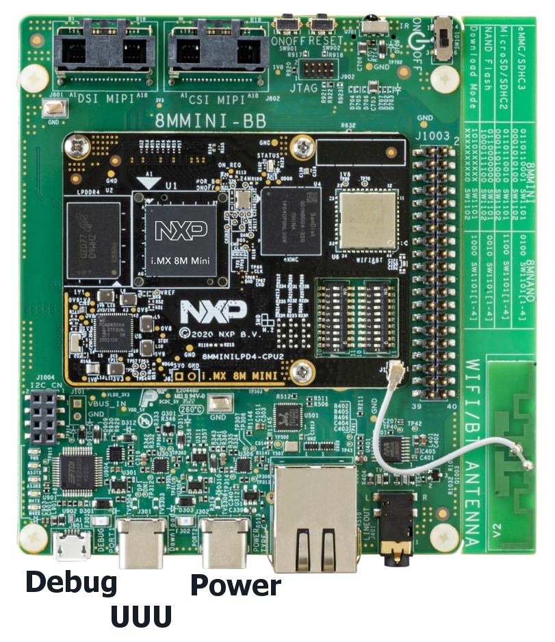

# [Yocto](https://www.yoctoproject.org) [NXP i.MX 8M Mini LPDDR4 EVKB](https://www.nxp.com/design/design-center/development-boards-and-designs/8MMINILPD4-EVK) (8MMINILPD4‑EVKB)
[](https://github.com/lankahsu520/HelperX)
[![GitHub license][license-image]][license-url]
[![GitHub stars][stars-image]][stars-url]
[![GitHub forks][forks-image]][forks-url]
[![GitHub issues][issues-image]][issues-image]
[![GitHub watchers][watchers-image]][watchers-image]

[license-image]: https://img.shields.io/github/license/lankahsu520/HelperX.svg
[license-url]: https://github.com/lankahsu520/HelperX/blob/master/LICENSE
[stars-image]: https://img.shields.io/github/stars/lankahsu520/HelperX.svg
[stars-url]: https://github.com/lankahsu520/HelperX/stargazers
[forks-image]: https://img.shields.io/github/forks/lankahsu520/HelperX.svg
[forks-url]: https://github.com/lankahsu520/HelperX/network
[issues-image]: https://img.shields.io/github/issues/lankahsu520/HelperX.svg
[issues-url]: https://github.com/lankahsu520/HelperX/issues
[watchers-image]: https://img.shields.io/github/watchers/lankahsu520/HelperX.svg
[watchers-url]: https://github.com/lankahsu520/HelperX/watchers

# 1. Overview

> The i.MX 8M Mini EVKB provides a platform for comprehensive evaluation of the i.MX 8M Mini and i.MX 8M Mini Lite applications processors. It delivers high performance with power efficiency, multimedia interfaces, and Wi-Fi/Bluetooth for connectivity out-of-the box.
>
> https://www.nxp.com/assets/images/en/dev-board-image/iMX8MMINIEVKLPDR4_TOP-LR-HR1.jpg



# 2. Building

## 2.1. Official steps

> [i.MX Repo Manifest README](https://github.com/nxp-imx/imx-manifest/blob/imx-linux-scarthgap/README.md)

> [imx-manifest](https://github.com/nxp-imx/imx-manifest) / [imx-6.6.52-2.2.0.xml](https://github.com/nxp-imx/imx-manifest/blob/imx-linux-scarthgap/imx-6.6.52-2.2.0.xml)

### 2.1.1. Configuration

#### A. MACHINE

> 選擇硬體平台
>
> ./sources/meta-nxp-connectivity/meta-nxp-otbr/recipes-kernel/linux/files/dts/*.dts

| MACHINE           | SoC          | EVK Board               | DESC                                                 |
| ----------------- | ------------ | ----------------------- | ---------------------------------------------------- |
| imx8mm-lpddr4-evk | i.MX 8M Mini | i.MX 8M Mini LPDDR4 EVK | 有 GPU、VPU、多媒體處理器。                          |
| imx8mnevk         | i.MX 8M Nano | i.MX 8M Nano EVK        | 低功耗版本，**無 GPU、VPU**，適合 IoT/簡化顯示應用。 |

#### B. DISTRO

> ./sources/meta-freescale-distro/conf/distro/*.conf

| DISTRO           | DESC                                       |
| ---------------- | ------------------------------------------ |
| fsl-imx-xwayland | NXP 提供，支援 X + Wayland                 |
| fsl-imx-wayland  | NXP 提供，純 Wayland 支援（推薦用於 i.MX） |
| fsl-imx-fb       | NXP 提供，僅 Framebuffer，無 GUI           |

#### C. BSP（Board Support Package）layer

| BSP            |      | REPO                                        | DESC                       |
| -------------- | ---- | ------------------------------------------- | -------------------------- |
| meta-imx       |      | https://github.com/nxp-imx/meta-imx         | NXP 官方                   |
| meta-freescale |      | https://github.com/Freescale/meta-freescale | 社群（Freescale/NXP 社群） |

#### D. Image

| IMAGE                | DESC                                                         |
| -------------------- | ------------------------------------------------------------ |
| imx-image-core       | core image with basic graphics and no multimedia             |
| imx-image-multimedia | This image contains all the packages except QT6/OpenCV/Machine Learning packages |
| imx-image-full       | This is the big image which includes imx-image-multimedia + OpenCV + QT6 + Machine Learning packages. |

### 2.1.2. build imx-image-xxx

```bash
# Download the Yocto Project BSP
$ mkdir -p 8MMINILPD4-EVK; cd 8MMINILPD4-EVK
$ repo init -u https://github.com/nxp-imx/imx-manifest \
 -b imx-linux-scarthgap \
 -m imx-6.6.52-2.2.0.xml
$ repo sync

# Setup the build folder for a BSP release
$ MACHINE=imx8mm-lpddr4-evk \
 DISTRO=fsl-imx-wayland \
 source ./imx-setup-release.sh -b build-wayland

#$ bitbake core-image-minimal
#$ bitbake imx-image-full
$ bitbake imx-image-core
```

## 2.2. [cookerX](https://github.com/lankahsu520/CrossCompilationX/tree/master/helper_cookerX.md)

### 2.2.1. Configuration

#### A.  imx8mm-evk-scarthgap-menu.json

> 這邊參考 [imx-manifest](https://github.com/nxp-imx/imx-manifest) / [imx-6.6.52-2.2.0.xml](https://github.com/nxp-imx/imx-manifest/blob/imx-linux-scarthgap/imx-6.6.52-2.2.0.xml) 進行整合。

### 2.2.2. build imx-image-xxx

```bash
$ python -V
Python 3.10.17

$ cd cookerX
$ . confs/imx8mm-scarthgap-core.conf
...

Please check dl-dir (PJ_YOCTO_DOWNLOADS_DIR=/yocto-cache/downloads) !!!
Please check sstate-dir (PJ_YOCTO_SSTATE_DIR=/yocto-cache/sstate-cache) !!!

$ make
# or 
cooker  -v init cooker-menu/imx8mm-evk-scarthgap-menu.json
cooker update
cooker generate
cooker  -v build imx8mm-evk-scarthgap
```
# 3. Outputs

> 這邊採用 cookerX 進行解說

```bash
$ make lnk-generate
# or
$ ./confs/sh/cooker_123.sh lnk
$ ./confs/sh/bb_linker.sh
```

## 3.1. rootfs

```bash
$ echo builds-lnk/$PJ_YOCTO_BUILD-rootfs
builds-lnk/imx8mm-evk-scarthgap-core-rootfs

$ ll builds-lnk/$PJ_YOCTO_BUILD-rootfs/
total 68
drwxr-xr-x 17 lanka lanka 4096 Mar  9  2018 ./
drwxr-xr-x 16 lanka lanka 4096 Jul  9 10:00 ../
lrwxrwxrwx  1 lanka lanka    7 Mar  9  2018 bin -> usr/bin/
drwxr-xr-x  2 lanka lanka 4096 Mar  9  2018 boot/
drwxr-xr-x  2 lanka lanka 4096 Mar  9  2018 dev/
drwxr-xr-x 46 lanka lanka 4096 Mar  9  2018 etc/
drwxr-xr-x  3 lanka lanka 4096 Mar  9  2018 home/
lrwxrwxrwx  1 lanka lanka    7 Mar  9  2018 lib -> usr/lib/
drwxr-xr-x  2 lanka lanka 4096 Mar  9  2018 media/
drwxr-xr-x  2 lanka lanka 4096 Mar  9  2018 mnt/
drwxr-xr-x  2 lanka lanka 4096 Mar  9  2018 proc/
drwx------  2 lanka lanka 4096 Mar  9  2018 root/
drwxr-xr-x  2 lanka lanka 4096 Mar  9  2018 run/
lrwxrwxrwx  1 lanka lanka    8 Mar  9  2018 sbin -> usr/sbin/
drwxr-xr-x  2 lanka lanka 4096 Mar  9  2018 srv/
drwxr-xr-x  2 lanka lanka 4096 Mar  9  2018 sys/
drwxr-xr-t  2 lanka lanka 4096 Mar  9  2018 tmp/
drwxr-xr-x 39 lanka lanka 4096 Mar  9  2018 unit_tests/
drwxr-xr-x 11 lanka lanka 4096 Mar  9  2018 usr/
drwxr-xr-x  9 lanka lanka 4096 Mar  9  2018 var/
```

## 3.2. images-lnk

```bash
$ ll images-lnk/
total 10200
drwxrwxr-x  2 lanka lanka    4096 Jul  9 16:06 ./
drwxrwxr-x 10 lanka lanka    4096 Jul  9 15:21 ../
-rw-rw-r--  1 lanka lanka 5956776 Jul  9 16:06 environment.txt
lrwxrwxrwx  1 lanka lanka     153 Jul  9 16:05 imx-image-core-imx8mm-lpddr4-evk.rootfs.manifest -> /yocto/cookerX/builds/build-imx8mm-evk-scarthgap-core/tmp/deploy/images/imx8mm-lpddr4-evk/imx-image-core-imx8mm-lpddr4-evk.rootfs-20250709015459.manifest
lrwxrwxrwx  1 lanka lanka     152 Jul  9 16:05 imx-image-core-imx8mm-lpddr4-evk.rootfs.wic.zst -> /yocto/cookerX/builds/build-imx8mm-evk-scarthgap-core/tmp/deploy/images/imx8mm-lpddr4-evk/imx-image-core-imx8mm-lpddr4-evk.rootfs-20250709015459.wic.zst
-rw-rw-r--  1 lanka lanka    7791 Jul  9 16:06 pn-buildlist
```

### 3.2.1. image

> 不管是用 Official or cookerX 都會產出 imx-image-core-imx8mm-lpddr4-evk.rootfs.wic.zst。

```bash
$ ll images-lnk/$PJ_YOCTO_IMAGE_WIC
lrwxrwxrwx 1 lanka lanka 152 Jul  9 16:05 images-lnk/imx-image-core-imx8mm-lpddr4-evk.rootfs.wic.zst -> /yocto/cookerX/builds/build-imx8mm-evk-scarthgap-core/tmp/deploy/images/imx8mm-lpddr4-evk/imx-image-core-imx8mm-lpddr4-evk.rootfs-20250709015459.wic.zst

$ cp images-lnk/imx-image-core-imx8mm-lpddr4-evk.rootfs.wic.zst ./

# unpack
$ unzstd imx-image-core-imx8mm-lpddr4-evk.rootfs.wic.zst
imx-image-core-imx8mm-lpddr4-evk.rootfs.wic.zst: 2411107328 bytes
$ ll imx-image-core-imx8mm-lpddr4-evk.rootfs.wic
-rw-r--r-- 1 lanka lanka 2411107328 Jul  7 08:45 imx-image-core-imx8mm-lpddr4-evk.rootfs.wic

$ wic ls imx-image-core-imx8mm-lpddr4-evk.rootfs.wic
Num     Start        End          Size      Fstype
 1       8388608    357354495    348965888  fat16
 2     360710144   2411107327   2050397184  ext4
```

## 3.3. builds-lnk

```bash
$ ll builds-lnk
total 24
drwxrwxr-x 2 lanka lanka 4096 Jul  8 08:04 ./
drwxrwxr-x 9 lanka lanka 4096 Jul  9 10:29 ../
lrwxrwxrwx 1 lanka lanka  117 Jul  8 08:04 imx8mm-evk-scarthgap-core-rootfs -> /yocto/cookerX/builds/build-imx8mm-evk-scarthgap-core/tmp/work/imx8mm_lpddr4_evk-poky-linux/imx-image-core/1.0/rootfs/
lrwxrwxrwx 1 lanka lanka   68 Jul  8 08:04 imx8mm-evk-scarthgap-core-rpm -> /yocto/cookerX/builds/build-imx8mm-evk-scarthgap-core/tmp/deploy/rpm/
lrwxrwxrwx 1 lanka lanka   89 Jul  8 08:04 imx8mm-lpddr4-evk -> /yocto/cookerX/builds/build-imx8mm-evk-scarthgap-core/tmp/deploy/images/imx8mm-lpddr4-evk/
lrwxrwxrwx 1 lanka lanka   68 Jul  8 08:04 sdk -> /yocto/cookerX/builds/build-imx8mm-evk-scarthgap-core/tmp/deploy/sdk
```

# 4. Burn Your Image

## 4.1. Boot Switch Setup

> 請記得設定 Download Mode

> 請參考 1. Overview 的圖示接上 UUU (Type-C) 接口。

| Switch                | `SW1101` [D1-D10] | `SW1102` [D1-D10] |
| :-------------------- | :---------------- | :---------------- |
| eMMC/uSDHC3 (default) | 0110110001        | 0001010100        |
| MicroSD/SDHC2         | 0110110010        | 0001101000        |
| QSPI NOR Flash        | 0110xxxxxx        | 00000x0010        |
| Serial Download Mode  | 1010xxxxxx        | xxxxxxxxx0        |

## 4.2. uuu (Universal Update Utility)

> [nxp-imx](https://github.com/nxp-imx)/**[mfgtools](https://github.com/nxp-imx/mfgtools)**
>
> UUU is a tool designed for deploying images on Freescale/NXP I.MX chips.

> 安裝 uuu；手邊是用win10。將 uuu.exe 複製到 C:\Windows\System32

## 4.3. Burn to eMMC

```bash
$ cd /drives/d/WINAPPS/Worker/uuu

$ uuu -lsusb
uuu (Universal Update Utility) for nxp imx chips -- libuuu_1.4.165-0-ge10b026

Your console don't support VT mode, fail back to verbose mode
Connected Known USB Devices
        Path     Chip    Pro     Vid     Pid     BcdVersion
        ==================================================
        1:2      MX8MM   SDP:    0x1FC9 0x0134   0x0101
```

### 4.3.1. NXP - android

> [Android OS for i.MX Applications Processors](https://www.nxp.com/design/design-center/software/embedded-software/i-mx-software/android-os-for-i-mx-applications-processors:IMXANDROID?tid=vanIMXANDROID)
>
> [15.0.0_1.0.0_DEMO_8MM](https://www.nxp.com/webapp/Download?colCode=15.0.0_1.0.0_DEMO_8MM&appType=license)

```bash
# 採用 -dryrun，分兩段，沒辦法一次完成。
$ ./uuu_imx_android_flash.sh -f imx8mm -a -e -D ./ -t emmc -dryrun
This script is validated with uuu 1.5.179 version, it is recommended to align with this version.
dtbo is supported
dual slot is supported
dynamic parttition is supported
vendor_boot parttition is supported
init_boot parttition is supported
generate lines to flash u-boot-imx8mm.imx to the partition of bootloader0
generate lines to flash partition-table.img to the partition of gpt
generate lines to flash dtbo-imx8mm.img to the partition of dtbo_a
generate lines to flash boot.img to the partition of boot_a
generate lines to flash vendor_boot.img to the partition of vendor_boot_a
generate lines to flash init_boot.img to the partition of init_boot_a
generate lines to flash vbmeta-imx8mm.img to the partition of vbmeta_a
generate lines to flash super.img to the partition of super

$ cp /tmp/uuu.lst ./
$ uuu uuu.lst
```

### 4.3.2. NXP - Linux

>  [Embedded Linux for i.MX Applications Processors](https://www.nxp.com/design/design-center/software/embedded-software/i-mx-software/embedded-linux-for-i-mx-applications-processors:IMXLINUX)
>
> Supported Platforms/Demo Images: i.MX 8M Mini EVK
>
> [L6.12.20-2.0.0_MX8MM](https://www.nxp.com/webapp/sps/download/license.jsp?colCode=L6.12.20-2.0.0_MX8MM&appType=file1&DOWNLOAD_ID=null)

```bash
# 這個是 NXP 提供的
$ uuu ./evkb/LF_v6.12.20-2.0.0_images_IMX8MMEVK.zip
uuu (Universal Update Utility) for nxp imx chips -- libuuu_1.5.201-0-g727fc2b

Your console don't support VT mode, fail back to verbose mode
Build in config:
        Pctl     Chip            Vid     Pid     BcdVersion      Serial_No
        ==================================================
        SDPS:    MX8QXP          0x1fc9  0x012f  [0x0002..0xffff]
        SDPS:    MX8QM           0x1fc9  0x0129  [0x0002..0xffff]
        SDPS:    MX8DXL          0x1fc9  0x0147
        SDPS:    MX28            0x15a2  0x004f
        SDPS:    MX815           0x1fc9  0x013e
        SDPS:    MX865           0x1fc9  0x0146
        SDPS:    MX8ULP          0x1fc9  0x014a
        SDPS:    MX8ULP          0x1fc9  0x014b
        SDPS:    MX93            0x1fc9  0x014e
        SDPS:    MX91            0x1fc9  0x0159
        SDPS:    MX95            0x1fc9  0x015d
        SDPS:    MX95            0x1fc9  0x015c
        SDPS:    MX943           0x1fc9  0x0027
        SDP:     MX7D            0x15a2  0x0076
        SDP:     MX6Q            0x15a2  0x0054
        SDP:     MX6D            0x15a2  0x0061
        SDP:     MX6SL           0x15a2  0x0063
        SDP:     MX6SX           0x15a2  0x0071
        SDP:     MX6UL           0x15a2  0x007d
        SDP:     MX6ULL          0x15a2  0x0080
        SDP:     MX6SLL          0x1fc9  0x0128
        SDP:     MX7ULP          0x1fc9  0x0126
        SDP:     MXRT106X        0x1fc9  0x0135
        SDP:     MX8MM           0x1fc9  0x0134
        SDP:     MX8MQ           0x1fc9  0x012b
        SDPU:    SPL             0x0525  0xb4a4  [0x0000..0x04ff]
        SDPV:    SPL1            0x0525  0xb4a4  [0x0500..0x9998]
        SDPV:    SPL1            0x1fc9  0x0151  [0x0500..0x9998]
        SDPU:    SPL             0x0525  0xb4a4  [0x9999..0x9999]
        SDPU:    SPL             0x3016  0x1001  [0x0000..0x04ff]
        SDPV:    SPL1            0x3016  0x1001  [0x0500..0x9998]
        FBK:                     0x066f  0x9afe
        FBK:                     0x066f  0x9bff
        FBK:                     0x1fc9  0x0153
        FB:                      0x0525  0xa4a5
        FB:                      0x18d1  0x0d02
        FB:                      0x3016  0x0001
        FB:                      0x1fc9  0x0152
        FB:                      0x0483  0x0afb
Wait for Known USB Device Appear...
Decompress file:uuu.auto
100%New USB Device Attached at 1:2-
1:2->Start Cmd:SDP: boot -f imx-boot-imx8mmevk-sd.bin-flash_evk
Decompress file:imx-boot-imx8mmevk-sd.bin-flash_evk
100%1:2->Okay (0.395s)
New USB Device Attached at 1:2-0A1D3209DAB5B3C9
1:2-0A1D3209DAB5B3C9>Start Cmd:SDPV: delay 1000
1:2-0A1D3209DAB5B3C9>Okay (1.001s)
1:2-0A1D3209DAB5B3C9>Start Cmd:SDPV: write -f imx-boot-imx8mmevk-sd.bin-flash_evk -skipspl
100%1:2-0A1D3209DAB5B3C9>Okay (3.047s)
1:2-0A1D3209DAB5B3C9>Start Cmd:SDPV: jump
100%1:2-0A1D3209DAB5B3C9>Okay (0.079s)
New USB Device Attached at 1:2-0A1D3209DAB5B3C9
1:2-0A1D3209DAB5B3C9>Start Cmd:FB: ucmd setenv fastboot_dev mmc
1:2-0A1D3209DAB5B3C9>Okay (0.229s)
1:2-0A1D3209DAB5B3C9>Start Cmd:FB: ucmd setenv mmcdev ${emmc_dev}
1:2-0A1D3209DAB5B3C9>Okay (0.158s)
1:2-0A1D3209DAB5B3C9>Start Cmd:FB: ucmd mmc dev ${emmc_dev}
1:2-0A1D3209DAB5B3C9>Okay (0.04s)
1:2-0A1D3209DAB5B3C9>Start Cmd:FB: flash -raw2sparse all imx-image-full-imx8mmevk.wic
100%1:2-0A1D3209DAB5B3C9>Okay (342.6s)
1:2-0A1D3209DAB5B3C9>Start Cmd:FB: flash bootloader imx-boot-imx8mmevk-sd.bin-flash_evk
0x400000001:2-0A1D3209DAB5B3C9>Okay (0.141s)
1:2-0A1D3209DAB5B3C9>Start Cmd:FB: ucmd if env exists emmc_ack; then ; else setenv emmc_ack 0; fi;
1:2-0A1D3209DAB5B3C9>Okay (0.003s)
1:2-0A1D3209DAB5B3C9>Start Cmd:FB: ucmd mmc partconf ${emmc_dev} ${emmc_ack} 1 0
1:2-0A1D3209DAB5B3C9>Okay (0.004s)
1:2-0A1D3209DAB5B3C9>Start Cmd:FB: done
1:2-0A1D3209DAB5B3C9>Okay (0s)
```

### 4.3.3. Myself

```bash
# 這邊是自己編譯的
$ uuu -b emmc_all \
 ./evkb/imx-boot-imx8mm-lpddr4-evk-sd.bin-flash_evk \
 ./evkb/imx-image-core-imx8mm-lpddr4-evk.rootfs.wic.zst

$ uuu -b emmc_all \
 ./evkb/imx-boot-imx8mm-lpddr4-evk-sd.bin-flash_evk \
 ./evkb/imx-image-core-imx8mm-lpddr4-evk.rootfs.wic
uuu (Universal Update Utility) for nxp imx chips -- libuuu_1.5.201-0-g727fc2b

Your console don't support VT mode, fail back to verbose mode
Build in config:
        Pctl     Chip            Vid     Pid     BcdVersion      Serial_No
        ==================================================
        SDPS:    MX8QXP          0x1fc9  0x012f  [0x0002..0xffff]
        SDPS:    MX8QM           0x1fc9  0x0129  [0x0002..0xffff]
        SDPS:    MX8DXL          0x1fc9  0x0147
        SDPS:    MX28            0x15a2  0x004f
        SDPS:    MX815           0x1fc9  0x013e
        SDPS:    MX865           0x1fc9  0x0146
        SDPS:    MX8ULP          0x1fc9  0x014a
        SDPS:    MX8ULP          0x1fc9  0x014b
        SDPS:    MX93            0x1fc9  0x014e
        SDPS:    MX91            0x1fc9  0x0159
        SDPS:    MX95            0x1fc9  0x015d
        SDPS:    MX95            0x1fc9  0x015c
        SDPS:    MX943           0x1fc9  0x0027
        SDP:     MX7D            0x15a2  0x0076
        SDP:     MX6Q            0x15a2  0x0054
        SDP:     MX6D            0x15a2  0x0061
        SDP:     MX6SL           0x15a2  0x0063
        SDP:     MX6SX           0x15a2  0x0071
        SDP:     MX6UL           0x15a2  0x007d
        SDP:     MX6ULL          0x15a2  0x0080
        SDP:     MX6SLL          0x1fc9  0x0128
        SDP:     MX7ULP          0x1fc9  0x0126
        SDP:     MXRT106X        0x1fc9  0x0135
        SDP:     MX8MM           0x1fc9  0x0134
        SDP:     MX8MQ           0x1fc9  0x012b
        SDPU:    SPL             0x0525  0xb4a4  [0x0000..0x04ff]
        SDPV:    SPL1            0x0525  0xb4a4  [0x0500..0x9998]
        SDPV:    SPL1            0x1fc9  0x0151  [0x0500..0x9998]
        SDPU:    SPL             0x0525  0xb4a4  [0x9999..0x9999]
        SDPU:    SPL             0x3016  0x1001  [0x0000..0x04ff]
        SDPV:    SPL1            0x3016  0x1001  [0x0500..0x9998]
        FBK:                     0x066f  0x9afe
        FBK:                     0x066f  0x9bff
        FBK:                     0x1fc9  0x0153
        FB:                      0x0525  0xa4a5
        FB:                      0x18d1  0x0d02
        FB:                      0x3016  0x0001
        FB:                      0x1fc9  0x0152
        FB:                      0x0483  0x0afb

Run built-in script:

uuu_version 1.4.149

# @_flash.bin            | bootloader, which can extract from wic image
# @_image   [_flash.bin] | wic image burn to emmc.


# This command will be run when i.MX6/7 i.MX8MM, i.MX8MQ
SDP: boot -f ./evkb/imx-boot-imx8mm-lpddr4-evk-sd.bin-flash_evk -scanlimited 0x800000

# This command will be run when ROM support stream mode
# i.MX8QXP, i.MX8QM
SDPS: boot -scanterm -f ./evkb/imx-boot-imx8mm-lpddr4-evk-sd.bin-flash_evk -scanlimited 0x800000

# These commands will be run when use SPL and will be skipped if no spl
# SDPU will be deprecated. please use SDPV instead of SDPU
# {
SDPU: delay 1000
SDPU: write -f ./evkb/imx-boot-imx8mm-lpddr4-evk-sd.bin-flash_evk -offset 0x57c00
SDPU: jump -scanlimited 0x800000
# }

# These commands will be run when use SPL and will be skipped if no spl
# if (SPL support SDPV)
# {
SDPV: delay 1000
SDPV: write -f ./evkb/imx-boot-imx8mm-lpddr4-evk-sd.bin-flash_evk -skipspl -scanterm -scanlimited 0x800000
SDPV: jump -scanlimited 0x800000
# }


FB: ucmd setenv fastboot_dev mmc
FB: ucmd setenv mmcdev ${emmc_dev}
FB: ucmd mmc dev ${emmc_dev}
FB: flash -raw2sparse all ./evkb/imx-image-core-imx8mm-lpddr4-evk.rootfs.wic
FB: flash -scanterm -scanlimited 0x800000 bootloader ./evkb/imx-boot-imx8mm-lpddr4-evk-sd.bin-flash_evk
FB: ucmd if env exists emmc_ack; then ; else setenv emmc_ack 0; fi;
FB: ucmd mmc partconf ${emmc_dev} ${emmc_ack} 1 0
FB: done


Wait for Known USB Device Appear...
New USB Device Attached at 1:2-
1:2->Start Cmd:SDP: boot -f ./evkb/imx-boot-imx8mm-lpddr4-evk-sd.bin-flash_evk -scanlimited 0x800000
100%1:2->Okay (0.392s)
New USB Device Attached at 1:2-0A1D3209DAB5B3C9
1:2-0A1D3209DAB5B3C9>Start Cmd:SDPV: delay 1000
1:2-0A1D3209DAB5B3C9>Okay (1.001s)
1:2-0A1D3209DAB5B3C9>Start Cmd:SDPV: write -f ./evkb/imx-boot-imx8mm-lpddr4-evk-sd.bin-flash_evk -skipspl -scanterm -scanlimited 0x800000
100%1:2-0A1D3209DAB5B3C9>Okay (2.848s)
1:2-0A1D3209DAB5B3C9>Start Cmd:SDPV: jump -scanlimited 0x800000
100%1:2-0A1D3209DAB5B3C9>Okay (0.076s)
New USB Device Attached at 1:2-0A1D3209DAB5B3C9
1:2-0A1D3209DAB5B3C9>Start Cmd:FB: ucmd setenv fastboot_dev mmc
1:2-0A1D3209DAB5B3C9>Okay (0.228s)
1:2-0A1D3209DAB5B3C9>Start Cmd:FB: ucmd setenv mmcdev ${emmc_dev}
1:2-0A1D3209DAB5B3C9>Okay (0.133s)
1:2-0A1D3209DAB5B3C9>Start Cmd:FB: ucmd mmc dev ${emmc_dev}
1:2-0A1D3209DAB5B3C9>Okay (0.041s)
1:2-0A1D3209DAB5B3C9>Start Cmd:FB: flash -raw2sparse all ./evkb/imx-image-core-imx8mm-lpddr4-evk.rootfs.wic
100%1:2-0A1D3209DAB5B3C9>Okay (87.72s)
1:2-0A1D3209DAB5B3C9>Start Cmd:FB: flash -scanterm -scanlimited 0x800000 bootloader ./evkb/imx-boot-imx8mm-lpddr4-evk-sd.bin-flash_evk
0x400000001:2-0A1D3209DAB5B3C9>Okay (0.117s)
1:2-0A1D3209DAB5B3C9>Start Cmd:FB: ucmd if env exists emmc_ack; then ; else setenv emmc_ack 0; fi;
1:2-0A1D3209DAB5B3C9>Okay (0.004s)
1:2-0A1D3209DAB5B3C9>Start Cmd:FB: ucmd mmc partconf ${emmc_dev} ${emmc_ack} 1 0
1:2-0A1D3209DAB5B3C9>Okay (0.004s)
1:2-0A1D3209DAB5B3C9>Start Cmd:FB: done
1:2-0A1D3209DAB5B3C9>Okay (0s)
```

# 5. Toolchain

## 5.1. Generate the Toolchain

### 5.1.1. cross-compile SDK

> 會產生 target rootfs 中的所有頭檔與庫（**針對該 image**）

```bash
$ make toolchain
# or
bitbake core-image-base -c populate_sdk

$ make cook-lnk
$ ll builds-lnk/sdk/*.sh
-rwxr-xr-x 2 lanka lanka 431474058 Jul  7 10:56 builds-lnk/sdk/fsl-imx-wayland-glibc-x86_64-core-image-base-armv8a-imx8mm-lpddr4-evk-toolchain-6.6-scarthgap.sh*

# install
$ builds-lnk/sdk/fsl-imx-wayland-glibc-x86_64-core-image-base-armv8a-imx8mm-lpddr4-evk-toolchain-6.6-scarthgap.sh
NXP i.MX Release Distro SDK installer version 6.6-scarthgap
===========================================================
Enter target directory for SDK (default: /opt/fsl-imx-wayland/6.6-scarthgap):
You are about to install the SDK to "/opt/fsl-imx-wayland/6.6-scarthgap". Proceed [Y/n]? y
Extracting SDK..............................................................................................................................done
Setting it up...done
SDK has been successfully set up and is ready to be used.
Each time you wish to use the SDK in a new shell session, you need to source the environment setup script e.g.
 $ . /opt/fsl-imx-wayland/6.6-scarthgap/environment-setup-armv8a-poky-linux
```

### 5.1.2. generic SDK

> 很簡單的 cross-compiler 和 基本 C runtime（如 glibc 或 musl）

```bash
$ make toolchain-pure
# or
bitbake meta-toolchain
```

## 5.2. Helloworld.c

### 5.2.1. Native-Compilation

```bash
$	cat > helloworld.c <<EOF
#include <stdio.h>

int main(int argc, char *argv[])
{

	printf("Hello world !!!\n");
	return 0;
}
EOF

$ gcc -o helloworld helloworld.c
$ ./helloworld
Hello world !!!
$ file helloworld
helloworld: ELF 64-bit LSB shared object, x86-64, version 1 (SYSV), dynamically linked, interpreter /lib64/ld-linux-x86-64.so.2, BuildID[sha1]=963bb5841deba5e7bed613604b0c89116249fae8, for GNU/Linux 3.2.0, not stripped

```

### 5.2.2. Cross-Compilation

```bash
#Each time you wish to use the SDK in a new shell session, you need to source the env
$ . /opt/fsl-imx-wayland/6.6-scarthgap/environment-setup-armv8a-poky-linux

$ echo $CC
aarch64-poky-linux-gcc -march=armv8-a+crc+crypto -mbranch-protection=standard -fstack-protector-strong -O2 -D_FORTIFY_SOURCE=2 -Wformat -Wformat-security -Werror=format-security --sysroot=/opt/fsl-imx-wayland/6.6-scarthgap/sysroots/armv8a-poky-linux

$ echo $CFLAGS
-O2 -pipe -g -feliminate-unused-debug-types

$ $CC -o helloworld helloworld.c

# 這邊直接執行當然會失敗
$ ./helloworld
-bash: ./helloworld: cannot execute binary file: Exec format error

$ file helloworld
helloworld: ELF 64-bit LSB shared object, ARM aarch64, version 1 (SYSV), dynamically linked, interpreter /lib/ld-linux-aarch64.so.1, BuildID[sha1]=b595ef8ba580a186cb7fd98e609a1bc385e32971, for GNU/Linux 5.15.0, with debug_info, not stripped

```

```bash
# Run on imx8mm-lpddr4-evk
root@imx8mm-lpddr4-evk:/tmp# ./helloworld
Hello world !!!
```

# Appendix

# I. Study

## I.1. [IMX8MM-HANDS-ON-LAB-GUIDE](https://www.nxp.com.cn/docs/en/training-reference-material/IMX8MM-HANDS-ON-LAB-GUIDE.pdf)

## I.2. [MCX工业和物联网微控制器](https://www.nxp.com.cn/products/processors-and-microcontrollers/arm-microcontrollers/general-purpose-mcus/mcx-arm-cortex-m:MCX-MCUS?cid=ps_pro240034g_tac1558850_ggle_cn_mcx_tw_brand&gad_source=1&gad_campaignid=21332736863&gclid=CjwKCAjw4K3DBhBqEiwAYtG_9H9segmCvl7XwsL1HFZXCfBcBfJBR8Worw1-iJmoimel1egH8ig8zBoCeqIQAvD_BwE)

## I.3. [i.MX 8M Mini EVKB快速入门](https://www.nxp.com.cn/document/guide/getting-started-with-the-i-mx-8m-mini-evkb:GS-iMX-8M-Mini-EVK)

# II. Debug

## II.1. NXP 8MMINILPD4-EVKB - Hardware Specifications

| HW      | [NXP 8MMINILPD4-EVKB](https://www.nxp.com/design/design-center/development-boards-and-designs/8MMINILPD4-EVK) |
| ------- | ------------------------------------------------------------ |
| CPU     | 4× Cortex-A53 @1.8 GHz<br/>1× Cortex‑M4 @400 MHz             |
| RAM     | 2 GB                                                         |
| Storage | 32 GB                                                        |

#### A. CPU

```bash
root@imx8mm-lpddr4-evk:~# cat /proc/cpuinfo
processor       : 0
BogoMIPS        : 16.00
Features        : fp asimd evtstrm aes pmull sha1 sha2 crc32 cpuid
CPU implementer : 0x41
CPU architecture: 8
CPU variant     : 0x0
CPU part        : 0xd03
CPU revision    : 4

processor       : 1
BogoMIPS        : 16.00
Features        : fp asimd evtstrm aes pmull sha1 sha2 crc32 cpuid
CPU implementer : 0x41
CPU architecture: 8
CPU variant     : 0x0
CPU part        : 0xd03
CPU revision    : 4

processor       : 2
BogoMIPS        : 16.00
Features        : fp asimd evtstrm aes pmull sha1 sha2 crc32 cpuid
CPU implementer : 0x41
CPU architecture: 8
CPU variant     : 0x0
CPU part        : 0xd03
CPU revision    : 4

processor       : 3
BogoMIPS        : 16.00
Features        : fp asimd evtstrm aes pmull sha1 sha2 crc32 cpuid
CPU implementer : 0x41
CPU architecture: 8
CPU variant     : 0x0
CPU part        : 0xd03
CPU revision    : 4

```

#### B. RAM

```bash
root@imx8mm-lpddr4-evk:~# free -h
               total        used        free      shared  buff/cache   available
Mem:           1.8Gi       334Mi       1.4Gi       9.0Mi       163Mi       1.5Gi
Swap:             0B          0B          0B

root@imx8mm-lpddr4-evk:~# cat /proc/meminfo
MemTotal:        1926060 kB
MemFree:         1515456 kB
MemAvailable:    1583856 kB
Buffers:            7388 kB
Cached:           145448 kB
SwapCached:            0 kB
Active:            28288 kB
Inactive:         160244 kB
Active(anon):        660 kB
Inactive(anon):    44236 kB
Active(file):      27628 kB
Inactive(file):   116008 kB
Unevictable:           0 kB
Mlocked:               0 kB
SwapTotal:             0 kB
SwapFree:              0 kB
Dirty:                60 kB
Writeback:             0 kB
AnonPages:         35728 kB
Mapped:            52012 kB
Shmem:              9192 kB
KReclaimable:      14780 kB
Slab:              43844 kB
SReclaimable:      14780 kB
SUnreclaim:        29064 kB
KernelStack:        2576 kB
PageTables:         1712 kB
SecPageTables:         0 kB
NFS_Unstable:          0 kB
Bounce:                0 kB
WritebackTmp:          0 kB
CommitLimit:      963028 kB
Committed_AS:     179984 kB
VmallocTotal:   133141626880 kB
VmallocUsed:        9348 kB
VmallocChunk:          0 kB
Percpu:             1072 kB
HardwareCorrupted:     0 kB
AnonHugePages:         0 kB
ShmemHugePages:        0 kB
ShmemPmdMapped:        0 kB
FileHugePages:         0 kB
FilePmdMapped:         0 kB
CmaTotal:         655360 kB
CmaFree:          519536 kB
HugePages_Total:       0
HugePages_Free:        0
HugePages_Rsvd:        0
HugePages_Surp:        0
Hugepagesize:       2048 kB
Hugetlb:               0 kB

```

#### C. DISK

```bash
root@imx8mm-lpddr4-evk:~# df -h
Filesystem      Size  Used Avail Use% Mounted on
/dev/root       1.7G  995M  616M  62% /
devtmpfs        619M  4.0K  619M   1% /dev
tmpfs           941M     0  941M   0% /dev/shm
tmpfs           377M  9.0M  368M   3% /run
tmpfs           941M  8.0K  941M   1% /tmp
tmpfs           941M   12K  941M   1% /var/volatile
/dev/mmcblk2p1  333M   36M  297M  11% /run/media/boot-mmcblk2p1
tmpfs           189M  8.0K  189M   1% /run/user/0

# 30535680 blocks × 512 bytes = 15,648,153,600 bytes ≈ **14.58 GiB**
root@imx8mm-lpddr4-evk:~# cat /proc/partitions
major minor  #blocks  name

  31        0      32768 mtdblock0
 179        0   30535680 mmcblk2
 179        1     340787 mmcblk2p1
 179        2    1853659 mmcblk2p2
 179       32       4096 mmcblk2boot0
 179       64       4096 mmcblk2boot1

root@imx8mm-lpddr4-evk:~# fdisk -l /dev/mmcblk2
Disk /dev/mmcblk2: 29.12 GiB, 31268536320 bytes, 61071360 sectors
Units: sectors of 1 * 512 = 512 bytes
Sector size (logical/physical): 512 bytes / 512 bytes
I/O size (minimum/optimal): 512 bytes / 512 bytes
Disklabel type: dos
Disk identifier: 0x076c4a2a

Device         Boot  Start     End Sectors   Size Id Type
/dev/mmcblk2p1 *     16384  697957  681574 332.8M  c W95 FAT32 (LBA)
/dev/mmcblk2p2      704512 4411829 3707318   1.8G 83 Linux

# 61071360 × 512 / 1024 / 1024 / 1024 ≒ 29 GB
root@imx8mm-lpddr4-evk:~# cat /sys/block/mmcblk2/size
61071360

root@imx8mm-lpddr4-evk:~# mount | grep '^/dev'
/dev/mmcblk2p2 on / type ext4 (rw,relatime)
/dev/mmcblk2p1 on /run/media/boot-mmcblk2p1 type vfat (rw,relatime,gid=6,fmask=0007,dmask=0007,allow_utime=0020,codepage=437,iocharset=iso8859-1,shortname=mixed,errors=remount-ro)

root@imx8mm-lpddr4-evk:~# cat /etc/fstab
# stock fstab - you probably want to override this with a machine specific one

/dev/root            /                    auto       defaults              1  1
proc                 /proc                proc       defaults              0  0
devpts               /dev/pts             devpts     mode=0620,ptmxmode=0666,gid=5      0  0
tmpfs                /run                 tmpfs      mode=0755,nodev,nosuid,strictatime 0  0
tmpfs                /var/volatile        tmpfs      defaults              0  0

# uncomment this if your device has a SD/MMC/Transflash slot
#/dev/mmcblk0p1       /media/card          auto       defaults,sync,noauto  0  0

root@imx8mm-lpddr4-evk:~# mount
/dev/mmcblk2p2 on / type ext4 (rw,relatime)
devtmpfs on /dev type devtmpfs (rw,relatime,size=633332k,nr_inodes=158333,mode=755)
proc on /proc type proc (rw,relatime)
sysfs on /sys type sysfs (rw,nosuid,nodev,noexec,relatime)
securityfs on /sys/kernel/security type securityfs (rw,nosuid,nodev,noexec,relatime)
tmpfs on /dev/shm type tmpfs (rw,nosuid,nodev)
devpts on /dev/pts type devpts (rw,relatime,gid=5,mode=620,ptmxmode=666)
tmpfs on /run type tmpfs (rw,nosuid,nodev,size=385212k,nr_inodes=819200,mode=755)
cgroup2 on /sys/fs/cgroup type cgroup2 (rw,nosuid,nodev,noexec,relatime,nsdelegate,memory_recursiveprot)
bpf on /sys/fs/bpf type bpf (rw,nosuid,nodev,noexec,relatime,mode=700)
hugetlbfs on /dev/hugepages type hugetlbfs (rw,nosuid,nodev,relatime,pagesize=2M)
mqueue on /dev/mqueue type mqueue (rw,nosuid,nodev,noexec,relatime)
debugfs on /sys/kernel/debug type debugfs (rw,nosuid,nodev,noexec,relatime)
tmpfs on /tmp type tmpfs (rw,nosuid,nodev,size=963032k,nr_inodes=1048576)
fusectl on /sys/fs/fuse/connections type fusectl (rw,nosuid,nodev,noexec,relatime)
configfs on /sys/kernel/config type configfs (rw,nosuid,nodev,noexec,relatime)
tmpfs on /var/volatile type tmpfs (rw,relatime)
tmpfs on /run/user/0 type tmpfs (rw,nosuid,nodev,relatime,size=192604k,nr_inodes=48151,mode=700)
/dev/mmcblk2p1 on /run/media/boot-mmcblk2p1 type vfat (rw,relatime,gid=6,fmask=0007,dmask=0007,allow_utime=0020,codepage=437,iocharset=iso8859-1,shortname=mixed,errors=remount-ro)

```

#### D. dmesg

```bash
root@imx8mm-lpddr4-evk:~# strings /proc/device-tree/model
FSL i.MX8MM EVK board

root@imx8mm-lpddr4-evk:~# dmesg
[    0.000000] Booting Linux on physical CPU 0x0000000000 [0x410fd034]
[    0.000000] Linux version 6.6.52-lts-next-ge0f9e2afd4cf (oe-user@oe-host) (aarch64-poky-linux-gcc (GCC) 13.3.0, GNU ld (GNU Binutils) 2.42.0.20240723) #1 SMP PREEMPT Tue Nov 19 23:01:49 UTC 2024
[    0.000000] KASLR enabled
[    0.000000] Machine model: FSL i.MX8MM EVK board
[    0.000000] efi: UEFI not found.
[    0.000000] Reserved memory: created CMA memory pool at 0x0000000096000000, size 640 MiB
[    0.000000] OF: reserved mem: initialized node linux,cma, compatible id shared-dma-pool
[    0.000000] OF: reserved mem: 0x0000000096000000..0x00000000bdffffff (655360 KiB) map reusable linux,cma
[    0.000000] OF: reserved mem: 0x00000000be000000..0x00000000bfdfffff (30720 KiB) nomap non-reusable optee_core@be000000
[    0.000000] OF: reserved mem: 0x00000000bfe00000..0x00000000bfffffff (2048 KiB) nomap non-reusable optee_shm@bfe00000
[    0.000000] NUMA: No NUMA configuration found
[    0.000000] NUMA: Faking a node at [mem 0x0000000040000000-0x00000000bdffffff]
[    0.000000] NUMA: NODE_DATA [mem 0x95bce6c0-0x95bd0fff]
[    0.000000] Zone ranges:
[    0.000000]   DMA      [mem 0x0000000040000000-0x00000000bdffffff]
[    0.000000]   DMA32    empty
[    0.000000]   Normal   empty
[    0.000000] Movable zone start for each node
[    0.000000] Early memory node ranges
[    0.000000]   node   0: [mem 0x0000000040000000-0x00000000bdffffff]
[    0.000000] Initmem setup node 0 [mem 0x0000000040000000-0x00000000bdffffff]
[    0.000000] On node 0, zone DMA: 8192 pages in unavailable ranges
[    0.000000] psci: probing for conduit method from DT.
[    0.000000] psci: PSCIv1.1 detected in firmware.
[    0.000000] psci: Using standard PSCI v0.2 function IDs
[    0.000000] psci: Trusted OS migration not required
[    0.000000] psci: SMC Calling Convention v1.4
[    0.000000] percpu: Embedded 22 pages/cpu s50920 r8192 d31000 u90112
[    0.000000] pcpu-alloc: s50920 r8192 d31000 u90112 alloc=22*4096
[    0.000000] pcpu-alloc: [0] 0 [0] 1 [0] 2 [0] 3
[    0.000000] Detected VIPT I-cache on CPU0
[    0.000000] CPU features: detected: GIC system register CPU interface
[    0.000000] CPU features: kernel page table isolation forced ON by KASLR
[    0.000000] CPU features: detected: Kernel page table isolation (KPTI)
[    0.000000] CPU features: detected: ARM erratum 845719
[    0.000000] alternatives: applying boot alternatives
[    0.000000] Kernel command line: console=ttymxc1,115200 root=/dev/mmcblk2p2 rootwait rw
[    0.000000] Dentry cache hash table entries: 262144 (order: 9, 2097152 bytes, linear)
[    0.000000] Inode-cache hash table entries: 131072 (order: 8, 1048576 bytes, linear)
[    0.000000] Fallback order for Node 0: 0
[    0.000000] Built 1 zonelists, mobility grouping on.  Total pages: 508032
[    0.000000] Policy zone: DMA
[    0.000000] mem auto-init: stack:all(zero), heap alloc:off, heap free:off
[    0.000000] software IO TLB: area num 4.
[    0.000000] software IO TLB: mapped [mem 0x000000008f800000-0x0000000093800000] (64MB)
[    0.000000] Memory: 1266668K/2064384K available (21120K kernel code, 1644K rwdata, 7820K rodata, 4032K init, 643K bss, 142356K reserved, 655360K cma-reserved)
[    0.000000] SLUB: HWalign=64, Order=0-3, MinObjects=0, CPUs=4, Nodes=1
[    0.000000] rcu: Preemptible hierarchical RCU implementation.
[    0.000000] rcu:     RCU event tracing is enabled.
[    0.000000] rcu:     RCU restricting CPUs from NR_CPUS=256 to nr_cpu_ids=4.
[    0.000000]  Trampoline variant of Tasks RCU enabled.
[    0.000000]  Tracing variant of Tasks RCU enabled.
[    0.000000] rcu: RCU calculated value of scheduler-enlistment delay is 25 jiffies.
[    0.000000] rcu: Adjusting geometry for rcu_fanout_leaf=16, nr_cpu_ids=4
[    0.000000] NR_IRQS: 64, nr_irqs: 64, preallocated irqs: 0
[    0.000000] GICv3: GIC: Using split EOI/Deactivate mode
[    0.000000] GICv3: 128 SPIs implemented
[    0.000000] GICv3: 0 Extended SPIs implemented
[    0.000000] Root IRQ handler: gic_handle_irq
[    0.000000] GICv3: GICv3 features: 16 PPIs
[    0.000000] GICv3: CPU0: found redistributor 0 region 0:0x0000000038880000
[    0.000000] ITS: No ITS available, not enabling LPIs
[    0.000000] rcu: srcu_init: Setting srcu_struct sizes based on contention.
[    0.000000] arch_timer: cp15 timer(s) running at 8.00MHz (phys).
[    0.000000] clocksource: arch_sys_counter: mask: 0xffffffffffffff max_cycles: 0x1d854df40, max_idle_ns: 440795202120 ns
[    0.000000] sched_clock: 56 bits at 8MHz, resolution 125ns, wraps every 2199023255500ns
[    0.000432] Console: colour dummy device 80x25
[    0.000497] Calibrating delay loop (skipped), value calculated using timer frequency.. 16.00 BogoMIPS (lpj=32000)
[    0.000507] pid_max: default: 32768 minimum: 301
[    0.000572] LSM: initializing lsm=capability,integrity
[    0.000667] Mount-cache hash table entries: 4096 (order: 3, 32768 bytes, linear)
[    0.000679] Mountpoint-cache hash table entries: 4096 (order: 3, 32768 bytes, linear)
[    0.002189] RCU Tasks: Setting shift to 2 and lim to 1 rcu_task_cb_adjust=1.
[    0.002258] RCU Tasks Trace: Setting shift to 2 and lim to 1 rcu_task_cb_adjust=1.
[    0.002432] rcu: Hierarchical SRCU implementation.
[    0.002436] rcu:     Max phase no-delay instances is 1000.
[    0.003571] EFI services will not be available.
[    0.003771] smp: Bringing up secondary CPUs ...
[    0.004302] Detected VIPT I-cache on CPU1
[    0.004370] GICv3: CPU1: found redistributor 1 region 0:0x00000000388a0000
[    0.004413] CPU1: Booted secondary processor 0x0000000001 [0x410fd034]
[    0.004949] Detected VIPT I-cache on CPU2
[    0.004996] GICv3: CPU2: found redistributor 2 region 0:0x00000000388c0000
[    0.005019] CPU2: Booted secondary processor 0x0000000002 [0x410fd034]
[    0.005484] Detected VIPT I-cache on CPU3
[    0.005526] GICv3: CPU3: found redistributor 3 region 0:0x00000000388e0000
[    0.005549] CPU3: Booted secondary processor 0x0000000003 [0x410fd034]
[    0.005611] smp: Brought up 1 node, 4 CPUs
[    0.005617] SMP: Total of 4 processors activated.
[    0.005621] CPU features: detected: 32-bit EL0 Support
[    0.005623] CPU features: detected: 32-bit EL1 Support
[    0.005628] CPU features: detected: CRC32 instructions
[    0.005693] CPU: All CPU(s) started at EL2
[    0.005713] alternatives: applying system-wide alternatives
[    0.007564] devtmpfs: initialized
[    0.014911] clocksource: jiffies: mask: 0xffffffff max_cycles: 0xffffffff, max_idle_ns: 7645041785100000 ns
[    0.014933] futex hash table entries: 1024 (order: 4, 65536 bytes, linear)
[    0.033591] pinctrl core: initialized pinctrl subsystem
[    0.035608] DMI not present or invalid.
[    0.036240] NET: Registered PF_NETLINK/PF_ROUTE protocol family
[    0.037162] DMA: preallocated 256 KiB GFP_KERNEL pool for atomic allocations
[    0.037261] DMA: preallocated 256 KiB GFP_KERNEL|GFP_DMA pool for atomic allocations
[    0.037374] DMA: preallocated 256 KiB GFP_KERNEL|GFP_DMA32 pool for atomic allocations
[    0.037434] audit: initializing netlink subsys (disabled)
[    0.037595] audit: type=2000 audit(0.036:1): state=initialized audit_enabled=0 res=1
[    0.038137] thermal_sys: Registered thermal governor 'step_wise'
[    0.038141] thermal_sys: Registered thermal governor 'power_allocator'
[    0.038177] cpuidle: using governor menu
[    0.038376] hw-breakpoint: found 6 breakpoint and 4 watchpoint registers.
[    0.038460] ASID allocator initialised with 32768 entries
[    0.039351] Serial: AMBA PL011 UART driver
[    0.039424] imx mu driver is registered.
[    0.039447] imx rpmsg driver is registered.
[    0.046083] platform soc@0: Fixed dependency cycle(s) with /soc@0/bus@30000000/efuse@30350000/unique-id@4
[    0.049707] imx8mm-pinctrl 30330000.pinctrl: initialized IMX pinctrl driver
[    0.050376] platform 30350000.efuse: Fixed dependency cycle(s) with /soc@0/bus@30000000/clock-controller@30380000
[    0.051530] platform 30350000.efuse: Fixed dependency cycle(s) with /soc@0/bus@30000000/clock-controller@30380000
[    0.058066] platform 32e00000.lcdif: Fixed dependency cycle(s) with /soc@0/bus@32c00000/mipi_dsi@32e10000
[    0.058292] platform 32e00000.lcdif: Fixed dependency cycle(s) with /soc@0/bus@32c00000/mipi_dsi@32e10000
[    0.058402] platform 32e10000.mipi_dsi: Fixed dependency cycle(s) with /soc@0/bus@30800000/i2c@30a30000/adv7535@3d
[    0.058434] platform 32e10000.mipi_dsi: Fixed dependency cycle(s) with /soc@0/bus@32c00000/lcdif@32e00000
[    0.058707] platform 32e20000.csi1_bridge: Fixed dependency cycle(s) with /soc@0/bus@32c00000/mipi_csi@32e30000
[    0.058943] platform 32e20000.csi1_bridge: Fixed dependency cycle(s) with /soc@0/bus@32c00000/mipi_csi@32e30000
[    0.059055] platform 32e30000.mipi_csi: Fixed dependency cycle(s) with /soc@0/bus@32c00000/csi1_bridge@32e20000
[    0.059128] platform 32e30000.mipi_csi: Fixed dependency cycle(s) with /soc@0/bus@30800000/i2c@30a40000/ov5640_mipi@3c
[    0.059787] platform 32e40000.usb: Fixed dependency cycle(s) with /soc@0/bus@30800000/i2c@30a30000/tcpc@50
[    0.065444] Modules: 2G module region forced by RANDOMIZE_MODULE_REGION_FULL
[    0.065473] Modules: 0 pages in range for non-PLT usage
[    0.065476] Modules: 515408 pages in range for PLT usage
[    0.066148] HugeTLB: registered 1.00 GiB page size, pre-allocated 0 pages
[    0.066155] HugeTLB: 0 KiB vmemmap can be freed for a 1.00 GiB page
[    0.066160] HugeTLB: registered 32.0 MiB page size, pre-allocated 0 pages
[    0.066163] HugeTLB: 0 KiB vmemmap can be freed for a 32.0 MiB page
[    0.066167] HugeTLB: registered 2.00 MiB page size, pre-allocated 0 pages
[    0.066172] HugeTLB: 0 KiB vmemmap can be freed for a 2.00 MiB page
[    0.066176] HugeTLB: registered 64.0 KiB page size, pre-allocated 0 pages
[    0.066181] HugeTLB: 0 KiB vmemmap can be freed for a 64.0 KiB page
[    0.068103] ACPI: Interpreter disabled.
[    0.068986] iommu: Default domain type: Translated
[    0.068994] iommu: DMA domain TLB invalidation policy: strict mode
[    0.069298] SCSI subsystem initialized
[    0.069417] libata version 3.00 loaded.
[    0.069608] usbcore: registered new interface driver usbfs
[    0.069633] usbcore: registered new interface driver hub
[    0.069666] usbcore: registered new device driver usb
[    0.070734] mc: Linux media interface: v0.10
[    0.070774] videodev: Linux video capture interface: v2.00
[    0.070837] pps_core: LinuxPPS API ver. 1 registered
[    0.070841] pps_core: Software ver. 5.3.6 - Copyright 2005-2007 Rodolfo Giometti <giometti@linux.it>
[    0.070852] PTP clock support registered
[    0.071153] EDAC MC: Ver: 3.0.0
[    0.071598] scmi_core: SCMI protocol bus registered
[    0.071925] FPGA manager framework
[    0.072008] Advanced Linux Sound Architecture Driver Initialized.
[    0.072758] Bluetooth: Core ver 2.22
[    0.072788] NET: Registered PF_BLUETOOTH protocol family
[    0.072791] Bluetooth: HCI device and connection manager initialized
[    0.072798] Bluetooth: HCI socket layer initialized
[    0.072803] Bluetooth: L2CAP socket layer initialized
[    0.072814] Bluetooth: SCO socket layer initialized
[    0.073170] vgaarb: loaded
[    0.073671] clocksource: Switched to clocksource arch_sys_counter
[    0.073902] VFS: Disk quotas dquot_6.6.0
[    0.073930] VFS: Dquot-cache hash table entries: 512 (order 0, 4096 bytes)
[    0.074095] pnp: PnP ACPI: disabled
[    0.080833] NET: Registered PF_INET protocol family
[    0.080980] IP idents hash table entries: 32768 (order: 6, 262144 bytes, linear)
[    0.082520] tcp_listen_portaddr_hash hash table entries: 1024 (order: 2, 16384 bytes, linear)
[    0.082548] Table-perturb hash table entries: 65536 (order: 6, 262144 bytes, linear)
[    0.082560] TCP established hash table entries: 16384 (order: 5, 131072 bytes, linear)
[    0.082706] TCP bind hash table entries: 16384 (order: 7, 524288 bytes, linear)
[    0.083154] TCP: Hash tables configured (established 16384 bind 16384)
[    0.083253] UDP hash table entries: 1024 (order: 3, 32768 bytes, linear)
[    0.083299] UDP-Lite hash table entries: 1024 (order: 3, 32768 bytes, linear)
[    0.083453] NET: Registered PF_UNIX/PF_LOCAL protocol family
[    0.083879] RPC: Registered named UNIX socket transport module.
[    0.083884] RPC: Registered udp transport module.
[    0.083887] RPC: Registered tcp transport module.
[    0.083889] RPC: Registered tcp-with-tls transport module.
[    0.083892] RPC: Registered tcp NFSv4.1 backchannel transport module.
[    0.084944] PCI: CLS 0 bytes, default 64
[    0.085300] kvm [1]: IPA Size Limit: 40 bits
[    0.087353] kvm [1]: GICv3: no GICV resource entry
[    0.087359] kvm [1]: disabling GICv2 emulation
[    0.087378] kvm [1]: GIC system register CPU interface enabled
[    0.087403] kvm [1]: vgic interrupt IRQ9
[    0.087427] kvm [1]: Hyp mode initialized successfully
[    0.088598] Initialise system trusted keyrings
[    0.088792] workingset: timestamp_bits=42 max_order=19 bucket_order=0
[    0.089073] squashfs: version 4.0 (2009/01/31) Phillip Lougher
[    0.089287] NFS: Registering the id_resolver key type
[    0.089315] Key type id_resolver registered
[    0.089319] Key type id_legacy registered
[    0.089336] nfs4filelayout_init: NFSv4 File Layout Driver Registering...
[    0.089341] nfs4flexfilelayout_init: NFSv4 Flexfile Layout Driver Registering...
[    0.089358] jffs2: version 2.2. (NAND) \xc2\xa9 2001-2006 Red Hat, Inc.
[    0.089550] 9p: Installing v9fs 9p2000 file system support
[    0.123134] Key type asymmetric registered
[    0.123139] Asymmetric key parser 'x509' registered
[    0.123179] Block layer SCSI generic (bsg) driver version 0.4 loaded (major 243)
[    0.123185] io scheduler mq-deadline registered
[    0.123189] io scheduler kyber registered
[    0.123214] io scheduler bfq registered
[    0.130166] EINJ: ACPI disabled.
[    0.141396] imx-sdma 302c0000.dma-controller: Direct firmware load for imx/sdma/sdma-imx7d.bin failed with error -2
[    0.141412] imx-sdma 302c0000.dma-controller: Falling back to sysfs fallback for: imx/sdma/sdma-imx7d.bin
[    0.147040] mxs-dma 33000000.dma-controller: initialized
[    0.148305] SoC: i.MX8MM revision 1.0
[    0.148751] Bus freq driver module loaded
[    0.161542] Serial: 8250/16550 driver, 4 ports, IRQ sharing enabled
[    0.164567] 30860000.serial: ttymxc0 at MMIO 0x30860000 (irq = 18, base_baud = 5000000) is a IMX
[    0.164701] serial serial0: tty port ttymxc0 registered
[    0.165177] 30880000.serial: ttymxc2 at MMIO 0x30880000 (irq = 19, base_baud = 5000000) is a IMX
[    0.165851] 30890000.serial: ttymxc1 at MMIO 0x30890000 (irq = 20, base_baud = 1500000) is a IMX
[    0.165876] printk: console [ttymxc1] enabled
[    1.462991] imx-drm display-subsystem: bound imx-lcdif-crtc.0 (ops lcdif_crtc_ops)
[    1.470721] imx_sec_dsim_drv 32e10000.mipi_dsi: version number is 0x1060200
[    1.477752] [drm:drm_bridge_attach] *ERROR* failed to attach bridge /soc@0/bus@32c00000/mipi_dsi@32e10000 to encoder DSI-34: -517
[    1.489458] imx_sec_dsim_drv 32e10000.mipi_dsi: Failed to attach bridge: 32e10000.mipi_dsi
[    1.497732] imx_sec_dsim_drv 32e10000.mipi_dsi: failed to bind sec dsim bridge: -517
[    1.512063] loop: module loaded
[    1.516914] megasas: 07.725.01.00-rc1
[    1.525831] spi-nor spi0.0: n25q256ax1 (32768 Kbytes)
[    1.535305] tun: Universal TUN/TAP device driver, 1.6
[    1.541323] thunder_xcv, ver 1.0
[    1.544599] thunder_bgx, ver 1.0
[    1.547866] nicpf, ver 1.0
[    1.552781] hns3: Hisilicon Ethernet Network Driver for Hip08 Family - version
[    1.560017] hns3: Copyright (c) 2017 Huawei Corporation.
[    1.565370] hclge is initializing
[    1.568726] e1000: Intel(R) PRO/1000 Network Driver
[    1.573608] e1000: Copyright (c) 1999-2006 Intel Corporation.
[    1.579388] e1000e: Intel(R) PRO/1000 Network Driver
[    1.584358] e1000e: Copyright(c) 1999 - 2015 Intel Corporation.
[    1.590310] igb: Intel(R) Gigabit Ethernet Network Driver
[    1.595757] igb: Copyright (c) 2007-2014 Intel Corporation.
[    1.601365] igbvf: Intel(R) Gigabit Virtual Function Network Driver
[    1.607649] igbvf: Copyright (c) 2009 - 2012 Intel Corporation.
[    1.613766] sky2: driver version 1.30
[    1.618018] usbcore: registered new device driver r8152-cfgselector
[    1.624323] usbcore: registered new interface driver r8152
[    1.630240] VFIO - User Level meta-driver version: 0.3
[    1.638177] usbcore: registered new interface driver uas
[    1.643534] usbcore: registered new interface driver usb-storage
[    1.649621] usbcore: registered new interface driver usbserial_generic
[    1.656182] usbserial: USB Serial support registered for generic
[    1.662219] usbcore: registered new interface driver ftdi_sio
[    1.667995] usbserial: USB Serial support registered for FTDI USB Serial Device
[    1.675338] usbcore: registered new interface driver usb_serial_simple
[    1.681893] usbserial: USB Serial support registered for carelink
[    1.688018] usbserial: USB Serial support registered for flashloader
[    1.694403] usbserial: USB Serial support registered for funsoft
[    1.700436] usbserial: USB Serial support registered for google
[    1.706382] usbserial: USB Serial support registered for hp4x
[    1.712157] usbserial: USB Serial support registered for kaufmann
[    1.718278] usbserial: USB Serial support registered for libtransistor
[    1.724829] usbserial: USB Serial support registered for moto_modem
[    1.731123] usbserial: USB Serial support registered for motorola_tetra
[    1.737763] usbserial: USB Serial support registered for nokia
[    1.743620] usbserial: USB Serial support registered for novatel_gps
[    1.750003] usbserial: USB Serial support registered for siemens_mpi
[    1.756387] usbserial: USB Serial support registered for suunto
[    1.762333] usbserial: USB Serial support registered for vivopay
[    1.768369] usbserial: USB Serial support registered for zio
[    1.774059] usbcore: registered new interface driver usb_ehset_test
[    1.783600] input: 30370000.snvs:snvs-powerkey as /devices/platform/soc@0/30000000.bus/30370000.snvs/30370000.snvs:snvs-powerkey/input/input0
[    1.798474] snvs_rtc 30370000.snvs:snvs-rtc-lp: registered as rtc0
[    1.804703] snvs_rtc 30370000.snvs:snvs-rtc-lp: setting system clock to 1970-01-01T00:00:00 UTC (0)
[    1.813905] i2c_dev: i2c /dev entries driver
[    1.820072] mx6s-csi 32e20000.csi1_bridge: initialising
[    1.826304] mxc_mipi-csi 32e30000.mipi_csi: supply mipi-phy not found, using dummy regulator
[    1.835067] mxc_mipi-csi 32e30000.mipi_csi: mipi csi v4l2 device registered
[    1.842043] CSI: Registered sensor subdevice: mxc_mipi-csi.0
[    1.847727] mxc_mipi-csi 32e30000.mipi_csi: lanes: 2, hs_settle: 13, clk_settle: 2, wclk: 1, freq: 333000000
[    1.861715] Bluetooth: HCI UART driver ver 2.3
[    1.866187] Bluetooth: HCI UART protocol H4 registered
[    1.871351] Bluetooth: HCI UART protocol BCSP registered
[    1.876699] Bluetooth: HCI UART protocol LL registered
[    1.881845] Bluetooth: HCI UART protocol ATH3K registered
[    1.887272] Bluetooth: HCI UART protocol Three-wire (H5) registered
[    1.893656] Bluetooth: HCI UART protocol Broadcom registered
[    1.899369] Bluetooth: HCI UART protocol QCA registered
[    1.906251] sdhci: Secure Digital Host Controller Interface driver
[    1.912451] sdhci: Copyright(c) Pierre Ossman
[    1.917387] Synopsys Designware Multimedia Card Interface Driver
[    1.924082] sdhci-pltfm: SDHCI platform and OF driver helper
[    1.932352] ledtrig-cpu: registered to indicate activity on CPUs
[    1.939960] SMCCC: SOC_ID: ARCH_SOC_ID not implemented, skipping ....
[    1.946896] usbcore: registered new interface driver usbhid
[    1.952484] usbhid: USB HID core driver
[    1.961831] hw perfevents: enabled with armv8_cortex_a53 PMU driver, 7 counters available
[    1.962866] mmc2: SDHCI controller on 30b60000.mmc [30b60000.mmc] using ADMA
[    1.979938]  cs_system_cfg: CoreSight Configuration manager initialised
[    1.987666] platform soc@0: Fixed dependency cycle(s) with /soc@0/bus@30000000/efuse@30350000
[    1.997355] optee: probing for conduit method.
[    2.001844] optee: revision 4.4 (60beb308810f9561)
[    2.002952] optee: dynamic shared memory is enabled
[    2.013048] optee: initialized driver
[    2.019019] hantrodec 0 : module inserted. Major = 509
[    2.024731] hantrodec 1 : module inserted. Major = 509
[    2.030853] hx280enc: module inserted. Major <508>
[    2.039804] NET: Registered PF_LLC protocol family
[    2.044711] u32 classifier
[    2.047468]     input device check on
[    2.047771] mmc2: new HS400 Enhanced strobe MMC card at address 0001
[    2.051147]     Actions configured
[    2.058387] mmcblk2: mmc2:0001 DG4032 29.1 GiB
[    2.061297] NET: Registered PF_INET6 protocol family
[    2.067366]  mmcblk2: p1 p2
[    2.072765] Segment Routing with IPv6
[    2.075000] mmcblk2boot0: mmc2:0001 DG4032 4.00 MiB
[    2.076904] In-situ OAM (IOAM) with IPv6
[    2.083367] mmcblk2boot1: mmc2:0001 DG4032 4.00 MiB
[    2.085705] NET: Registered PF_PACKET protocol family
[    2.092394] mmcblk2rpmb: mmc2:0001 DG4032 4.00 MiB, chardev (234:0)
[    2.095602] bridge: filtering via arp/ip/ip6tables is no longer available by default. Update your scripts to load br_netfilter if you need this.
[    2.115882] Bluetooth: RFCOMM TTY layer initialized
[    2.120783] Bluetooth: RFCOMM socket layer initialized
[    2.125941] Bluetooth: RFCOMM ver 1.11
[    2.129711] Bluetooth: BNEP (Ethernet Emulation) ver 1.3
[    2.135031] Bluetooth: BNEP filters: protocol multicast
[    2.140268] Bluetooth: BNEP socket layer initialized
[    2.145242] Bluetooth: HIDP (Human Interface Emulation) ver 1.2
[    2.151171] Bluetooth: HIDP socket layer initialized
[    2.156896] 8021q: 802.1Q VLAN Support v1.8
[    2.161113] lib80211: common routines for IEEE802.11 drivers
[    2.166777] lib80211_crypt: registered algorithm 'NULL'
[    2.166783] lib80211_crypt: registered algorithm 'WEP'
[    2.166787] lib80211_crypt: registered algorithm 'CCMP'
[    2.166792] lib80211_crypt: registered algorithm 'TKIP'
[    2.166823] 9pnet: Installing 9P2000 support
[    2.171264] Key type dns_resolver registered
[    2.175940] NET: Registered PF_VSOCK protocol family
[    2.203330] registered taskstats version 1
[    2.207581] Loading compiled-in X.509 certificates
[    2.236253] gpio gpiochip0: Static allocation of GPIO base is deprecated, use dynamic allocation.
[    2.246719] gpio gpiochip1: Static allocation of GPIO base is deprecated, use dynamic allocation.
[    2.257295] gpio gpiochip2: Static allocation of GPIO base is deprecated, use dynamic allocation.
[    2.267850] gpio gpiochip3: Static allocation of GPIO base is deprecated, use dynamic allocation.
[    2.278465] gpio gpiochip4: Static allocation of GPIO base is deprecated, use dynamic allocation.
[    2.291947] usb_phy_generic usbphynop1: dummy supplies not allowed for exclusive requests
[    2.300453] usb_phy_generic usbphynop2: dummy supplies not allowed for exclusive requests
[    2.309855] i2c i2c-0: IMX I2C adapter registered
[    2.315923] adv7511 1-003d: supply avdd not found, using dummy regulator
[    2.322758] adv7511 1-003d: supply dvdd not found, using dummy regulator
[    2.325880] nxp-pca9450 0-0025: pca9450a probed.
[    2.329525] adv7511 1-003d: supply pvdd not found, using dummy regulator
[    2.340851] adv7511 1-003d: supply a2vdd not found, using dummy regulator
[    2.347700] adv7511 1-003d: supply v3p3 not found, using dummy regulator
[    2.354449] adv7511 1-003d: supply v1p2 not found, using dummy regulator
[    2.362283] adv7511 1-003d: Probe failed. Remote port 'mipi_dsi@32e10000' disabled
[    2.370116] platform 32e40000.usb: Fixed dependency cycle(s) with /soc@0/bus@30800000/i2c@30a30000/tcpc@50
[    2.379928] i2c 1-0050: Fixed dependency cycle(s) with /soc@0/bus@32c00000/usb@32e40000
[    2.391232] i2c i2c-1: IMX I2C adapter registered
[    2.397505] pca953x 2-0020: using no AI
[    2.409192] ov5640_mipi 2-003c: No sensor reset pin available
[    2.415012] ov5640_mipi 2-003c: supply DOVDD not found, using dummy regulator
[    2.422286] ov5640_mipi 2-003c: supply DVDD not found, using dummy regulator
[    2.429382] ov5640_mipi 2-003c: supply AVDD not found, using dummy regulator
[    2.446289] ov5640_mipi 2-003c: Read reg error: reg=300a
[    2.451618] ov5640_mipi 2-003c: Camera is not found
[    2.456802] i2c i2c-2: IMX I2C adapter registered
[    2.464531] imx6q-pcie 33800000.pcie: host bridge /soc@0/pcie@33800000 ranges:
[    2.467540] imx-drm display-subsystem: bound imx-lcdif-crtc.0 (ops lcdif_crtc_ops)
[    2.471832] imx6q-pcie 33800000.pcie:       IO 0x001ff80000..0x001ff8ffff -> 0x0000000000
[    2.479519] imx_sec_dsim_drv 32e10000.mipi_dsi: version number is 0x1060200
[    2.487567] imx6q-pcie 33800000.pcie:      MEM 0x0018000000..0x001fefffff -> 0x0018000000
[    2.494556] [drm:drm_bridge_attach] *ERROR* failed to attach bridge /soc@0/bus@32c00000/mipi_dsi@32e10000 to encoder DSI-34: -19
[    2.514310] imx_sec_dsim_drv 32e10000.mipi_dsi: Failed to attach bridge: 32e10000.mipi_dsi
[    2.522586] imx_sec_dsim_drv 32e10000.mipi_dsi: failed to bind sec dsim bridge: -19
[    2.530256] imx-drm display-subsystem: bound 32e10000.mipi_dsi (ops imx_sec_dsim_ops)
[    2.538719] [drm] Initialized imx-drm 1.0.0 20120507 for display-subsystem on minor 0
[    2.546585] imx-drm display-subsystem: [drm] Cannot find any crtc or sizes
[    2.557184] pps pps0: new PPS source ptp0
[    2.674123] mdio_bus 30be0000.ethernet-1:00: Fixed dependency cycle(s) with /soc@0/bus@30800000/ethernet@30be0000/mdio/ethernet-phy@0/vddio-regulator
[    2.718196] imx6q-pcie 33800000.pcie: iATU: unroll T, 4 ob, 4 ib, align 64K, limit 4G
[    2.774116] vddio: Bringing 1500000uV into 1800000-1800000uV
[    2.781793] fec 30be0000.ethernet eth0: registered PHC device 0
[    2.794618] imx-cpufreq-dt imx-cpufreq-dt: cpu speed grade 3 mkt segment 0 supported-hw 0x8 0x1
[    2.808860] galcore: clk_get vg clock failed, disable vg!
[    2.808875] sdhci-esdhc-imx 30b50000.mmc: Got CD GPIO
[    2.814863] Galcore version 6.4.11.p2.745085
[    2.838592] mmc0: SDHCI controller on 30b40000.mmc [30b40000.mmc] using ADMA
[    2.851612] mmc1: SDHCI controller on 30b50000.mmc [30b50000.mmc] using ADMA
[    2.868467] [drm] Initialized vivante 1.0.0 20170808 for 38000000.gpu on minor 1
[    2.880470] OF: graph: no port node found in /soc@0/bus@30800000/i2c@30a30000/tcpc@50/connector
[    2.889212] OF: graph: no port node found in /soc@0/bus@30800000/i2c@30a30000/tcpc@50/connector
[    2.897931] OF: graph: no port node found in /soc@0/bus@30800000/i2c@30a30000/tcpc@50/connector
[    2.924464] mmc0: new ultra high speed SDR104 SDIO card at address 0001
[    2.931166] cfg80211: Loading compiled-in X.509 certificates for regulatory database
[    2.940344] Loaded X.509 cert 'sforshee: 00b28ddf47aef9cea7'
[    2.946673] Loaded X.509 cert 'wens: 61c038651aabdcf94bd0ac7ff06c7248db18c600'
[    2.953976] clk: Disabling unused clocks
[    2.957982] platform regulatory.0: Direct firmware load for regulatory.db failed with error -2
[    2.963978] ALSA device list:
[    2.966619] platform regulatory.0: Falling back to sysfs fallback for: regulatory.db
[    2.969587]   No soundcards found.
[    3.724036] imx6q-pcie 33800000.pcie: Phy link never came up
[    4.003088] ddrc freq set to low bus mode
[    4.149520] ddrc freq set to high bus mode
[    4.727868] imx6q-pcie 33800000.pcie: Phy link never came up
[    4.733897] imx6q-pcie 33800000.pcie: PCI host bridge to bus 0000:00
[    4.740340] pci_bus 0000:00: root bus resource [bus 00-ff]
[    4.745854] pci_bus 0000:00: root bus resource [io  0x0000-0xffff]
[    4.752065] pci_bus 0000:00: root bus resource [mem 0x18000000-0x1fefffff]
[    4.759023] pci 0000:00:00.0: [16c3:abcd] type 01 class 0x060400
[    4.765137] pci 0000:00:00.0: reg 0x10: [mem 0x00000000-0x000fffff]
[    4.771429] pci 0000:00:00.0: reg 0x38: [mem 0x00000000-0x0000ffff pref]
[    4.778177] pci 0000:00:00.0: supports D1
[    4.782200] pci 0000:00:00.0: PME# supported from D0 D1 D3hot D3cold
[    4.790080] pci 0000:00:00.0: BAR 0: assigned [mem 0x18000000-0x180fffff]
[    4.796894] pci 0000:00:00.0: BAR 6: assigned [mem 0x18100000-0x1810ffff pref]
[    4.804123] pci 0000:00:00.0: PCI bridge to [bus 01-ff]
[    4.809762] pcieport 0000:00:00.0: PME: Signaling with IRQ 221
[    4.898108] EXT4-fs (mmcblk2p2): recovery complete
[    4.903900] EXT4-fs (mmcblk2p2): mounted filesystem 94ba6f5b-6518-47ab-851c-4a10790a442b r/w with ordered data mode. Quota mode: none.
[    4.916060] VFS: Mounted root (ext4 filesystem) on device 179:2.
[    4.922232] devtmpfs: mounted
[    4.926548] Freeing unused kernel memory: 4032K
[    4.931175] Run /sbin/init as init process
[    4.935276]   with arguments:
[    4.935278]     /sbin/init
[    4.935280]   with environment:
[    4.935282]     HOME=/
[    4.935284]     TERM=linux
[    5.016927] systemd[1]: System time before build time, advancing clock.
[    5.049064] systemd[1]: systemd 255.4^ running in system mode (+PAM -AUDIT -SELINUX -APPARMOR +IMA -SMACK +SECCOMP -GCRYPT -GNUTLS -OPENSSL +ACL +BLKID -CURL -ELFUTILS -FIDO2 -IDN2 -IDN -IPTC +KMOD -LIBCRYPTSETUP +LIBFDISK -PCRE2 -PWQUALITY -P11KIT -QRENCODE -TPM2 -BZIP2 -LZ4 -XZ -ZLIB +ZSTD -BPF_FRAMEWORK -XKBCOMMON +UTMP +SYSVINIT default-hierarchy=unified)
[    5.080975] systemd[1]: Detected architecture arm64.
[    5.102369] systemd[1]: Hostname set to <imx8mm-lpddr4-evk>.
[    5.188121] systemd-sysv-generator[132]: SysV service '/etc/init.d/rc.local' lacks a native systemd unit file. ~ Automatically generating a unit file for compatibility. Please update package to include a native systemd unit file, in order to make it safe, robust and future-proof. ! This compatibility logic is deprecated, expect removal soon. !
[    5.498375] systemd[1]: Queued start job for default target Graphical Interface.
[    5.529117] systemd[1]: Created slice Slice /system/getty.
[    5.552078] systemd[1]: Created slice Slice /system/modprobe.
[    5.576080] systemd[1]: Created slice Slice /system/serial-getty.
[    5.599564] systemd[1]: Created slice User and Session Slice.
[    5.622136] systemd[1]: Started Dispatch Password Requests to Console Directory Watch.
[    5.646075] systemd[1]: Started Forward Password Requests to Wall Directory Watch.
[    5.669974] systemd[1]: Reached target Path Units.
[    5.689863] systemd[1]: Reached target Remote File Systems.
[    5.709830] systemd[1]: Reached target Slice Units.
[    5.729814] systemd[1]: Reached target Swaps.
[    5.779226] systemd[1]: Listening on RPCbind Server Activation Socket.
[    5.801957] systemd[1]: Reached target RPC Port Mapper.
[    5.824318] systemd[1]: Listening on Syslog Socket.
[    5.846741] systemd[1]: Listening on initctl Compatibility Named Pipe.
[    5.871400] systemd[1]: Listening on Journal Audit Socket.
[    5.890309] systemd[1]: Listening on Journal Socket (/dev/log).
[    5.910846] systemd[1]: Listening on Journal Socket.
[    5.930522] systemd[1]: Listening on Network Service Netlink Socket.
[    5.950857] systemd[1]: Listening on udev Control Socket.
[    5.970282] systemd[1]: Listening on udev Kernel Socket.
[    5.990480] systemd[1]: Listening on User Database Manager Socket.
[    6.041938] systemd[1]: Mounting Huge Pages File System...
[    6.065463] systemd[1]: Mounting POSIX Message Queue File System...
[    6.093737] systemd[1]: Mounting Kernel Debug File System...
[    6.114160] systemd[1]: Kernel Trace File System was skipped because of an unmet condition check (ConditionPathExists=/sys/kernel/tracing).
[    6.131605] systemd[1]: Mounting Temporary Directory /tmp...
[    6.159177] systemd[1]: Starting Create List of Static Device Nodes...
[    6.185846] systemd[1]: Starting Load Kernel Module configfs...
[    6.209239] systemd[1]: Starting Load Kernel Module drm...
[    6.234114] systemd[1]: Starting Load Kernel Module fuse...
[    6.259989] systemd[1]: Starting RPC Bind...
[    6.268878] fuse: init (API version 7.39)
[    6.281968] systemd[1]: File System Check on Root Device was skipped because of an unmet condition check (ConditionPathIsReadWrite=!/).
[    6.301994] systemd[1]: Starting Journal Service...
[    6.319335] systemd[1]: Load Kernel Modules was skipped because no trigger condition checks were met.
[    6.332478] systemd[1]: Starting Generate network units from Kernel command line...
[    6.361341] systemd[1]: Starting Remount Root and Kernel File Systems...
[    6.376629] systemd-journald[148]: Collecting audit messages is enabled.
[    6.389575] systemd[1]: Starting Apply Kernel Variables...
[    6.415098] systemd[1]: Starting Coldplug All udev Devices...
[    6.426122] EXT4-fs (mmcblk2p2): re-mounted 94ba6f5b-6518-47ab-851c-4a10790a442b r/w. Quota mode: none.
[    6.463021] systemd[1]: Starting Virtual Console Setup...
[    6.487247] systemd[1]: Started RPC Bind.
[    6.492247] systemd[1]: Started Journal Service.
[    6.651862] systemd-journald[148]: Received client request to flush runtime journal.
[    6.833088] audit: type=1334 audit(1709054765.812:2): prog-id=6 op=LOAD
[    6.841576] audit: type=1334 audit(1709054765.812:3): prog-id=7 op=LOAD
[    6.959539] audit: type=1334 audit(1709054765.940:4): prog-id=8 op=LOAD
[    6.967183] audit: type=1334 audit(1709054765.948:5): prog-id=9 op=LOAD
[    6.973947] audit: type=1334 audit(1709054765.948:6): prog-id=10 op=LOAD
[    7.024564] audit: type=1334 audit(1709054766.004:7): prog-id=11 op=LOAD
[    7.052930] audit: type=1334 audit(1709054766.032:8): prog-id=12 op=LOAD
[    8.076871] imx-sdma 302b0000.dma-controller: firmware found.
[    8.076883] imx-sdma 30bd0000.dma-controller: firmware found.
[    8.077047] imx-sdma 30bd0000.dma-controller: loaded firmware 4.6
[    8.083472] imx-sdma 302c0000.dma-controller: firmware found.
[    8.160078] audit: type=1334 audit(1709054949.180:9): prog-id=13 op=LOAD
[    8.169214] audit: type=1334 audit(1709054949.188:10): prog-id=14 op=LOAD
[    8.179606] audit: type=1334 audit(1709054949.188:11): prog-id=15 op=LOAD
[    8.798381] Qualcomm Atheros AR8031/AR8033 30be0000.ethernet-1:00: attached PHY driver (mii_bus:phy_addr=30be0000.ethernet-1:00, irq=POLL)
[    8.922996] Registered IR keymap rc-empty
[    8.934428] rc rc0: gpio_ir_recv as /devices/platform/ir-receiver/rc/rc0
[    8.942533] input: gpio_ir_recv as /devices/platform/ir-receiver/rc/rc0/input1
[    9.018353] debugfs: File 'Playback' in directory 'dapm' already present!
[    9.026826] debugfs: File 'Capture' in directory 'dapm' already present!
[    9.043475] caam-snvs 30370000.caam-snvs: ipid matched - 0x3e
[    9.051743] caam-snvs 30370000.caam-snvs: violation handlers armed - non-secure state
[    9.141156] caam 30900000.crypto: device ID = 0x0a16040100000000 (Era 9)
[    9.148330] caam 30900000.crypto: job rings = 1, qi = 0
[    9.565721] random: crng init done
[    9.838539] caam algorithms registered in /proc/crypto
[    9.849064] caam 30900000.crypto: caam pkc algorithms registered in /proc/crypto
[    9.860046] caam 30900000.crypto: rng crypto API alg registered prng-caam
[    9.869309] caam 30900000.crypto: registering rng-caam
[    9.878026] Device caam-keygen registered
[   19.940868] platform backlight: deferred probe pending
[   19.946048] platform sound-ak4458: deferred probe pending
```

# III. Glossary

# IV. Tool Usage

# Author

> Created and designed by [Lanka Hsu](lankahsu@gmail.com).

# License

> [CrossCompilationX](https://github.com/lankahsu520/CrossCompilationX) is available under the BSD-3-Clause license. See the LICENSE file for more info.
