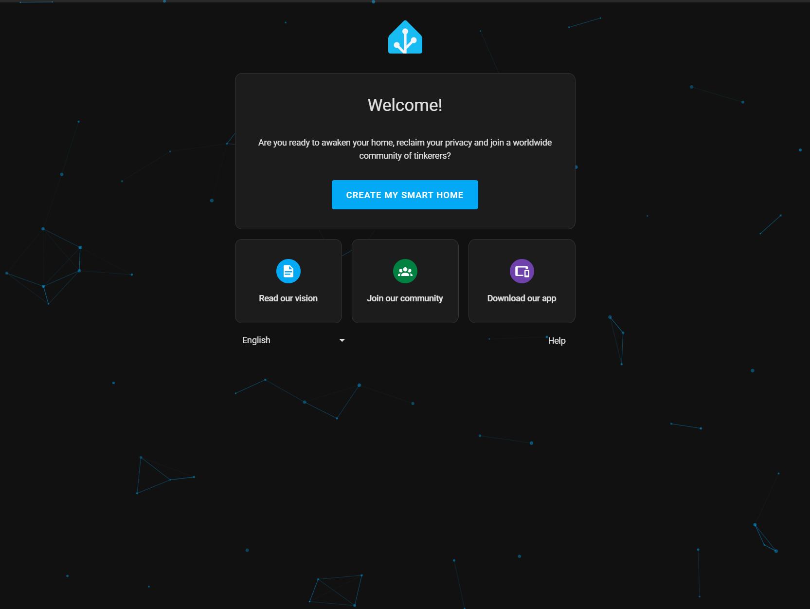

# [Yocto](https://www.yoctoproject.org) [Home Assistant](https://www.home-assistant.io)

[](https://github.com/lankahsu520/CrossCompilationX)
[![GitHub license][license-image]][license-url]
[![GitHub stars][stars-image]][stars-url]
[![GitHub forks][forks-image]][forks-url]
[![GitHub issues][issues-image]][issues-image]


[license-image]: https://img.shields.io/github/license/lankahsu520/CrossCompilationX.svg
[license-url]: https://github.com/lankahsu520/CrossCompilationX/blob/master/LICENSE
[stars-image]: https://img.shields.io/github/stars/lankahsu520/CrossCompilationX.svg
[stars-url]: https://github.com/lankahsu520/CrossCompilationX/stargazers
[forks-image]: https://img.shields.io/github/forks/lankahsu520/CrossCompilationX.svg
[forks-url]: https://github.com/lankahsu520/CrossCompilationX/network
[issues-image]: https://img.shields.io/github/issues/lankahsu520/CrossCompilationX.svg
[issues-url]: https://github.com/lankahsu520/CrossCompilationX/issues

# 1. Overview

> Home Assistant 是一款開源的家庭自動化平台，強調本地控制與隱私保護。由全球熱衷創客與 DIY 愛好者所推動與維護，非常適合在 Raspberry Pi 或本地伺服器上執行。
>
> 它是一個輔助工具，是讓現有的環境下，整合成一個方便的 UI 環境，讓您能夠輕鬆地管理和控制各種智慧設備，讓它們可以協同作業。

> [ChatGPT] Home Assistant 是什麼
>
> Home Assistant 是一個開源的**家庭自動化平台**，用來整合並控制你家中所有的智慧裝置。它可以安裝在像是 Raspberry Pi 或其他電腦上，讓你把燈光、溫度、感測器、相機、安全系統等智慧設備統一管理，甚至可以設定自動化規則。
>
> ###  Home Assistant 的核心特色：
>
> 1. **完全本地執行（Local Control）**：
>    - 資料存在你自己的裝置，不必依賴雲端，保障隱私與安全。
> 2. **支援上千種設備與平台**：
>    - 包括 Google Nest、Philips Hue、Xiaomi、Zigbee/Z-Wave 裝置、智慧插座、感測器等。
>    - 透過整合（Integration）方式與設備連接。
> 3. **自動化（Automation）**：
>    - 你可以寫條件，例如「當日落時自動開燈」、「當門打開時發送通知」、「溫度高於30度時啟動冷氣」等。
> 4. **Web 界面控制**：
>    - 用瀏覽器或手機 App（iOS / Android）就可以控制家中所有裝置。
>    - 可以自訂儀表板（Dashboard）介面。
> 5. **強大的社群與開發資源**：
>    - 大量現成的元件（Component）、Blueprints（自動化模板）、HACS（社群商店）可用。

# 2. Build and Target

> 請善用 [cookerX](https://github.com/lankahsu520/CrossCompilationX/tree/master/Yocto/cookerX)，這是本作者包裝後的整合平台。以下內容都將採用此開發。

## 2.1. Environment

| ITEM        | VERSION         |
| ----------- | --------------- |
| Hardware    | 8MMINILPD4‑EVKB |
| Yocto       | 5.0 Scarthgap   |
| Building OS | Ubuntu 20.04    |
| Python      | 3.10.18         |

## 2.2. Build

| ITEM        | FILE                                              |
| ----------- | ------------------------------------------------- |
| configure   | imx8mm-scarthgap-rauc-home2023.12.0.conf          |
| cooker-menu | imx8mm-evk-scarthgap-rauc-home2023.12.0-menu.json |

```bash
$ git clone https://github.com/lankahsu520/CrossCompilationX.git
$ cd CrossCompilationX/Yocto/cookerX/
$ . confs/imx8mm-scarthgap-rauc-home2023.12.0.conf
$ make
```

### 2.2.1. Image

> 如果只是要 image

```bash
$ bitbake -e $PJ_YOCTO_IMAGE | grep ^IMAGE_FSTYPES=
IMAGE_FSTYPES="  wic.zst ext4"

# 編譯
$ make image
# or
# bitbake $PJ_YOCTO_IMAGE
$ bitbake imx-image-core
```

### 2.2.2. bundle

> 如果只是要 bundle

```bash
# 編譯
$ make bundle
# or
# bitbake $PJ_YOCTO_BUNDLE
$ bitbake imx-bundle
```

## 2.3. Target

| ITEM        | FILE                                            |
| ----------- | ----------------------------------------------- |
| u-boot      | imx-boot-imx8mm-lpddr4-evk-sd.bin-flash_evk     |
| u-boot-env  | u-boot-imx-initial-env-sd                       |
| Image       | imx-image-core-imx8mm-lpddr4-evk.rootfs.wic.zst |
| RAUC Bundle | update-bundle-imx8mm-lpddr4-evk.raucb           |

## 2.4. Burn

### 2.4.1. uuu

```bash
$ cd /drives/d/WINAPPS/Worker/uuu
$ uuu -lsusb
$ uuu -b emmc_all \
 ./evkb/imx-boot-imx8mm-lpddr4-evk-sd.bin-flash_evk \
 ./evkb/imx-image-core-imx8mm-lpddr4-evk.rootfs.wic.zst
```

### 2.4.2. rauc install

```bash
root@imx8mm-lpddr4-evk:~# rauc install /tmp/update-bundle-imx8mm-lpddr4-evk.raucb
```

### 2.4.3. Burn to MicroSD

> *.wic 和 .img 是相同的，只是副檔名不同而已。

```bash
$ unzstd imx-image-multimedia-imx8mmevk-matter.rootfs.wic.zst
$ mv imx-image-multimedia-imx8mmevk-matter.rootfs.wic imx-image-multimedia-imx8mmevk-matter.rootfs.img
```


# 3. Layers

## 3.1. Layer Index

### 3.1.1. [OpenEmbedded Layer Index](https://layers.openembedded.org/layerindex/)

| Layer name                                                   | Description              | Type     | Repository                                                   |
| :----------------------------------------------------------- | :----------------------- | :------- | :----------------------------------------------------------- |
| [meta-homeassistant](https://layers.openembedded.org/layerindex/branch/master/layer/meta-homeassistant/) | Layer for Home Assistant | Software | https://github.com/meta-homeassistant/meta-homeassistant.git |

## 3.2. [meta-homeassistant](https://github.com/meta-homeassistant/meta-homeassistant)

> 當初一開始接觸時是使用 2023.12.0，花了很長的時間，結果發現無法支援 HACS。
>
> 現在就得考慮是不是直接升級到最新版；而要升級至 2025.7.1時，yocto 的版本又要升級至 whinlatter (5.3)；之後又遇到  i.MX Repo Manifest 只支援到 walnascar (5.2)，解決了一個問題，又有一堆問題，彼此環環相扣。

| Check | Yocto                              | python3-homeassistant | Date                | rev                                      |
| ----- | ---------------------------------- | --------------------- | ------------------- | ---------------------------------------- |
|       | whinlatter (5.3)                   | 2025.7.1              | 2025/07/16 17:16:37 | 2376bb467084e975fd00e54834fd196ab276f76e |
|       | whinlatter (5.3)                   | 2025.7.1              | 2025/07/12 23:40:57 | 083ed472adaae7d9c01480faabd30ed284d8ce24 |
|       | whinlatter (5.3)                   | 2025.7.1              | 2025/07/12 20:51:26 | 67e0a443839df4723b740dd968f649bb7395df90 |
|       | styhead (5.1),<br/>walnascar (5.2) | 2025.6.0b5            | 2025/06/28 05:11:08 | 65755926143661407c8686ec3ffc4129d504f562 |
|       | styhead (5.1),<br>walnascar (5.2)  | 2025.5.1              | 2025/05/27 04:59:45 | 4430d53483c50f335d291fdb8790bd11203ae048 |
| v     | styhead (5.1),<br/>walnascar (5.2) | 2025.4.0              | 2025/05/27 04:42:46 | 1b37b27b8aebee02bd5da8a43129661e5f364be3 |
|       | styhead (5.1),<br/>walnascar (5.2) | 2025.4.0              | 2025/04/03 16:20:30 | 434ccbe145be248176651b3c664bf769e2b91ca8 |
|       | styhead (5.1),<br/>walnascar (5.2) | 2025.3.4              | 2025/03/30 05:32:27 | 74d21d78880832ada2c315678004af4e79d72e44 |
|       | styhead (5.1)                      | 2025.1.0              | 2025/01/06 04:52:46 | 74d90690e18de29fd7a4042752debc4a7d9cdb2c |
| v     | nanbield (4.3),<br>scarthgap (5.0) | 2023.12.0             | 2024/03/20 05:10:32 | 5ee63318c53bec1bfc2e56221783c23c61b32a1e |
|       | nanbield (4.3)                     | 2023.12.0             | 2024/02/25 05:56:17 | 863a92980349b6a80d03843ba2958b4d1deb131a |

### 3.2.1. Add layer

> 因為 homeassistant 相依很多套件，這邊就不列出所有的。

#### A. update $PJ_COOKER_MENU

>  IMAGE_INSTALL: python3-homeassistant
>
>  LICENSE_FLAGS_ACCEPTED: commercial

```bash
$ echo $PJ_COOKER_MENU
imx8mm-evk-scarthgap-rauc-home2023.12.0-menu.json

# 更新 $PJ_COOKER_MENU
$ vi cooker-menu/$PJ_COOKER_MENU
  ...
  "sources": [
    {
      "url": "https://github.com/meta-homeassistant/meta-homeassistant",
      "branch": "main",
      "dir": "meta-homeassistant",
      "rev": "5ee63318c53bec1bfc2e56221783c23c61b32a1e"
    },
  ],
  "layers": [
    "meta-homeassistant",
  ],
  "builds": {
    "imx8mm-evk-scarthgap-home": {
      "local.conf": [
        "IMAGE_INSTALL:append = ' python3-homeassistant'",
        "LICENSE_FLAGS_ACCEPTED += 'commercial'"
      ]
    }
  }

# 更新完記得執行
$ cooker generate

$ cat $PJ_YOCTO_BUILD_DIR/conf/local.conf
$ cat $PJ_YOCTO_BUILD_DIR/conf/bblayers.conf

$ bitbake-layers show-recipes python3-homeassistant
NOTE: Starting bitbake server...
Loading cache: 100% |############################################################| Time: 0:00:01
Loaded 5813 entries from dependency cache.
Parsing recipes: 100% |##########################################################| Time: 0:00:00
Parsing of 3734 .bb files complete (3731 cached, 3 parsed). 5811 targets, 586 skipped, 3 masked, 0 errors.
WARNING: preferred version 4.18.imx+stable of xen not available
WARNING: versions of xen available: 4.17+stable 4.18+stable 4.19+git 4.19.0+stable
WARNING: preferred version 1.24.0.imx of gst-devtools not available
WARNING: versions of gst-devtools available: 1.22.12 1.22.5.imx
=== Matching recipes: ===
python3-homeassistant:
  meta-homeassistant   2023.12.0
```

> 因為 python3-ha-av dependency ffmpeg，但是 ffmpeg LICENSE = "commercial"

```bash
$ find -name ffmpeg*.bb
./layers-scarthgap/poky/meta/recipes-multimedia/ffmpeg/ffmpeg_6.1.1.bb
./layers-scarthgap/meta-freescale/recipes-multimedia/ffmpeg/ffmpeg_4.4.1.bb

$ cat $PJ_YOCTO_LAYERS_DIR/meta-freescale/recipes-multimedia/ffmpeg/ffmpeg_4.4.1.bb | grep LICENSE_FLAGS
LICENSE_FLAGS = "commercial"
```

### 3.2.2. Recipes 

#### python3-homeassistant

```bash
$ bb-info python3-homeassistant
$ bitbake -c build python3-homeassistant
```

```bash
$ oe-pkgdata-util list-pkg-files python3-homeassistant
```

> homeassistant.service
>
> HOMEASSISTANT_CONFIG_DIR : /var/lib/homeassistant

```bash
$ vi $PJ_YOCTO_LAYERS_DIR/meta-homeassistant-202*/recipes-homeassistant/homeassistant/python3-homeassistant/homeassistant.service
[Unit]
Description=Home Assistant
After=network.target

[Service]
Type=simple
User=@HOMEASSISTANT_USER@
ExecStart=/usr/bin/hass --skip-pip -c "@HOMEASSISTANT_CONFIG_DIR@"
Restart=on-failure

[Install]
WantedBy=multi-user.target

$ vi builds-lnk/$PJ_YOCTO_BUILD-rootfs/usr/lib/systemd/system/homeassistant.service
```

#### python3-ha-ffmpeg

> github: [ha-ffmpeg](https://github.com/home-assistant-libs/ha-ffmpeg)
>
> A library that handling with ffmpeg for home-assistant

```bash
$ bb-info python3-ha-ffmpeg
$ bitbake -c build python3-ha-ffmpeg
```

```bash
$ oe-pkgdata-util list-pkg-files python3-ha-ffmpeg
```

#### [python3-python-matter-server](https://github.com/home-assistant-libs/python-matter-server)

> The Open Home Foundation Matter Server is an [officially certified](https://csa-iot.org/csa_product/open-home-foundation-matter-server/) Software Component to create a Matter controller. It serves as the foundation to provide Matter support to [Home Assistant](https://home-assistant.io/) but its universal approach makes it suitable to be used in other projects too.
>

> 基本上有編譯 matter (chip-tool) 才會有用處。如何編譯可見 [helper_Yocto-meta-NXP-Matter.md](https://github.com/lankahsu520/CrossCompilationX/blob/master/helper_Yocto-meta-NXP-Matter.md)。
>
> [meta-nxp-connectivity](https://github.com/nxp-imx/meta-nxp-connectivity/tree/imx_matter_2025_q1-post)/[docs](https://github.com/nxp-imx/meta-nxp-connectivity/tree/imx_matter_2025_q1-post/docs)/[guides](https://github.com/nxp-imx/meta-nxp-connectivity/tree/imx_matter_2025_q1-post/docs/guides)/[Running Matter Commissioning in Home Assistant application based on i.MX MPU platforms](https://github.com/nxp-imx/meta-nxp-connectivity/blob/imx_matter_2025_q1-post/docs/guides/nxp_mpu_matter_Home_Assistant.md)
>
> 文中介紹在 imx93evk 使用 Docker images-homeassistant  and matter-server。
>
> 對於開發人員一點用處也沒有用，這邊生起一個念頭，"為什麼都是用 Docker ? 是不是有什麼不想讓別人知道裏面實際內容"


```bash
$ bb-info python3-python-matter-server
$ bitbake -c build python3-python-matter-server
```

```bash
$ oe-pkgdata-util list-pkg-files python3-python-matter-server
```
> 注意版本

| rev                                  | 2023.12.0                                | 2025.4.0                                 |
| ------------------------------------ | ---------------------------------------- | ---------------------------------------- |
| meta-homeassistant                   | 5ee63318c53bec1bfc2e56221783c23c61b32a1e | 1b37b27b8aebee02bd5da8a43129661e5f364be3 |
| python3-homeassistant                | 2023.12.0                                | 2025.4.0                                 |
| python3-matter-server                | 5.0.0                                    | 7.0.1                                    |
| python3-home-assistant-chip-clusters | 2023.10.2                                | 2024.11.4                                |
| python3-home-assistant-chip-core     | 未內建                                   | 未內建                                   |

```bash
$ git-log python3-python-matter-server_7.0.1.bb
* d029c3e (2025/03/29 21:32:27) <Tom Geelen> various version fixes
* 8edc7cf (2025/03/29 21:32:27) <Tom Geelen> python3-python-matter-server: upgrade 6.6.0 -> 7.0.1

$ grep -nrs python3-python-matter-server
recipes-homeassistant/homeassistant/python3-homeassistant/integrations.inc:614:    python3-python-matter-server (>7.0.0) \

$ git-log python3-python-matter-server_8.1.0.bb
* f619704 (2025/09/21 12:12:13) <Tom Geelen> python3-python-matter-server: clean RDEPENDS
* 70e51e6 (2025/09/15 00:17:42) <Tom Geelen> python3-python-matter-server: upgrade 7.0.1 -> 8.1.0
```

```bash
$ tree -L 1 $PJ_YOCTO_BUILD_DIR/tmp/work/$PJ_YOCTO_LINUX/$PJ_YOCTO_IMAGE/*/rootfs/usr/lib/python3.13/site-packages/matter_server
/yocto/cookerX-walnascar/builds/build-imx8mm-evk-walnascar-matter-home/tmp/work/imx8mmevk_matter-poky-linux/imx-image-multimedia/1.0/rootfs/usr/lib/python3.13/site-packages/matter_server
├── client
├── common
├── dashboard
├── __init__.py
├── __pycache__
├── py.typed
└── server

5 directories, 2 files

$ tree -L 1 $PJ_YOCTO_BUILD_DIR/tmp/work/$PJ_YOCTO_LINUX/$PJ_YOCTO_IMAGE/*/rootfs/usr/lib/python3.13/site-packages/homeassistant/components/matter
```

> 這邊採用第二項，其它請見以下 python3-home-assistant-chip-core
>
> #### Installation / Running the Matter Server
>
> - Endusers of Home Assistant, refer to the [Home Assistant documentation](https://www.home-assistant.io/integrations/matter/) how to run Matter in Home Assistant using the official Matter Server add-on, which is based on this project.
> - For running the server and/or client in your development environment, see the [Development documentation](https://github.com/matter-js/python-matter-server/blob/main/DEVELOPMENT.md).
> - For running the Matter Server as a standalone docker container, see our instructions [here](https://github.com/matter-js/python-matter-server/blob/main/docs/docker.md).

> paa-root-certs 的問題請見 [helper_MatterController-chip-tool.md](https://github.com/lankahsu520/HelperX/blob/master/helper_MatterController-chip-tool.md)

```bash
root@imx8mmevk-matter:~# python3 -m matter_server.server --storage-path ~/.matter_server --paa-root-cert-dir /usr/share/chip/paa-root-certs --log-level debug
```

> matter-server.service : 未內建
>
> HOMEASSISTANT_CONFIG_DIR : /var/lib/homeassistant

```bash
$ vi $PJ_YOCTO_LAYERS_DIR/meta-homeassistant-plus-202*/recipes-homeassistant-plus/homeassistant-plus/files/matter-server.service
[Unit]
Description=matter server
After=network.target

[Service]
Type=simple
User=root

PermissionsStartOnly=true
ExecStartPre=/bin/mkdir -p /data
ExecStart=/usr/bin/python3 -m matter_server.server --storage-path /data --paa-root-cert-dir /usr/share/chip/paa-root-certs --log-level debug
Restart=on-failure

[Install]
WantedBy=multi-user.target

$ vi builds-lnk/$PJ_YOCTO_BUILD-rootfs/usr/lib/systemd/system/matter-server.service
```

## 3.3. meta-homeassistant-plus

> 這邊要先有一個重要的認知，homeassistant 算是整合各家的 IoT 系統，當要整入 embedded 時，就有可能會有`缺失`，而這`缺失`是不是剛好是自己需要的，有需要就自己解決。
>
> 或許聰明的人就會說，「pip 安裝就好了」、「rpm 安裝也行」、「最慘的用setup 」。
>
> 問題是不是這樣，這邊不多做解釋，但是身為 embedded engineer 就無法避免。

### 3.3.1. create-layer

```bash
$ echo $PJ_YOCTO_LAYERS_DIR
/yocto/cookerX-scarthgap/layers-scarthgap
$ cd $PJ_YOCTO_LAYERS_DIR
$ bitbake-layers create-layer meta-homeassistant-plus
NOTE: Starting bitbake server...
Add your new layer with 'bitbake-layers add-layer meta-homeassistant-plus'

$ mv meta-homeassistant-plus/recipes-example meta-homeassistant-plus/recipes-homeassistant-plus

$ cd meta-homeassistant-plus/recipes-homeassistant-plus
$ mv example homeassistant-plus

$ cd homeassistant-plus
$ mv example_0.1.bb homeassistant-plus_0.1.bb

$ echo $PJ_COOKER_MENU
imx8mm-evk-scarthgap-home-menu.json

$ cd-root; vi ./cooker-menu/$PJ_COOKER_MENU
# add "meta-homeassistant-plus" into "layers"
$ cooker generate
$ bitbake-layers show-layers | grep meta-homeassistant-plus
$ cat $PJ_YOCTO_BUILD_DIR/conf/bblayers.conf | grep meta-homeassistant-plus

# check homeassistant-plus
$ bitbake -s | grep homeassistant-plus
homeassistant-plus                                    :0.1-r0
```

#### A. update $PJ_COOKER_MENU

> 其本上不用更動

#### B. show-recipes

```bash
$ bitbake-layers show-recipes homeassistant-plus
NOTE: Starting bitbake server...
Loading cache: 100% |############################################################| Time: 0:00:01
Loaded 5810 entries from dependency cache.
Parsing recipes: 100% |##########################################################| Time: 0:00:00
Parsing of 3735 .bb files complete (3733 cached, 2 parsed). 5812 targets, 586 skipped, 3 masked, 0 errors.
WARNING: preferred version 4.18.imx+stable of xen not available
WARNING: versions of xen available: 4.17+stable 4.18+stable 4.19+git 4.19.0+stable
WARNING: preferred version 1.24.0.imx of gst-devtools not available
WARNING: versions of gst-devtools available: 1.22.12 1.22.5.imx
=== Matching recipes: ===
homeassistant-plus:
  meta-homeassistant-plus 0.1
```

#### C. python3-homeassistant_%.bbappend

> 儘量不要去更改 python3-homeassistant.bb，而使用 *.bbappend

```bash
$ cd $PJ_YOCTO_LAYERS_DIR
$ vi $PJ_YOCTO_LAYERS_DIR/meta-homeassistant-plus/recipes-homeassistant-plus/homeassistant-plus/python3-homeassistant_%.bbappend

$ bitbake-layers show-appends | grep homeassistant

$ bitbake -c build python3-homeassistant
```

#### D. Files

```bash
$ tree -L 4 ${PJ_YOCTO_LAYERS_DIR}/meta-homeassistant-plus/recipes-homeassistant-plus/homeassistant-plus
/yocto/cookerX-scarthgap/layers-scarthgap/meta-homeassistant-plus/recipes-homeassistant-plus/homeassistant-plus
├── files
│   ├── automations.yaml
│   ├── configuration.yaml
│   ├── scenes.yaml
│   ├── scripts.yaml
│   └── secrets.yaml
├── homeassistant-plus_0.1.bb
└── python3-homeassistant_%.bbappend

1 directory, 7 files
```

##### D.1. configuration.yaml

> 這邊是 compile time 就進行修改
>
> change default:8123 -> 12345

> http://192.168.31.62:12345

```bash

# Loads default set of integrations. Do not remove.
default_config:

# Load frontend themes from the themes folder
frontend:
  themes: !include_dir_merge_named themes

automation: !include automations.yaml
script: !include scripts.yaml
scene: !include scenes.yaml

http:
  server_port: 12345

```

### 3.3.2. Add recipes - No module named `xxxx`

> 如前面所提，meta-homeassistant 只是

```bash

```

```bash
# 可以進到 NXP 板子裏直接查看 log
root@imx8mm-lpddr4-evk:/# cat /var/lib/homeassistant/home-assistant.log
```

```bash
# 查看是否已經安裝至 yocto-rootfs 
$ cd-rootfs
$ pwd
/yocto/cookerX-scarthgap/builds-lnk/imx8mm-evk-scarthgap-home-rootfs

$ find123 pyasn1* pydantic* bitstruct* python_otbr_api* miniaudio* pysensibo* tuya_iot* srptools* chacha20poly1305* pyatv* mediafile* filetype* hap-python* aiohomekit* synology_dsm* commentjson* lark* zeep* onvif_zeep* onvif_zeep_async* requests_file* wsdiscovery*
```


#### pyasn1

> pypi: [pyasn1 0.6.1](https://pypi.org/project/pyasn1/)
>
> This is a free and open source implementation of ASN.1 types and codecs as a Python package. It has been first written to support particular protocol (SNMP) but then generalized to be suitable for a wide range of protocols based on [ASN.1 specification](https://www.itu.int/rec/dologin_pub.asp?lang=e&id=T-REC-X.208-198811-W!!PDF-E&type=items).

```bash
$ bitbake -s | grep pyasn1
# yocto 已經內建 python3-pyasn1
$ bb-info python3-pyasn1
$ bitbake -c build python3-pyasn1
```

#### pydantic

> pypi: [pydantic 2.11.7](https://pypi.org/project/pydantic/)
>
> Data validation using Python type hints.
>
> Fast and extensible, Pydantic plays nicely with your linters/IDE/brain. Define how data should be in pure, canonical Python 3.9+; validate it with Pydantic.

```bash
$ bitbake -s | grep pydantic
# yocto 已經內建 python3-pydantic
$ bb-info python3-pydantic
$ bitbake -c build python3-pydantic
```

#### pytest-sugar

> pypi: [pytest-sugar 1.0.0](https://pypi.org/project/pytest-sugar)
>
> This plugin extends [pytest](http://pytest.org/) by showing failures and errors instantly, adding a progress bar, improving the test results, and making the output look better.

```bash
$ bitbake -s | grep pytest-sugar
# yocto 未內建 python3-pytest-sugar
$ bb-info python3-pytest-sugar
$ bitbake -c build python3-pytest-sugar
```

### 3.3.3. Add recipes - ONVIF

#### onvif-zeep

> pypi: [onvif-zeep 0.2.12](https://pypi.org/project/onvif-zeep)
>
> ONVIF Client Implementation in Python

```bash
$ bitbake -s | grep onvif-zeep
# yocto 未內建 python3-onvif-zeep
$ bb-info python3-onvif-zeep
$ bitbake -c build python3-onvif-zeep
```

#### onvif-zeep-async

> pypi: [onvif-zeep-async 4.0.1](https://pypi.org/project/onvif-zeep-async)
>
> ONVIF Client Implementation in Python 3

```bash
$ bitbake -s | onvif-zeep-async
# yocto 未內建 python3-onvif-zeep-async，這邊採用舊版 3.1.13
$ bb-info python3-onvif-zeep-async
$ bitbake -c build python3-onvif-zeep-async
```

#### requests-file

> pypi: [requests-file 2.1.0](https://pypi.org/project/requests-file)
>
> Requests-File is a transport adapter for use with the [Requests](https://github.com/kennethreitz/requests) Python library to allow local filesystem access via file:// URLs.

```bash
$ bitbake -s | grep requests-file
# yocto 已經內建 python3-requests-file
$ bb-info python3-requests-file
$ bitbake -c build python3-requests-file
```

#### wsdiscovery

> pypi: [WSDiscovery 2.1.2](https://pypi.org/project/WSDiscovery)
>
> This is WS-Discovery implementation for Python 3. It allows to both discover services and publish discoverable services. For Python 2 support, use the latest 1.x version of this package.

```bash
$ bitbake -s | grep wsdiscovery
# yocto 未內建 python3-wsdiscovery
$ bb-info python3-wsdiscovery
$ bitbake -c build python3-wsdiscovery
```

#### zeep

> pypi: [zeep 4.3.1](https://pypi.org/project/zeep)
>
> a modern parsing library

```bash
$ bitbake -s | grep zeep
# yocto 未內建 python3-zeep
$ bb-info python3-zeep
$ bitbake -c build python3-zeep
```

### 3.3.4. Add recipes - Homekit

#### aiohomekit

> pypi: [aiohomekit 3.2.15](https://pypi.org/project/aiohomekit/)
>
> This library implements the HomeKit protocol for controlling Homekit accessories using asyncio.
>
> It's primary use is for with Home Assistant. We target the same versions of python as them and try to follow their code standards.
>
> At the moment we don't offer any API guarantees. API stability and documentation will happen after we are happy with how things are working within Home Assistant.

```bash
$ bitbake -s | grep aiohomekit
# yocto 未內建 python3-aiohomekit，這邊採用舊版 3.2.7
$ bb-info python3-aiohomekit
# 清除 bitbake cache
$ bitbake -p -f
$ bitbake -c cleansstate python3-aiohomekit
$ bitbake -c cleanall python3-aiohomekit
$ bitbake -c build python3-aiohomekit
```

#### commentjson

> pypi: [commentjson 0.9.0](https://pypi.org/project/commentjson)
>
> commentjson (Comment JSON) is a Python package that helps you create JSON files with Python and JavaScript style inline comments. Its API is very similar to the Python standard library’s [json](http://docs.python.org/2/library/json.html) module.

```bash
$ bitbake -s | grep commentjson
# yocto 未內建 python3-commentjson
$ bb-info python3-commentjson
$ bitbake -c build python3-commentjson
```

#### hap-python

> pypi: [HAP-python 4.9.2](https://pypi.org/project/HAP-python)
>
> HomeKit Accessory Protocol implementation in python 3. With this project, you can integrate your own smart devices and add them to your iOS Home app. Since Siri is integrated with the Home app, you can start voice-control your accessories right away.

```bash
$ bitbake -s | grep hap
# yocto 未內建 python3-hap-python
$ bb-info python3-hap-python
# 清除 bitbake cache
$ bitbake -p -f
$ bitbake -c cleansstate python3-hap-python
$ bitbake -c cleanall python3-hap-python
$ bitbake -c build python3-hap-python
```

#### lark

> pypi: [lark 1.2.2](https://pypi.org/project/lark)
>
> Lark is a modern general-purpose parsing library for Python. With Lark, you can parse any context-free grammar, efficiently, with very little code. 

```bash
$ bitbake -s | grep lark
# yocto 未內建 python3-lark
$ bb-info python3-lark
$ bitbake -c build python3-lark
```

### 3.3.5. Add recipes - Apple TV

#### chacha20poly1305

> pypi: [chacha20poly1305 0.0.3](https://pypi.org/project/chacha20poly1305)
>
> Simple pure-python chacha20-poly1305 implementation based on [tlslite-ng](https://github.com/tomato42/tlslite-ng) code. Designed to be compatible with Cryptography API.

```bash
$ bitbake -s | grep chacha20poly1305
# yocto 未內建 python3-chacha20poly1305
$ bb-info python3-chacha20poly1305
$ bitbake -c build python3-chacha20poly1305
```

#### chacha20poly1305_reuseable

> pypi: [chacha20poly1305-reuseable 0.13.2](https://pypi.org/project/chacha20poly1305-reuseable/)
>
> ChaCha20Poly1305 that is reuseable for asyncio

```bash
$ bitbake -s | grep chacha20poly1305
# yocto 未內建 python3-chacha20poly1305_reuseable
$ bb-info python3-chacha20poly1305-reuseable
$ bitbake -c build python3-chacha20poly1305-reuseable
```

#### filetype

> pypi: [filetype 1.2.0](https://pypi.org/project/filetype/)
>
> Small and dependency free [Python](http://python.org/) package to infer file type and MIME type checking the [magic numbers](https://en.wikipedia.org/wiki/Magic_number_(programming)#Magic_numbers_in_files) signature of a file or buffer.
>
> This is a Python port from [filetype](https://github.com/h2non/filetype) Go package.

```bash
$ bitbake -s | grep filetype
# yocto 未內建 python3-filetype
$ bb-info python3-filetype
$ bitbake -c build python3-filetype
```

#### mediafile

> pypi: [mediafile 0.13.0](https://pypi.org/project/mediafile/)
>
> MediaFile is a simple interface to the metadata tags for many audio file formats. It wraps [Mutagen](https://github.com/quodlibet/mutagen), a high-quality library for low-level tag manipulation, with a high-level, format-independent interface for a common set of tags.

```bash
$ bitbake -s | grep mediafile
# yocto 未內建 python3-mediafile
$ bb-info python3-mediafile
$ bitbake -c build python3-mediafile
```

#### pyatv

> pypi: [pyatv 0.16.1](https://pypi.org/project/pyatv/)
>
> This is an asyncio python library for interacting with Apple TV and AirPlay devices. It mainly targets Apple TVs (all generations, **including tvOS 15 and later**), but also supports audio streaming via AirPlay to receivers like the HomePod, AirPort Express and third-party speakers. It can act as remote control to the Music app/iTunes in macOS.

```bash
$ bitbake -s | grep pyatv
# yocto 未內建 python3-pyatv，這邊採用舊版 0.14.5
$ bb-info python3-pyatv
# 清除 bitbake cache
$ bitbake -p -f
$ bitbake -c cleansstate python3-pyatv
$ bitbake -c cleanall python3-pyatv
$ bitbake -c build python3-pyatv
```

#### srptools

> pypi: [srptools 1.0.1](https://pypi.org/project/srptools/)
>
> *Tools to implement Secure Remote Password (SRP) authentication*
>
> SRP is a secure password-based authentication and key-exchange protocol - a password-authenticated key agreement protocol (PAKE).
>
> This package contains protocol implementation for Python 2 and 3.
>
> You may import it into you applications and use its API or you may use srptools command-line utility (CLI):

```bash
$ bitbake -s | grep srptools
# yocto 未內建 python3-tuya-iot-py-sdk
$ bb-info python3-srptools
$ bitbake -c build python3-srptools
```

### 3.3.6. Add recipes - synology

#### py-synologydsm-api

> pypi: [py-synologydsm-api 2.7.3](https://pypi.org/project/py-synologydsm-api/)
>
> Python API for communication with Synology DSM

```bash
$ bitbake -s | grep py-synologydsm-api
# yocto 未內建 python3-py-synologydsm-api
$ bb-info python3-py-synologydsm-api
$ bitbake -c build python3-py-synologydsm-api
```

### 3.3.7. Add recipes - tuya

> github: [home-assistant](https://github.com/home-assistant)/[core](https://github.com/home-assistant/core/tree/dev)/[tests](https://github.com/home-assistant/core/tree/dev/tests)/[components](https://github.com/home-assistant/core/tree/dev/tests/components)/[tuya](https://github.com/home-assistant/core/tree/dev/tests/components/tuya)

> [tuya-smart-life](https://github.com/tuya/tuya-smart-life)
>
> This project has now officially been integrated into the Home Assistant official project core repository, corresponding to version 2024.2. This project will no longer continue to iterate. Subsequent iterations and support will be carried out under the Home Assistant official project.

> [tuya-home-assistant](https://github.com/tuya/tuya-home-assistant)
>
> Tuya has developed a new HA integration called [Smart Life](https://github.com/tuya/tuya-smart-life), available for free to developers. Currently in beta testing, it eliminates the need to register a cloud development project on Tuya IoT platform and extend the Tuya cloud development IoT Core Service resources when expired. This significantly lowers the access barrier and enhances user experience.

#### tuya-iot-py-sdk

> pypi: [tuya-iot-py-sdk 0.6.6](https://pypi.org/project/tuya-iot-py-sdk)
>
> A Python sdk for Tuya Open API, which provides IoT capabilities, maintained by Tuya officialA Python sdk for Tuya Open API, which provides IoT capabilities, maintained by Tuya official

```bash
$ bitbake -s | grep tuya
# yocto 未內建 python3-tuya-iot-py-sdk
$ bb-info python3-tuya-iot-py-sdk
# 清除 bitbake cache
$ bitbake -p -f
$ bitbake -c cleansstate python3-tuya-iot-py-sdk
$ bitbake -c cleanall python3-tuya-iot-py-sdk
$ bitbake -c build python3-tuya-iot-py-sdk
```

#### tuya-device-sharing-sdk

> pypi: [tuya-device-sharing-sdk 0.2.1](https://pypi.org/project/tuya-device-sharing-sdk/) (新版)
>
> A Python sdk for Tuya Open API, which provides basic IoT capabilities like device management capabilities, helping you create IoT solutions. With diversified devices and industries, Tuya IoT Development Platform opens basic IoT capabilities like device management, AI scenarios, and data analytics services, as well as industry capabilities, helping you create IoT solutions.

```bash
$ bitbake -s | grep tuya
# yocto 未內建 python3-tuya-iot-py-sdk
$ bb-info python3-tuya-device-sharing-sdk
# 清除 bitbake cache
$ bitbake -p -f
$ bitbake -c cleansstate python3-tuya-device-sharing-sdk
$ bitbake -c cleanall python3-tuya-device-sharing-sdk
$ bitbake -c build python3-tuya-device-sharing-sdk
```

```bash
$ devtool add python3-tuya-device-sharing-sdk \
  https://files.pythonhosted.org/packages/b6/95/21737fb84c23571694a41518eef425d7a31d7d4e179be0927597754d713f/tuya-device-sharing-sdk-0.2.1.tar.gz
$ ll ${PJ_YOCTO_BUILD_DIR}/workspace/recipes/python3-tuya-device-sharing-sdk/python3-tuya-device-sharing-sdk_0.2.1.bb
-rw-rw-r-- 1 lanka lanka 1306 Aug 11 11:52 ./builds/build-imx8mm-evk-walnascar-rauc-home/workspace/recipes/python3-tuya-device-sharing-sdk/python3-tuya-device-sharing-sdk_0.2.1.bb
.bb

$ devtool build python3-tuya-device-sharing-sdk
$ devtool reset python3-tuya-device-sharing-sdk
```

### 3.3.8. Add recipes - sensibo

> github: [home-assistant](https://github.com/home-assistant)/[core](https://github.com/home-assistant/core/tree/dev)/[tests](https://github.com/home-assistant/core/tree/dev/tests)/[components](https://github.com/home-assistant/core/tree/dev/tests/components)/[sensibo](https://github.com/home-assistant/core/tree/dev/tests/components/sensibo)

#### miniaudio

> pypi: [miniaudio 1.61](https://pypi.org/project/miniaudio/)
>
> Multiplatform audio playback, recording, decoding and sample format conversion for Linux (including Raspberri Pi), Windows, Mac and others.

```bash
$ bitbake -s | grep miniaudio
# yocto 未內建 python3-miniaudio
$ bb-info python3-miniaudio
# 清除 bitbake cache
$ bitbake -p -f
$ bitbake -c cleansstate python3-miniaudio
$ bitbake -c cleanall python3-miniaudio
$ bitbake -c build python3-miniaudio
```

#### pysensibo

> pypi: [pysensibo 1.2.1](https://pypi.org/project/pysensibo/)
>
> asyncio-friendly python API for Sensibo ([https://sensibo.com](https://sensibo.com/)). Supported on Python 3.11+

```bash
$ bitbake -s | grep sensibo
# yocto 未內建 python3-pysensibo
$ bb-info python3-pysensibo
# 清除 bitbake cache
$ bitbake -p -f
$ bitbake -c cleansstate python3-pysensibo
$ bitbake -c cleanall python3-pysensibo
$ bitbake -c build python3-pysensibo
```

### 3.3.9. Add recipes - OTBR

#### bitstruct

> pypi: [bitstruct 8.21.0](https://pypi.org/project/bitstruct/)
>
> This module is intended to have a similar interface as the python struct module, but working on bits instead of primitive data types (char, int, …).

```bash
$ bitbake -s | grep bitstruct
# yocto 已經內建 python3-bitstruct
$ bb-info python3-bitstruct
$ bitbake -c build python3-bitstruct
```

#### python_otbr_api

> pypi: [python-otbr-api 2.6.0](https://pypi.org/project/python-otbr-api/)
>
> Python package to interact with an OTBR via its REST API

```bash
$ bitbake -s | grep otbr
# yocto 未內建 python3-otbr-api
# 因為採用 inherit pypi，檔案名就只能 python3-python-otbr-api
$ bb-info python3-python-otbr-api
# 清除 bitbake cache
$ bitbake -p -f
$ bitbake -c cleansstate python3-python-otbr-api
$ bitbake -c cleanall python3-python-otbr-api
$ bitbake -c build python3-python-otbr-api
```

### 3.3.10. Add recipes - matter

> `聰明人` 就會說：「看到 python-matter-server 和 chip，我的 Home Assistant 就天下無敵」。
>
> `務實的人` 只能在那邊尋找解決方案。
>
> 下圖很清楚說明關聯，缺少甚麼`齒輪` ?


> [Matter Python Device Controller Wheels](https://github.com/home-assistant-libs/chip-wheels)
>
> [home-assistant-chip-repl](https://pypi.org/project/home-assistant-chip-repl/)
>
> [home-assistant-chip-core](https://pypi.org/project/home-assistant-chip-core/) (contains the native dependency)
>
> [home-assistant-chip-clusters](https://pypi.org/project/home-assistant-chip-clusters/)

```bash
root@imx8mmevk-matter:~# pip install home-assistant-chip-core
Collecting home-assistant-chip-core
  Downloading home_assistant_chip_core-2025.7.0-cp37-abi3-manylinux_2_31_aarch64.whl.metadata (707 bytes)
Requirement already satisfied: coloredlogs in /usr/lib/python3.13/site-packages (from home-assistant-chip-core) (15.0.1)
Collecting construct (from home-assistant-chip-core)
  Downloading construct-2.10.70-py3-none-any.whl.metadata (4.2 kB)
Requirement already satisfied: dacite in /usr/lib/python3.13/site-packages (from home-assistant-chip-core) (1.8.1)
Collecting rich (from home-assistant-chip-core)
  Downloading rich-14.2.0-py3-none-any.whl.metadata (18 kB)
Requirement already satisfied: pyyaml in /usr/lib/python3.13/site-packages (from home-assistant-chip-core) (6.0.2)
Collecting ipdb (from home-assistant-chip-core)
  Downloading ipdb-0.13.13-py3-none-any.whl.metadata (14 kB)
Collecting deprecation (from home-assistant-chip-core)
  Downloading deprecation-2.1.0-py2.py3-none-any.whl.metadata (4.6 kB)
Requirement already satisfied: cryptography in /usr/lib/python3.13/site-packages (from home-assistant-chip-core) (44.0.2)
Requirement already satisfied: ecdsa in /usr/lib/python3.13/site-packages (from home-assistant-chip-core) (0.19.1)
Requirement already satisfied: humanfriendly>=9.1 in /usr/lib/python3.13/site-packages (from coloredlogs->home-assistant-chip-core) (10.0)
Requirement already satisfied: cffi>=1.12 in /usr/lib/python3.13/site-packages (from cryptography->home-assistant-chip-core) (1.17.1)
Requirement already satisfied: packaging in /usr/lib/python3.13/site-packages (from deprecation->home-assistant-chip-core) (24.2)
Requirement already satisfied: six>=1.9.0 in /usr/lib/python3.13/site-packages (from ecdsa->home-assistant-chip-core) (1.17.0)
Collecting ipython>=7.31.1 (from ipdb->home-assistant-chip-core)
  Downloading ipython-9.6.0-py3-none-any.whl.metadata (4.4 kB)
Collecting decorator (from ipdb->home-assistant-chip-core)
  Downloading decorator-5.2.1-py3-none-any.whl.metadata (3.9 kB)
Collecting markdown-it-py>=2.2.0 (from rich->home-assistant-chip-core)
  Downloading markdown_it_py-4.0.0-py3-none-any.whl.metadata (7.3 kB)
Requirement already satisfied: pygments<3.0.0,>=2.13.0 in /usr/lib/python3.13/site-packages (from rich->home-assistant-chip-core) (2.19.1)
Requirement already satisfied: pycparser in /usr/lib/python3.13/site-packages (from cffi>=1.12->cryptography->home-assistant-chip-core) (2.22)
Collecting ipython-pygments-lexers (from ipython>=7.31.1->ipdb->home-assistant-chip-core)
  Downloading ipython_pygments_lexers-1.1.1-py3-none-any.whl.metadata (1.1 kB)
Collecting jedi>=0.16 (from ipython>=7.31.1->ipdb->home-assistant-chip-core)
  Downloading jedi-0.19.2-py2.py3-none-any.whl.metadata (22 kB)
Collecting matplotlib-inline (from ipython>=7.31.1->ipdb->home-assistant-chip-core)
  Downloading matplotlib_inline-0.2.1-py3-none-any.whl.metadata (2.3 kB)
Requirement already satisfied: pexpect>4.3 in /usr/lib/python3.13/site-packages (from ipython>=7.31.1->ipdb->home-assistant-chip-core) (4.9.0)
Collecting prompt_toolkit<3.1.0,>=3.0.41 (from ipython>=7.31.1->ipdb->home-assistant-chip-core)
  Downloading prompt_toolkit-3.0.52-py3-none-any.whl.metadata (6.4 kB)
Collecting stack_data (from ipython>=7.31.1->ipdb->home-assistant-chip-core)
  Downloading stack_data-0.6.3-py3-none-any.whl.metadata (18 kB)
Collecting traitlets>=5.13.0 (from ipython>=7.31.1->ipdb->home-assistant-chip-core)
  Downloading traitlets-5.14.3-py3-none-any.whl.metadata (10 kB)
Collecting mdurl~=0.1 (from markdown-it-py>=2.2.0->rich->home-assistant-chip-core)
  Downloading mdurl-0.1.2-py3-none-any.whl.metadata (1.6 kB)
Collecting parso<0.9.0,>=0.8.4 (from jedi>=0.16->ipython>=7.31.1->ipdb->home-assistant-chip-core)
  Downloading parso-0.8.5-py2.py3-none-any.whl.metadata (8.3 kB)
Requirement already satisfied: ptyprocess>=0.5 in /usr/lib/python3.13/site-packages (from pexpect>4.3->ipython>=7.31.1->ipdb->home-assistant-chip-core) (0.7.0)
Collecting wcwidth (from prompt_toolkit<3.1.0,>=3.0.41->ipython>=7.31.1->ipdb->home-assistant-chip-core)
  Downloading wcwidth-0.2.14-py2.py3-none-any.whl.metadata (15 kB)
Collecting executing>=1.2.0 (from stack_data->ipython>=7.31.1->ipdb->home-assistant-chip-core)
  Downloading executing-2.2.1-py2.py3-none-any.whl.metadata (8.9 kB)
Collecting asttokens>=2.1.0 (from stack_data->ipython>=7.31.1->ipdb->home-assistant-chip-core)
  Downloading asttokens-3.0.0-py3-none-any.whl.metadata (4.7 kB)
Collecting pure-eval (from stack_data->ipython>=7.31.1->ipdb->home-assistant-chip-core)
  Downloading pure_eval-0.2.3-py3-none-any.whl.metadata (6.3 kB)
Downloading home_assistant_chip_core-2025.7.0-cp37-abi3-manylinux_2_31_aarch64.whl (33.7 MB)
   ━━━━━━━━━━━━━━━━━━━━━━━━━━━━━━━━━━━━━━━━ 33.7/33.7 MB 2.5 MB/s eta 0:00:00
Downloading construct-2.10.70-py3-none-any.whl (63 kB)
Downloading deprecation-2.1.0-py2.py3-none-any.whl (11 kB)
Downloading ipdb-0.13.13-py3-none-any.whl (12 kB)
Downloading rich-14.2.0-py3-none-any.whl (243 kB)
Downloading ipython-9.6.0-py3-none-any.whl (616 kB)
   ━━━━━━━━━━━━━━━━━━━━━━━━━━━━━━━━━━━━━━━━ 616.2/616.2 kB 1.0 MB/s eta 0:00:00
Downloading markdown_it_py-4.0.0-py3-none-any.whl (87 kB)
Downloading decorator-5.2.1-py3-none-any.whl (9.2 kB)
Downloading jedi-0.19.2-py2.py3-none-any.whl (1.6 MB)
   ━━━━━━━━━━━━━━━━━━━━━━━━━━━━━━━━━━━━━━━━ 1.6/1.6 MB 3.0 MB/s eta 0:00:00
Downloading mdurl-0.1.2-py3-none-any.whl (10.0 kB)
Downloading prompt_toolkit-3.0.52-py3-none-any.whl (391 kB)
Downloading traitlets-5.14.3-py3-none-any.whl (85 kB)
Downloading ipython_pygments_lexers-1.1.1-py3-none-any.whl (8.1 kB)
Downloading matplotlib_inline-0.2.1-py3-none-any.whl (9.5 kB)
Downloading stack_data-0.6.3-py3-none-any.whl (24 kB)
Downloading asttokens-3.0.0-py3-none-any.whl (26 kB)
Downloading executing-2.2.1-py2.py3-none-any.whl (28 kB)
Downloading parso-0.8.5-py2.py3-none-any.whl (106 kB)
Downloading pure_eval-0.2.3-py3-none-any.whl (11 kB)
Downloading wcwidth-0.2.14-py2.py3-none-any.whl (37 kB)
Installing collected packages: pure-eval, wcwidth, traitlets, parso, mdurl, ipython-pygments-lexers, executing, deprecation, decorator, construct, asttokens, stack_data, prompt_toolkit, matplotlib-inline, markdown-it-py, jedi, rich, ipython, ipdb, home-assistant-chip-core
Successfully installed asttokens-3.0.0 construct-2.10.70 decorator-5.2.1 deprecation-2.1.0 executing-2.2.1 home-assistant-chip-core-2025.7.0 ipdb-0.13.13 ipython-9.6.0 ipython-pygments-lexers-1.1.1 jedi-0.19.2 markdown-it-py-4.0.0 matplotlib-inline-0.2.1 mdurl-0.1.2 parso-0.8.5 prompt_toolkit-3.0.52 pure-eval-0.2.3 rich-14.2.0 stack_data-0.6.3 traitlets-5.14.3 wcwidth-0.2.14
WARNING: Running pip as the 'root' user can result in broken permissions and conflicting behaviour with the system package manager, possibly rendering your system unusable. It is recommended to use a virtual environment instead: https://pip.pypa.io/warnings/venv. Use the --root-user-action option if you know what you are doing and want to suppress this warning.
```

#### python3-home-assistant-chip-core

> 雖然 meta-homeassistant 已經內建了python3-python-matter-server，但是找遍了官網內容，沒有任何一篇提及安裝 python3-home-assistant-chip-core（如果有請告知在那）。真的不知是在隱藏什麼！
>
> 為了配合 python3-home-assistant-chip-clusters_2024.11.4.bb，改用 home-assistant-chip-core 2024.11.4

> pypi: [home-assistant-chip-core 2025.7.0](https://pypi.org/project/home-assistant-chip-core)
>
> Python-base APIs and tools for CHIP.

```bash
$ bitbake -s | grep home-assistant-chip-core
# yocto 未內建 home-assistant-chip-core
$ bb-info python3-home-assistant-chip-core
$ bitbake -c build python3-home-assistant-chip-core
```

```bash
$ oe-pkgdata-util list-pkg-files python3-home-assistant-chip-core
```

#### python3-construct

> pypi: [construct 2.10.70](https://pypi.org/project/construct/#files)
>
> Construct is a powerful **declarative** and **symmetrical** parser and builder for binary data.

```bash
$ bitbake -s | grep construct
# yocto 未內建 construct
$ bb-info python3-construct
$ bitbake -c build python3-construct
```

```bash
$ oe-pkgdata-util list-pkg-files python3-construct
```

#### python3-deprecation

> pypi: [deprecation 2.1.0](https://pypi.org/project/deprecation)
>
> The deprecation library provides a deprecated decorator and a fail_if_not_removed decorator for your tests. Together, the two enable the automation of several things.

```bash
$ bitbake -s | grep deprecation
# yocto 未內建 deprecation
$ bb-info python3-deprecation
$ bitbake -c build python3-deprecation
```

```bash
$ oe-pkgdata-util list-pkg-files python3-deprecation
```

#### python3-ipdb

> pypi: [ipdb 0.13.13](https://pypi.org/project/ipdb)
>
> ipdb exports functions to access the [IPython](http://ipython.org/) debugger, which features tab completion, syntax highlighting, better tracebacks, better introspection with the same interface as the pdb module.

```bash
$ bitbake -s | grep ipdb
# yocto 未內建 ipdb
$ bb-info python3-ipdb
$ bitbake -c build python3-ipdb
```

```bash
$ oe-pkgdata-util list-pkg-files python3-ipdb
```

```bash
$ oe-pkgdata-util list-pkg-files python3-deprecation
```

#### python3-markdown-it-py

> pypi: [markdown-it-py 4.0.0](https://pypi.org/project/markdown-it-py)
>
> *Markdown parser done right.*

```bash
$ bitbake -s | grep markdown-it-py
# yocto 未內建 markdown-it-py
$ bb-info python3-markdown-it-py
$ bitbake -c build python3-markdown-it-py
```

```bash
$ oe-pkgdata-util list-pkg-files python3-markdown-it-py
```

#### python3-jedi

> pypi: [jedi 0.19.2](https://pypi.org/project/jedi)
>
> Jedi is a static analysis tool for Python that is typically used in IDEs/editors plugins. Jedi has a focus on autocompletion and goto functionality. Other features include refactoring, code search and finding references.

```bash
$ bitbake -s | grep jedi
# yocto 未內建 jedi
$ bb-info python3-jedi
$ bitbake -c build python3-jedi
```

```bash
$ oe-pkgdata-util list-pkg-files python3-jedi
```

#### python3-mdurl

> pypi: [mdurl 0.1.2](https://pypi.org/project/mdurl)
>
> This is a Python port of the JavaScript [mdurl](https://www.npmjs.com/package/mdurl) package. See the [upstream README.md file](https://github.com/markdown-it/mdurl/blob/master/README.md) for API documentation.

```bash
$ bitbake -s | grep mdurl
# yocto 未內建 mdurl
$ bb-info python3-mdurl
$ bitbake -c build python3-mdurl
```

```bash
$ oe-pkgdata-util list-pkg-files python3-mdurl
```

#### python3-ipython-pygments-lexers

> pypi: [ipython-pygments-lexers 1.1.1](https://pypi.org/project/ipython-pygments-lexers)
>
> A [Pygments](https://pygments.org/) plugin for IPython code & console sessions

```bash
$ bitbake -s | grep ipython-pygments-lexers
# yocto 未內建 ipython-pygments-lexers
$ bb-info python3-ipython-pygments-lexers
$ bitbake -c build python3-ipython-pygments-lexers
```

```bash
$ oe-pkgdata-util list-pkg-files python3-ipython-pygments-lexers
```

#### python3-pure-eval

> pypi: [pure-eval 0.2.3](https://pypi.org/project/pure-eval)
>
> This is a Python package that lets you safely evaluate certain AST nodes without triggering arbitrary code that may have unwanted side effects.

```bash
$ bitbake -s | grep pure-eval
# yocto 未內建 pure-eval
$ bb-info python3-pure-eval
$ bitbake -c build python3-pure-eval
```

```bash
$ oe-pkgdata-util list-pkg-files python3-pure-eval
```

### ~~3.3.11. Add recipes - Xiaomi miio~~

> 目前在台灣還不是很友善，無法順利使用。

```bash
$ pip install micloud
$ pip install python-miio
```

#### ~~micloud~~

> ~~pypi: [micloud 0.6](https://pypi.org/project/micloud)~~

#### ~~python-miio~~

> ~~pypi: [python-miio 0.5.12](https://pypi.org/project/python-miio)~~
>
> ~~This library (and its accompanying cli tool) can be used to interface with devices using Xiaomi’s [miIO](https://github.com/OpenMiHome/mihome-binary-protocol/blob/master/doc/PROTOCOL.md) and MIoT protocols.~~

```bash
$ bitbake -s | grep python-miio
# yocto 未內建 python3-python-miio
$ bb-info python3-python-miio
$ bitbake -c build python3-python-miio
```

# 4. Outputs

## 4.1. Check rootfs

```bash
$ make lnk-generate

$ cd-rootfs
$ find123 ffmpeg pyav hass haffmpeg homeassistant.service
```

## 4.2. Check Matter

```bash
$ cd-rootfs
$ find123 _ChipDeviceCtrl.so matter-server.service
```

# 5. Showtime

## 5.1. Homepage

> You should now be able to access Home Assistant via web browser usually under the address: 
>
> http://<ip>:8123
>
> 預設的 Port: 8123

> 因為本篇不是研究 homeassistant，而是讓 homeassistant 在 NXP 8MMINILPD4‑EVKB 上執行。

> http://192.168.31.62:8123



## 5.2. Special listen port

> 這邊是 run time 就進行修改
>
> change default:8123 -> 12345

> http://192.168.31.62:12345

```bash
root@imx8mm-lpddr4-evk:~# ps -aux | grep hass
homeass+     400 50.3 13.6 2709920 262844 ?      Ssl  02:20   0:32 python3 /usr/bin/hass --skip-pip -c /var/lib/homeassistant
root         600  0.0  0.0   3508  1280 ttymxc1  S+   02:21   0:00 grep hass

root@imx8mm-lpddr4-evk:~# ls -al /var/lib/homeassistant
total 1008
drwxr-xr-x  7 homeassistant homeassistant   4096 Jul 14 02:20 .
drwxr-xr-x 15 root          root            4096 Feb 27  2024 ..
-rw-r--r--  1 homeassistant homeassistant      9 Feb 27  2024 .HA_VERSION
drwxr-xr-x  2 homeassistant homeassistant   4096 Jul 11 08:10 .cloud
drwxr-xr-x  2 homeassistant homeassistant   4096 Jul 14 02:20 .storage
-rw-r--r--  1 homeassistant homeassistant      2 Feb 27  2024 automations.yaml
drwxr-xr-x  4 homeassistant homeassistant   4096 Feb 27  2024 blueprints
-rw-r--r--  1 homeassistant homeassistant    295 Jul 14 02:20 configuration.yaml
drwxr-xr-x  2 homeassistant homeassistant   4096 Feb 27  2024 deps
-rw-r--r--  1 homeassistant homeassistant  18980 Jul 14 02:21 home-assistant.log
-rw-r--r--  1 homeassistant homeassistant  42081 Jul 14 02:19 home-assistant.log.1
-rw-r--r--  1 homeassistant homeassistant      0 Jul 14 02:20 home-assistant.log.fault
-rw-r--r--  1 homeassistant homeassistant 679936 Jul 14 02:20 home-assistant_v2.db
-rw-r--r--  1 homeassistant homeassistant  32768 Jul 14 02:21 home-assistant_v2.db-shm
-rw-r--r--  1 homeassistant homeassistant 206032 Jul 14 02:21 home-assistant_v2.db-wal
-rw-r--r--  1 homeassistant homeassistant      0 Feb 27  2024 scenes.yaml
-rw-r--r--  1 homeassistant homeassistant      0 Feb 27  2024 scripts.yaml
-rw-r--r--  1 homeassistant homeassistant    161 Feb 27  2024 secrets.yaml
drwxr-xr-x  2 homeassistant homeassistant   4096 Feb 27  2024 tts

root@imx8mm-lpddr4-evk:~# vi /var/lib/homeassistant/configuration.yaml
# 新增下面的設定
http:
  server_port: 12345

root@imx8mm-lpddr4-evk:/# systemctl restart homeassistant.service
# or
root@imx8mm-lpddr4-evk:~# reboot
```

# 6. Debug

> 比較有無 meta-homeassistant 後的狀況，方便評估是否

## 6.1. homeassistant.service

```bash
root@imx8mm-lpddr4-evk:/# ps -aux | grep home
homeass+     429  3.4 13.8 2771104 266664 ?      Ssl  07:38   0:46 python3 /usr/bin/hass --skip-pip -c /var/lib/homeassistant

root@imx8mm-lpddr4-evk:~# vi /usr/lib/systemd/system/homeassistant.service
[Unit]
Description=Home Assistant
After=network.target

[Service]
Type=simple
User=homeassistant
ExecStart=/usr/bin/hass --skip-pip -c "/var/lib/homeassistant"
Restart=on-failure

[Install]
WantedBy=multi-user.target

root@imx8mm-lpddr4-evk:~# systemctl daemon-reload
root@imx8mm-lpddr4-evk:~# systemctl status homeassistant.service
root@imx8mm-lpddr4-evk:~# systemctl stop homeassistant.service
root@imx8mm-lpddr4-evk:~# systemctl start homeassistant.service
root@imx8mm-lpddr4-evk:~# journalctl -xefu matter-server.service
```

## 6.2. /var/lib/homeassistant

```bash
root@imx8mm-lpddr4-evk:/var/lib/homeassistant# ls -al
total 1432
drwxr-xr-x  6 homeassistant homeassistant    4096 Jul 23 02:52 .
drwxr-xr-x 15 root          root             4096 Jul 23 02:51 ..
-rw-r--r--  1 homeassistant homeassistant       9 Feb 27  2024 .HA_VERSION
drwxr-xr-x  2 homeassistant homeassistant    4096 Jul 23 02:51 .cloud
drwxr-xr-x  2 homeassistant homeassistant    4096 Jul 23 03:22 .storage
-rw-r--r--  1 root          root                2 Mar  9  2018 automations.yaml
drwxr-xr-x  4 homeassistant homeassistant    4096 Jul 23 02:52 blueprints
-rw-r--r--  1 root          root              294 Mar  9  2018 configuration.yaml
-rw-r--r--  1 homeassistant homeassistant     796 Jul 23 03:08 home-assistant.log
-rw-r--r--  1 homeassistant homeassistant       0 Feb 27  2024 home-assistant.log.1
-rw-r--r--  1 homeassistant homeassistant       0 Feb 27  2024 home-assistant.log.fault
-rw-r--r--  1 homeassistant homeassistant    4096 Jul 23 02:51 home-assistant_v2.db
-rw-r--r--  1 homeassistant homeassistant   32768 Jul 23 03:31 home-assistant_v2.db-shm
-rw-r--r--  1 homeassistant homeassistant 1384352 Jul 23 03:31 home-assistant_v2.db-wal
-rw-r--r--  1 root          root                0 Mar  9  2018 scenes.yaml
-rw-r--r--  1 root          root                0 Mar  9  2018 scripts.yaml
-rw-r--r--  1 root          root              161 Mar  9  2018 secrets.yaml
drwxr-xr-x  2 homeassistant homeassistant    4096 Jul 23 02:52 tts
```

## 6.3. matter-server.service

```bash
root@imx8mmevk-matter:~# ps -aux | grep matter_server.server
root         760  0.0  9.3 509928 186232 ?       Ssl  Nov05   1:01 /usr/bin/python3 -m matter_server.server --storage-path /data --paa-root-cert-dir /usr/share/chip/paa-root-certs --log-level debug

root@imx8mmevk-matter:~# vi /usr/lib/systemd/system/matter-server.service
[Unit]
Description=matter server
After=network.target

[Service]
Type=simple
User=root

PermissionsStartOnly=true
ExecStartPre=/bin/mkdir -p /data
ExecStart=/usr/bin/python3 -m matter_server.server --storage-path /data --paa-root-cert-dir /usr/share/chip/paa-root-certs --log-level debug
Restart=on-failure

[Install]
WantedBy=multi-user.target

root@imx8mmevk-matter:~# systemctl daemon-reload
root@imx8mmevk-matter:~# systemctl status matter-server.service
root@imx8mmevk-matter:~# systemctl stop matter-server.service
root@imx8mmevk-matter:~# systemctl start matter-server.service
root@imx8mmevk-matter:~# journalctl -xefu matter-server.service
```

# Appendix

# I. Study

## I.1. Home Assistant Libraries

> 整理出會用的`套件`

### I.1.1. Main

| NAME                                                         | BB                                            | DESC                                                         |
| ------------------------------------------------------------ | --------------------------------------------- | ------------------------------------------------------------ |
| [home-assistant](https://github.com/home-assistant)/**[core](https://github.com/home-assistant/core)** | python3-homeassistant_2025.4.0.bb             | Open source home automation that puts local control and privacy first. |
| [home-assistant](https://github.com/home-assistant)/**[supervisor](https://github.com/home-assistant/supervisor)** |                                               | Home Assistant Supervisor                                    |
| [home-assistant](https://github.com/home-assistant)/**[frontend](https://github.com/home-assistant/frontend)** | python3-home-assistant-frontend_20250109.2.bb | Frontend for Home Assistant                                  |
| [matter-js](https://github.com/matter-js)/**[python-matter-server](https://github.com/matter-js/python-matter-server)** | python3-python-matter-server_7.0.1.bb         | Python server to interact with Matter                        |
|                                                              |                                               |                                                              |

### I.1.2. Matter

| NAME                                                         | BB                                                | DESC                                                         |
| ------------------------------------------------------------ | ------------------------------------------------- | ------------------------------------------------------------ |
| [chip-wheels](https://github.com/home-assistant-libs/chip-wheels) |                                                   | Matter Python Device Controller Wheels                       |
| [home-assistant-chip-repl](https://pypi.org/project/home-assistant-chip-repl/) |                                                   | 這是給 **開發者測試用的 command-line 工具**，不是 Home Assistant 運作所必需。 |
| [home-assistant-chip-core](https://pypi.org/project/home-assistant-chip-core/) | python3-home-assistant-chip-core_2024.11.4.bb     | Home Assistant 用來跟 Matter 裝置通訊的核心 Python API       |
| [home-assistant-chip-clusters](https://pypi.org/project/home-assistant-chip-clusters/) | python3-home-assistant-chip-clusters_2024.11.4.bb | Home Assistant 對應使用的 Matter cluster 定義與 Python API   |
|                                                              |                                                   |                                                              |

# II. Debug

## II.1. linux (with RAUC)

> 同樣使用 FSL i.MX8MM EVK board，在 RAUC 之上加入 Home Assistant，查看系統的變化 。
>
> 畢竟各家公司在開發自家產品時，參照公板後進行客製化，就可以在硬體評估時判斷是否可行。

#### A. CPU

> pass

#### B. RAM

```bash
root@imx8mm-lpddr4-evk:~# free -h
               total        used        free      shared  buff/cache   available
Mem:           1.8Gi       567Mi       1.0Gi       9.0Mi       353Mi       1.3Gi
Swap:             0B          0B          0B

root@imx8mm-lpddr4-evk:~# cat /proc/meminfo
MemTotal:        1925928 kB
MemFree:         1090408 kB
MemAvailable:    1345220 kB
Buffers:           30456 kB
Cached:           301328 kB
SwapCached:            0 kB
Active:            57492 kB
Inactive:         554620 kB
Active(anon):        672 kB
Inactive(anon):   288884 kB
Active(file):      56820 kB
Inactive(file):   265736 kB
Unevictable:           0 kB
Mlocked:               0 kB
SwapTotal:             0 kB
SwapFree:              0 kB
Dirty:                 0 kB
Writeback:             0 kB
AnonPages:        280364 kB
Mapped:            89060 kB
Shmem:              9212 kB
KReclaimable:      29768 kB
Slab:              59044 kB
SReclaimable:      29768 kB
SUnreclaim:        29276 kB
KernelStack:        2640 kB
PageTables:         2608 kB
SecPageTables:         0 kB
NFS_Unstable:          0 kB
Bounce:                0 kB
WritebackTmp:          0 kB
CommitLimit:      962964 kB
Committed_AS:     593776 kB
VmallocTotal:   133141626880 kB
VmallocUsed:        9452 kB
VmallocChunk:          0 kB
Percpu:             1168 kB
HardwareCorrupted:     0 kB
AnonHugePages:         0 kB
ShmemHugePages:        0 kB
ShmemPmdMapped:        0 kB
FileHugePages:         0 kB
FilePmdMapped:         0 kB
CmaTotal:         655360 kB
CmaFree:          519536 kB
HugePages_Total:       0
HugePages_Free:        0
HugePages_Rsvd:        0
HugePages_Surp:        0
Hugepagesize:       2048 kB
Hugetlb:               0 kB
```

#### C. DISK

```bash
root@imx8mm-lpddr4-evk:~# df -h
Filesystem      Size  Used Avail Use% Mounted on
/dev/root       2.3G  1.8G  374M  83% /
devtmpfs        619M  4.0K  619M   1% /dev
tmpfs           941M     0  941M   0% /dev/shm
tmpfs           377M  9.0M  368M   3% /run
tmpfs           941M  8.0K  941M   1% /tmp
tmpfs           941M   12K  941M   1% /var/volatile
/dev/mmcblk2p4  3.8G  1.1M  3.6G   1% /data
/dev/mmcblk2p2  1.4G 1003M  283M  79% /run/media/mmcblk2p2
/dev/mmcblk2p1  333M   37M  297M  11% /run/media/boot-mmcblk2p1
tmpfs           189M  4.0K  189M   1% /run/user/0

root@imx8mm-lpddr4-evk:~#  mount | grep '^/dev'
/dev/mmcblk2p3 on / type ext4 (rw,relatime)
/dev/mmcblk2p4 on /data type ext4 (rw,relatime)
/dev/mmcblk2p2 on /run/media/mmcblk2p2 type ext4 (rw,relatime)
/dev/mmcblk2p1 on /run/media/boot-mmcblk2p1 type vfat (rw,relatime,gid=6,fmask=0007,dmask=0007,allow_utime=0020,codepage=437,iocharset=iso8859-1,shortname=mixed,errors=remount-ro)

```

#### D. dmesg

```bash
root@imx8mm-lpddr4-evk:~# strings /proc/device-tree/model
FSL i.MX8MM EVK board

root@imx8mm-lpddr4-evk:~# dmesg
[    0.000000] Booting Linux on physical CPU 0x0000000000 [0x410fd034]
[    0.000000] Linux version 6.6.52-lts-next-ge0f9e2afd4cf (oe-user@oe-host) (aarch64-poky-linux-gcc (GCC) 13.3.0, GNU ld (GNU Binutils) 2.42.0.20240723) #1 SMP PREEMPT Tue Nov 19 23:01:49 UTC 2024
[    0.000000] KASLR enabled
[    0.000000] Machine model: FSL i.MX8MM EVK board
[    0.000000] efi: UEFI not found.
[    0.000000] Reserved memory: created CMA memory pool at 0x0000000096000000, size 640 MiB
[    0.000000] OF: reserved mem: initialized node linux,cma, compatible id shared-dma-pool
[    0.000000] OF: reserved mem: 0x0000000096000000..0x00000000bdffffff (655360 KiB) map reusable linux,cma
[    0.000000] OF: reserved mem: 0x00000000be000000..0x00000000bfdfffff (30720 KiB) nomap non-reusable optee_core@be000000
[    0.000000] OF: reserved mem: 0x00000000bfe00000..0x00000000bfffffff (2048 KiB) nomap non-reusable optee_shm@bfe00000
[    0.000000] NUMA: No NUMA configuration found
[    0.000000] NUMA: Faking a node at [mem 0x0000000040000000-0x00000000bdffffff]
[    0.000000] NUMA: NODE_DATA [mem 0x95bce6c0-0x95bd0fff]
[    0.000000] Zone ranges:
[    0.000000]   DMA      [mem 0x0000000040000000-0x00000000bdffffff]
[    0.000000]   DMA32    empty
[    0.000000]   Normal   empty
[    0.000000] Movable zone start for each node
[    0.000000] Early memory node ranges
[    0.000000]   node   0: [mem 0x0000000040000000-0x00000000bdffffff]
[    0.000000] Initmem setup node 0 [mem 0x0000000040000000-0x00000000bdffffff]
[    0.000000] On node 0, zone DMA: 8192 pages in unavailable ranges
[    0.000000] psci: probing for conduit method from DT.
[    0.000000] psci: PSCIv1.1 detected in firmware.
[    0.000000] psci: Using standard PSCI v0.2 function IDs
[    0.000000] psci: Trusted OS migration not required
[    0.000000] psci: SMC Calling Convention v1.4
[    0.000000] percpu: Embedded 22 pages/cpu s50920 r8192 d31000 u90112
[    0.000000] pcpu-alloc: s50920 r8192 d31000 u90112 alloc=22*4096
[    0.000000] pcpu-alloc: [0] 0 [0] 1 [0] 2 [0] 3
[    0.000000] Detected VIPT I-cache on CPU0
[    0.000000] CPU features: detected: GIC system register CPU interface
[    0.000000] CPU features: kernel page table isolation forced ON by KASLR
[    0.000000] CPU features: detected: Kernel page table isolation (KPTI)
[    0.000000] CPU features: detected: ARM erratum 845719
[    0.000000] alternatives: applying boot alternatives
[    0.000000] Kernel command line: console=ttymxc1,115200 root=/dev/mmcblk2p3 rootwait rw rauc.slot=B
[    0.000000] Dentry cache hash table entries: 262144 (order: 9, 2097152 bytes, linear)
[    0.000000] Inode-cache hash table entries: 131072 (order: 8, 1048576 bytes, linear)
[    0.000000] Fallback order for Node 0: 0
[    0.000000] Built 1 zonelists, mobility grouping on.  Total pages: 508032
[    0.000000] Policy zone: DMA
[    0.000000] mem auto-init: stack:all(zero), heap alloc:off, heap free:off
[    0.000000] software IO TLB: area num 4.
[    0.000000] software IO TLB: mapped [mem 0x000000008f800000-0x0000000093800000] (64MB)
[    0.000000] Memory: 1266536K/2064384K available (21248K kernel code, 1646K rwdata, 7844K rodata, 4032K init, 643K bss, 142488K reserved, 655360K cma-reserved)
[    0.000000] SLUB: HWalign=64, Order=0-3, MinObjects=0, CPUs=4, Nodes=1
[    0.000000] rcu: Preemptible hierarchical RCU implementation.
[    0.000000] rcu:     RCU event tracing is enabled.
[    0.000000] rcu:     RCU restricting CPUs from NR_CPUS=256 to nr_cpu_ids=4.
[    0.000000]  Trampoline variant of Tasks RCU enabled.
[    0.000000]  Tracing variant of Tasks RCU enabled.
[    0.000000] rcu: RCU calculated value of scheduler-enlistment delay is 25 jiffies.
[    0.000000] rcu: Adjusting geometry for rcu_fanout_leaf=16, nr_cpu_ids=4
[    0.000000] NR_IRQS: 64, nr_irqs: 64, preallocated irqs: 0
[    0.000000] GICv3: GIC: Using split EOI/Deactivate mode
[    0.000000] GICv3: 128 SPIs implemented
[    0.000000] GICv3: 0 Extended SPIs implemented
[    0.000000] Root IRQ handler: gic_handle_irq
[    0.000000] GICv3: GICv3 features: 16 PPIs
[    0.000000] GICv3: CPU0: found redistributor 0 region 0:0x0000000038880000
[    0.000000] ITS: No ITS available, not enabling LPIs
[    0.000000] rcu: srcu_init: Setting srcu_struct sizes based on contention.
[    0.000000] arch_timer: cp15 timer(s) running at 8.00MHz (phys).
[    0.000000] clocksource: arch_sys_counter: mask: 0xffffffffffffff max_cycles: 0x1d854df40, max_idle_ns: 440795202120 ns
[    0.000000] sched_clock: 56 bits at 8MHz, resolution 125ns, wraps every 2199023255500ns
[    0.000444] Console: colour dummy device 80x25
[    0.000510] Calibrating delay loop (skipped), value calculated using timer frequency.. 16.00 BogoMIPS (lpj=32000)
[    0.000521] pid_max: default: 32768 minimum: 301
[    0.000587] LSM: initializing lsm=capability,integrity
[    0.000683] Mount-cache hash table entries: 4096 (order: 3, 32768 bytes, linear)
[    0.000695] Mountpoint-cache hash table entries: 4096 (order: 3, 32768 bytes, linear)
[    0.002214] RCU Tasks: Setting shift to 2 and lim to 1 rcu_task_cb_adjust=1.
[    0.002280] RCU Tasks Trace: Setting shift to 2 and lim to 1 rcu_task_cb_adjust=1.
[    0.002459] rcu: Hierarchical SRCU implementation.
[    0.002463] rcu:     Max phase no-delay instances is 1000.
[    0.003650] EFI services will not be available.
[    0.003856] smp: Bringing up secondary CPUs ...
[    0.004395] Detected VIPT I-cache on CPU1
[    0.004460] GICv3: CPU1: found redistributor 1 region 0:0x00000000388a0000
[    0.004504] CPU1: Booted secondary processor 0x0000000001 [0x410fd034]
[    0.005035] Detected VIPT I-cache on CPU2
[    0.005078] GICv3: CPU2: found redistributor 2 region 0:0x00000000388c0000
[    0.005102] CPU2: Booted secondary processor 0x0000000002 [0x410fd034]
[    0.005575] Detected VIPT I-cache on CPU3
[    0.005617] GICv3: CPU3: found redistributor 3 region 0:0x00000000388e0000
[    0.005638] CPU3: Booted secondary processor 0x0000000003 [0x410fd034]
[    0.005705] smp: Brought up 1 node, 4 CPUs
[    0.005711] SMP: Total of 4 processors activated.
[    0.005716] CPU features: detected: 32-bit EL0 Support
[    0.005718] CPU features: detected: 32-bit EL1 Support
[    0.005723] CPU features: detected: CRC32 instructions
[    0.005788] CPU: All CPU(s) started at EL2
[    0.005811] alternatives: applying system-wide alternatives
[    0.007667] devtmpfs: initialized
[    0.015020] clocksource: jiffies: mask: 0xffffffff max_cycles: 0xffffffff, max_idle_ns: 7645041785100000 ns
[    0.015044] futex hash table entries: 1024 (order: 4, 65536 bytes, linear)
[    0.033671] pinctrl core: initialized pinctrl subsystem
[    0.035749] DMI not present or invalid.
[    0.036393] NET: Registered PF_NETLINK/PF_ROUTE protocol family
[    0.037337] DMA: preallocated 256 KiB GFP_KERNEL pool for atomic allocations
[    0.037437] DMA: preallocated 256 KiB GFP_KERNEL|GFP_DMA pool for atomic allocations
[    0.037554] DMA: preallocated 256 KiB GFP_KERNEL|GFP_DMA32 pool for atomic allocations
[    0.037615] audit: initializing netlink subsys (disabled)
[    0.037780] audit: type=2000 audit(0.036:1): state=initialized audit_enabled=0 res=1
[    0.038290] thermal_sys: Registered thermal governor 'step_wise'
[    0.038294] thermal_sys: Registered thermal governor 'power_allocator'
[    0.038330] cpuidle: using governor menu
[    0.038546] hw-breakpoint: found 6 breakpoint and 4 watchpoint registers.
[    0.038631] ASID allocator initialised with 32768 entries
[    0.039569] Serial: AMBA PL011 UART driver
[    0.039635] imx mu driver is registered.
[    0.039655] imx rpmsg driver is registered.
[    0.046281] platform soc@0: Fixed dependency cycle(s) with /soc@0/bus@30000000/efuse@30350000/unique-id@4
[    0.049930] imx8mm-pinctrl 30330000.pinctrl: initialized IMX pinctrl driver
[    0.050596] platform 30350000.efuse: Fixed dependency cycle(s) with /soc@0/bus@30000000/clock-controller@30380000
[    0.051781] platform 30350000.efuse: Fixed dependency cycle(s) with /soc@0/bus@30000000/clock-controller@30380000
[    0.058345] platform 32e00000.lcdif: Fixed dependency cycle(s) with /soc@0/bus@32c00000/mipi_dsi@32e10000
[    0.058568] platform 32e00000.lcdif: Fixed dependency cycle(s) with /soc@0/bus@32c00000/mipi_dsi@32e10000
[    0.058681] platform 32e10000.mipi_dsi: Fixed dependency cycle(s) with /soc@0/bus@30800000/i2c@30a30000/adv7535@3d
[    0.058710] platform 32e10000.mipi_dsi: Fixed dependency cycle(s) with /soc@0/bus@32c00000/lcdif@32e00000
[    0.058985] platform 32e20000.csi1_bridge: Fixed dependency cycle(s) with /soc@0/bus@32c00000/mipi_csi@32e30000
[    0.059216] platform 32e20000.csi1_bridge: Fixed dependency cycle(s) with /soc@0/bus@32c00000/mipi_csi@32e30000
[    0.059331] platform 32e30000.mipi_csi: Fixed dependency cycle(s) with /soc@0/bus@32c00000/csi1_bridge@32e20000
[    0.059396] platform 32e30000.mipi_csi: Fixed dependency cycle(s) with /soc@0/bus@30800000/i2c@30a40000/ov5640_mipi@3c
[    0.060044] platform 32e40000.usb: Fixed dependency cycle(s) with /soc@0/bus@30800000/i2c@30a30000/tcpc@50
[    0.065723] Modules: 2G module region forced by RANDOMIZE_MODULE_REGION_FULL
[    0.065751] Modules: 0 pages in range for non-PLT usage
[    0.065754] Modules: 515376 pages in range for PLT usage
[    0.066547] HugeTLB: registered 1.00 GiB page size, pre-allocated 0 pages
[    0.066554] HugeTLB: 0 KiB vmemmap can be freed for a 1.00 GiB page
[    0.066559] HugeTLB: registered 32.0 MiB page size, pre-allocated 0 pages
[    0.066562] HugeTLB: 0 KiB vmemmap can be freed for a 32.0 MiB page
[    0.066566] HugeTLB: registered 2.00 MiB page size, pre-allocated 0 pages
[    0.066571] HugeTLB: 0 KiB vmemmap can be freed for a 2.00 MiB page
[    0.066575] HugeTLB: registered 64.0 KiB page size, pre-allocated 0 pages
[    0.066581] HugeTLB: 0 KiB vmemmap can be freed for a 64.0 KiB page
[    0.068511] ACPI: Interpreter disabled.
[    0.069420] iommu: Default domain type: Translated
[    0.069429] iommu: DMA domain TLB invalidation policy: strict mode
[    0.069822] SCSI subsystem initialized
[    0.069938] libata version 3.00 loaded.
[    0.070128] usbcore: registered new interface driver usbfs
[    0.070157] usbcore: registered new interface driver hub
[    0.070183] usbcore: registered new device driver usb
[    0.071296] mc: Linux media interface: v0.10
[    0.071333] videodev: Linux video capture interface: v2.00
[    0.071395] pps_core: LinuxPPS API ver. 1 registered
[    0.071399] pps_core: Software ver. 5.3.6 - Copyright 2005-2007 Rodolfo Giometti <giometti@linux.it>
[    0.071416] PTP clock support registered
[    0.071713] EDAC MC: Ver: 3.0.0
[    0.072150] scmi_core: SCMI protocol bus registered
[    0.072536] FPGA manager framework
[    0.072613] Advanced Linux Sound Architecture Driver Initialized.
[    0.073326] Bluetooth: Core ver 2.22
[    0.073350] NET: Registered PF_BLUETOOTH protocol family
[    0.073353] Bluetooth: HCI device and connection manager initialized
[    0.073361] Bluetooth: HCI socket layer initialized
[    0.073366] Bluetooth: L2CAP socket layer initialized
[    0.073377] Bluetooth: SCO socket layer initialized
[    0.073746] vgaarb: loaded
[    0.074261] clocksource: Switched to clocksource arch_sys_counter
[    0.074481] VFS: Disk quotas dquot_6.6.0
[    0.074511] VFS: Dquot-cache hash table entries: 512 (order 0, 4096 bytes)
[    0.074677] pnp: PnP ACPI: disabled
[    0.081443] NET: Registered PF_INET protocol family
[    0.081595] IP idents hash table entries: 32768 (order: 6, 262144 bytes, linear)
[    0.083146] tcp_listen_portaddr_hash hash table entries: 1024 (order: 2, 16384 bytes, linear)
[    0.083174] Table-perturb hash table entries: 65536 (order: 6, 262144 bytes, linear)
[    0.083187] TCP established hash table entries: 16384 (order: 5, 131072 bytes, linear)
[    0.083335] TCP bind hash table entries: 16384 (order: 7, 524288 bytes, linear)
[    0.083792] TCP: Hash tables configured (established 16384 bind 16384)
[    0.083890] UDP hash table entries: 1024 (order: 3, 32768 bytes, linear)
[    0.083936] UDP-Lite hash table entries: 1024 (order: 3, 32768 bytes, linear)
[    0.084090] NET: Registered PF_UNIX/PF_LOCAL protocol family
[    0.084500] RPC: Registered named UNIX socket transport module.
[    0.084505] RPC: Registered udp transport module.
[    0.084508] RPC: Registered tcp transport module.
[    0.084510] RPC: Registered tcp-with-tls transport module.
[    0.084513] RPC: Registered tcp NFSv4.1 backchannel transport module.
[    0.085555] PCI: CLS 0 bytes, default 64
[    0.085915] kvm [1]: IPA Size Limit: 40 bits
[    0.087969] kvm [1]: GICv3: no GICV resource entry
[    0.087975] kvm [1]: disabling GICv2 emulation
[    0.087995] kvm [1]: GIC system register CPU interface enabled
[    0.088020] kvm [1]: vgic interrupt IRQ9
[    0.088041] kvm [1]: Hyp mode initialized successfully
[    0.089243] Initialise system trusted keyrings
[    0.089423] workingset: timestamp_bits=42 max_order=19 bucket_order=0
[    0.089697] squashfs: version 4.0 (2009/01/31) Phillip Lougher
[    0.089916] NFS: Registering the id_resolver key type
[    0.089942] Key type id_resolver registered
[    0.089946] Key type id_legacy registered
[    0.089963] nfs4filelayout_init: NFSv4 File Layout Driver Registering...
[    0.089973] nfs4flexfilelayout_init: NFSv4 Flexfile Layout Driver Registering...
[    0.089991] jffs2: version 2.2. (NAND) \xc2\xa9 2001-2006 Red Hat, Inc.
[    0.090185] 9p: Installing v9fs 9p2000 file system support
[    0.123742] NET: Registered PF_ALG protocol family
[    0.123753] Key type asymmetric registered
[    0.123757] Asymmetric key parser 'x509' registered
[    0.123799] Block layer SCSI generic (bsg) driver version 0.4 loaded (major 243)
[    0.123805] io scheduler mq-deadline registered
[    0.123809] io scheduler kyber registered
[    0.123837] io scheduler bfq registered
[    0.130993] EINJ: ACPI disabled.
[    0.141946] imx-sdma 302c0000.dma-controller: Direct firmware load for imx/sdma/sdma-imx7d.bin failed with error -2
[    0.141963] imx-sdma 302c0000.dma-controller: Falling back to sysfs fallback for: imx/sdma/sdma-imx7d.bin
[    0.147981] mxs-dma 33000000.dma-controller: initialized
[    0.149264] SoC: i.MX8MM revision 1.0
[    0.149694] Bus freq driver module loaded
[    0.162622] Serial: 8250/16550 driver, 4 ports, IRQ sharing enabled
[    0.165713] 30860000.serial: ttymxc0 at MMIO 0x30860000 (irq = 18, base_baud = 5000000) is a IMX
[    0.165842] serial serial0: tty port ttymxc0 registered
[    0.166361] 30880000.serial: ttymxc2 at MMIO 0x30880000 (irq = 19, base_baud = 5000000) is a IMX
[    0.167050] 30890000.serial: ttymxc1 at MMIO 0x30890000 (irq = 20, base_baud = 1500000) is a IMX
[    0.167089] printk: console [ttymxc1] enabled
[    1.470317] imx-drm display-subsystem: bound imx-lcdif-crtc.0 (ops lcdif_crtc_ops)
[    1.478054] imx_sec_dsim_drv 32e10000.mipi_dsi: version number is 0x1060200
[    1.485082] [drm:drm_bridge_attach] *ERROR* failed to attach bridge /soc@0/bus@32c00000/mipi_dsi@32e10000 to encoder DSI-34: -517
[    1.496780] imx_sec_dsim_drv 32e10000.mipi_dsi: Failed to attach bridge: 32e10000.mipi_dsi
[    1.505056] imx_sec_dsim_drv 32e10000.mipi_dsi: failed to bind sec dsim bridge: -517
[    1.519392] loop: module loaded
[    1.524248] megasas: 07.725.01.00-rc1
[    1.533282] spi-nor spi0.0: n25q256ax1 (32768 Kbytes)
[    1.542684] tun: Universal TUN/TAP device driver, 1.6
[    1.548678] thunder_xcv, ver 1.0
[    1.551950] thunder_bgx, ver 1.0
[    1.555215] nicpf, ver 1.0
[    1.560213] hns3: Hisilicon Ethernet Network Driver for Hip08 Family - version
[    1.567448] hns3: Copyright (c) 2017 Huawei Corporation.
[    1.572798] hclge is initializing
[    1.576153] e1000: Intel(R) PRO/1000 Network Driver
[    1.581038] e1000: Copyright (c) 1999-2006 Intel Corporation.
[    1.586816] e1000e: Intel(R) PRO/1000 Network Driver
[    1.591788] e1000e: Copyright(c) 1999 - 2015 Intel Corporation.
[    1.597736] igb: Intel(R) Gigabit Ethernet Network Driver
[    1.603183] igb: Copyright (c) 2007-2014 Intel Corporation.
[    1.608795] igbvf: Intel(R) Gigabit Virtual Function Network Driver
[    1.615073] igbvf: Copyright (c) 2009 - 2012 Intel Corporation.
[    1.621171] sky2: driver version 1.30
[    1.625442] usbcore: registered new device driver r8152-cfgselector
[    1.631747] usbcore: registered new interface driver r8152
[    1.637696] VFIO - User Level meta-driver version: 0.3
[    1.645723] usbcore: registered new interface driver uas
[    1.651084] usbcore: registered new interface driver usb-storage
[    1.657164] usbcore: registered new interface driver usbserial_generic
[    1.663723] usbserial: USB Serial support registered for generic
[    1.669760] usbcore: registered new interface driver ftdi_sio
[    1.675532] usbserial: USB Serial support registered for FTDI USB Serial Device
[    1.682873] usbcore: registered new interface driver usb_serial_simple
[    1.689428] usbserial: USB Serial support registered for carelink
[    1.695545] usbserial: USB Serial support registered for flashloader
[    1.701929] usbserial: USB Serial support registered for funsoft
[    1.707965] usbserial: USB Serial support registered for google
[    1.713917] usbserial: USB Serial support registered for hp4x
[    1.719695] usbserial: USB Serial support registered for kaufmann
[    1.725816] usbserial: USB Serial support registered for libtransistor
[    1.732369] usbserial: USB Serial support registered for moto_modem
[    1.738662] usbserial: USB Serial support registered for motorola_tetra
[    1.745303] usbserial: USB Serial support registered for nokia
[    1.751163] usbserial: USB Serial support registered for novatel_gps
[    1.757544] usbserial: USB Serial support registered for siemens_mpi
[    1.763925] usbserial: USB Serial support registered for suunto
[    1.769872] usbserial: USB Serial support registered for vivopay
[    1.775908] usbserial: USB Serial support registered for zio
[    1.781603] usbcore: registered new interface driver usb_ehset_test
[    1.791179] input: 30370000.snvs:snvs-powerkey as /devices/platform/soc@0/30000000.bus/30370000.snvs/30370000.snvs:snvs-powerkey/input/input0
[    1.805946] snvs_rtc 30370000.snvs:snvs-rtc-lp: registered as rtc0
[    1.812178] snvs_rtc 30370000.snvs:snvs-rtc-lp: setting system clock to 2025-08-04T01:59:29 UTC (1754272769)
[    1.822164] i2c_dev: i2c /dev entries driver
[    1.828390] mx6s-csi 32e20000.csi1_bridge: initialising
[    1.834624] mxc_mipi-csi 32e30000.mipi_csi: supply mipi-phy not found, using dummy regulator
[    1.843383] mxc_mipi-csi 32e30000.mipi_csi: mipi csi v4l2 device registered
[    1.850359] CSI: Registered sensor subdevice: mxc_mipi-csi.0
[    1.856046] mxc_mipi-csi 32e30000.mipi_csi: lanes: 2, hs_settle: 13, clk_settle: 2, wclk: 1, freq: 333000000
[    1.870150] device-mapper: ioctl: 4.48.0-ioctl (2023-03-01) initialised: dm-devel@redhat.com
[    1.878718] Bluetooth: HCI UART driver ver 2.3
[    1.883185] Bluetooth: HCI UART protocol H4 registered
[    1.888332] Bluetooth: HCI UART protocol BCSP registered
[    1.893679] Bluetooth: HCI UART protocol LL registered
[    1.898825] Bluetooth: HCI UART protocol ATH3K registered
[    1.904251] Bluetooth: HCI UART protocol Three-wire (H5) registered
[    1.910648] Bluetooth: HCI UART protocol Broadcom registered
[    1.916339] Bluetooth: HCI UART protocol QCA registered
[    1.923218] sdhci: Secure Digital Host Controller Interface driver
[    1.929430] sdhci: Copyright(c) Pierre Ossman
[    1.934392] Synopsys Designware Multimedia Card Interface Driver
[    1.941093] sdhci-pltfm: SDHCI platform and OF driver helper
[    1.949440] ledtrig-cpu: registered to indicate activity on CPUs
[    1.957045] SMCCC: SOC_ID: ARCH_SOC_ID not implemented, skipping ....
[    1.963976] usbcore: registered new interface driver usbhid
[    1.969564] usbhid: USB HID core driver
[    1.979435] mmc2: SDHCI controller on 30b60000.mmc [30b60000.mmc] using ADMA
[    1.979556] hw perfevents: enabled with armv8_cortex_a53 PMU driver, 7 counters available
[    1.997992]  cs_system_cfg: CoreSight Configuration manager initialised
[    2.005724] platform soc@0: Fixed dependency cycle(s) with /soc@0/bus@30000000/efuse@30350000
[    2.015400] optee: probing for conduit method.
[    2.019886] optee: revision 4.4 (60beb308810f9561)
[    2.020725] optee: dynamic shared memory is enabled
[    2.030796] optee: initialized driver
[    2.036805] hantrodec 0 : module inserted. Major = 509
[    2.042528] hantrodec 1 : module inserted. Major = 509
[    2.048631] hx280enc: module inserted. Major <508>
[    2.058351] NET: Registered PF_LLC protocol family
[    2.063253] u32 classifier
[    2.064999] mmc2: new HS400 Enhanced strobe MMC card at address 0001
[    2.065998]     input device check on
[    2.073177] mmcblk2: mmc2:0001 DG4032 29.1 GiB
[    2.075999]     Actions configured
[    2.082759]  mmcblk2: p1 p2 p3 p4
[    2.084198] NET: Registered PF_INET6 protocol family
[    2.088668] mmcblk2boot0: mmc2:0001 DG4032 4.00 MiB
[    2.094205] Segment Routing with IPv6
[    2.098856] mmcblk2boot1: mmc2:0001 DG4032 4.00 MiB
[    2.100771] In-situ OAM (IOAM) with IPv6
[    2.107511] mmcblk2rpmb: mmc2:0001 DG4032 4.00 MiB, chardev (234:0)
[    2.109609] NET: Registered PF_PACKET protocol family
[    2.120890] bridge: filtering via arp/ip/ip6tables is no longer available by default. Update your scripts to load br_netfilter if you need this.
[    2.134933] Bluetooth: RFCOMM TTY layer initialized
[    2.139834] Bluetooth: RFCOMM socket layer initialized
[    2.144992] Bluetooth: RFCOMM ver 1.11
[    2.148756] Bluetooth: BNEP (Ethernet Emulation) ver 1.3
[    2.154076] Bluetooth: BNEP filters: protocol multicast
[    2.159314] Bluetooth: BNEP socket layer initialized
[    2.164287] Bluetooth: HIDP (Human Interface Emulation) ver 1.2
[    2.170215] Bluetooth: HIDP socket layer initialized
[    2.176250] 8021q: 802.1Q VLAN Support v1.8
[    2.180469] lib80211: common routines for IEEE802.11 drivers
[    2.186140] lib80211_crypt: registered algorithm 'NULL'
[    2.186145] lib80211_crypt: registered algorithm 'WEP'
[    2.186151] lib80211_crypt: registered algorithm 'CCMP'
[    2.186156] lib80211_crypt: registered algorithm 'TKIP'
[    2.186188] 9pnet: Installing 9P2000 support
[    2.190633] Key type dns_resolver registered
[    2.195674] NET: Registered PF_VSOCK protocol family
[    2.223536] registered taskstats version 1
[    2.228043] Loading compiled-in X.509 certificates
[    2.255955] gpio gpiochip0: Static allocation of GPIO base is deprecated, use dynamic allocation.
[    2.266458] gpio gpiochip1: Static allocation of GPIO base is deprecated, use dynamic allocation.
[    2.276903] gpio gpiochip2: Static allocation of GPIO base is deprecated, use dynamic allocation.
[    2.287463] gpio gpiochip3: Static allocation of GPIO base is deprecated, use dynamic allocation.
[    2.297926] gpio gpiochip4: Static allocation of GPIO base is deprecated, use dynamic allocation.
[    2.311261] usb_phy_generic usbphynop1: dummy supplies not allowed for exclusive requests
[    2.319745] usb_phy_generic usbphynop2: dummy supplies not allowed for exclusive requests
[    2.329085] i2c i2c-0: IMX I2C adapter registered
[    2.335568] adv7511 1-003d: supply avdd not found, using dummy regulator
[    2.342440] adv7511 1-003d: supply dvdd not found, using dummy regulator
[    2.344023] nxp-pca9450 0-0025: pca9450a probed.
[    2.349201] adv7511 1-003d: supply pvdd not found, using dummy regulator
[    2.360527] adv7511 1-003d: supply a2vdd not found, using dummy regulator
[    2.367357] adv7511 1-003d: supply v3p3 not found, using dummy regulator
[    2.374102] adv7511 1-003d: supply v1p2 not found, using dummy regulator
[    2.381638] adv7511 1-003d: Probe failed. Remote port 'mipi_dsi@32e10000' disabled
[    2.389461] platform 32e40000.usb: Fixed dependency cycle(s) with /soc@0/bus@30800000/i2c@30a30000/tcpc@50
[    2.399261] i2c 1-0050: Fixed dependency cycle(s) with /soc@0/bus@32c00000/usb@32e40000
[    2.410237] i2c i2c-1: IMX I2C adapter registered
[    2.416796] pca953x 2-0020: using no AI
[    2.424914] ov5640_mipi 2-003c: No sensor reset pin available
[    2.430743] ov5640_mipi 2-003c: supply DOVDD not found, using dummy regulator
[    2.437999] ov5640_mipi 2-003c: supply DVDD not found, using dummy regulator
[    2.445113] ov5640_mipi 2-003c: supply AVDD not found, using dummy regulator
[    2.462871] ov5640_mipi 2-003c: Read reg error: reg=300a
[    2.468197] ov5640_mipi 2-003c: Camera is not found
[    2.473384] i2c i2c-2: IMX I2C adapter registered
[    2.481225] imx6q-pcie 33800000.pcie: host bridge /soc@0/pcie@33800000 ranges:
[    2.484151] imx-drm display-subsystem: bound imx-lcdif-crtc.0 (ops lcdif_crtc_ops)
[    2.488528] imx6q-pcie 33800000.pcie:       IO 0x001ff80000..0x001ff8ffff -> 0x0000000000
[    2.496230] imx_sec_dsim_drv 32e10000.mipi_dsi: version number is 0x1060200
[    2.504259] imx6q-pcie 33800000.pcie:      MEM 0x0018000000..0x001fefffff -> 0x0018000000
[    2
```

# III. Glossary

# IV. Tool Usage

## IV.1. [matter_server.server](https://github.com/matter-js/python-matter-server/blob/main/DEVELOPMENT.md) Usage

```bash
root@imx8mmevk-matter:~# python3 -m matter_server.server --help
usage: __main__.py [-h] [--vendorid VENDORID] [--fabricid FABRICID] [--storage-path STORAGE_PATH] [--port PORT] [--listen-address LISTEN_ADDRESS]
                   [--log-level LOG_LEVEL] [--log-level-sdk LOG_LEVEL_SDK] [--log-file LOG_FILE] [--primary-interface PRIMARY_INTERFACE]
                   [--paa-root-cert-dir PAA_ROOT_CERT_DIR] [--enable-test-net-dcl] [--bluetooth-adapter BLUETOOTH_ADAPTER]
                   [--log-node-ids LOG_NODE_IDS [LOG_NODE_IDS ...]] [--ota-provider-dir OTA_PROVIDER_DIR] [--disable-server-interactions]

Matter Controller Server using WebSockets.

options:
  -h, --help            show this help message and exit
  --vendorid VENDORID   Vendor ID for the Fabric, defaults to 65521
  --fabricid FABRICID   Fabric ID for the Fabric, defaults to 1
  --storage-path STORAGE_PATH
                        Storage path to keep persistent data, defaults to /root/.matter_server
  --port PORT           TCP Port to run the websocket server, defaults to 5580
  --listen-address LISTEN_ADDRESS
                        IP address to bind the websocket server to, defaults to any IPv4 and IPv6 address.
  --log-level LOG_LEVEL
                        Global logging level. Example --log-level debug, default=info, possible=(critical, error, warning, info, debug, verbose)
  --log-level-sdk LOG_LEVEL_SDK
                        Matter SDK logging level. Example --log-level-sdk detail, default=error, possible=(none, error, progress, detail,
                        automation)
  --log-file LOG_FILE   Log file to write to (optional).
  --primary-interface PRIMARY_INTERFACE
                        Primary network interface for link-local addresses (optional).
  --paa-root-cert-dir PAA_ROOT_CERT_DIR
                        Directory where PAA root certificates are stored.
  --enable-test-net-dcl
                        Enable PAA root certificates and other device information from test-net DCL.
  --bluetooth-adapter BLUETOOTH_ADAPTER
                        Optional bluetooth adapter (id) to enable direct commisisoning support.
  --log-node-ids LOG_NODE_IDS [LOG_NODE_IDS ...]
                        List of node IDs to show logs from (applies only to server logs).
  --ota-provider-dir OTA_PROVIDER_DIR
                        Directory where OTA Provider stores software updates and configuration.
  --disable-server-interactions
                        Controls disabling server cluster interactions on a controller. This in turn disables advertisement of active controller
                        operational identities.
```

# Author

> Created and designed by [Lanka Hsu](lankahsu@gmail.com).

# License

> [CrossCompilationX](https://github.com/lankahsu520/CrossCompilationX) is available under the BSD-3-Clause license. See the LICENSE file for more info.

