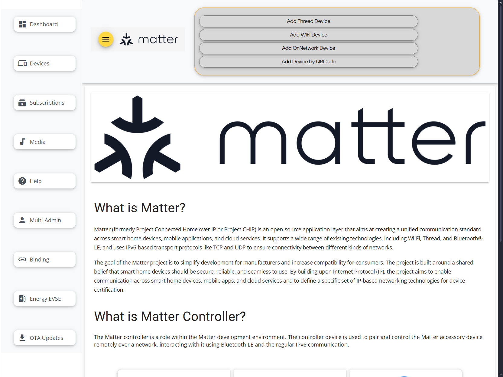

# [Yocto](https://www.yoctoproject.org) [Matter](https://www.home-assistant.io/integrations/matter)

[](https://github.com/lankahsu520/CrossCompilationX)
[![GitHub license][license-image]][license-url]
[![GitHub stars][stars-image]][stars-url]
[![GitHub forks][forks-image]][forks-url]
[![GitHub issues][issues-image]][issues-image]


[license-image]: https://img.shields.io/github/license/lankahsu520/CrossCompilationX.svg
[license-url]: https://github.com/lankahsu520/CrossCompilationX/blob/master/LICENSE
[stars-image]: https://img.shields.io/github/stars/lankahsu520/CrossCompilationX.svg
[stars-url]: https://github.com/lankahsu520/CrossCompilationX/stargazers
[forks-image]: https://img.shields.io/github/forks/lankahsu520/CrossCompilationX.svg
[forks-url]: https://github.com/lankahsu520/CrossCompilationX/network
[issues-image]: https://img.shields.io/github/issues/lankahsu520/CrossCompilationX.svg
[issues-url]: https://github.com/lankahsu520/CrossCompilationX/issues

# 1. Overview

> [[維基百科] Matter](https://zh.wikipedia.org/zh-tw/Matter)
>
> **Matter**是一項[智慧型家居](https://zh.wikipedia.org/wiki/智能家居)的[開源標準](https://zh.wikipedia.org/wiki/开源标准)，由[連接標準聯盟](https://zh.wikipedia.org/wiki/连接标准联盟)制定、認證、推廣，該標準基於網際網路協定（IP），遵循該標準的智慧型家居裝置、行動應用程式和雲服務能夠進行互聯和通信。

# 2. Build and Target

> 請善用 [cookerX](https://github.com/lankahsu520/CrossCompilationX/tree/master/Yocto/cookerX)，這是本作者包裝後的整合平台。以下內容都將採用此開發。

## 2.1. Environment

| ITEM        | VERSION         |
| ----------- | --------------- |
| Hardware    | 8MMINILPD4‑EVKB |
| Yocto       | 5.2 Walnascar   |
| Building OS | Ubuntu 20.04    |
| Python      | 3.10.18         |

## 2.2. Build

| ITEM         | FILE                                  |
| ------------ | ------------------------------------- |
| configure    | imx8mm-walnascar-matter.conf          |
| cooker-menu: | imx8mm-evk-walnascar-matter-menu.json |

```bash
$ git clone https://github.com/lankahsu520/CrossCompilationX.git
$ cd CrossCompilationX/Yocto/cookerX/
$ . confs/imx8mm-walnascar-matter.conf
$ make
```

## 2.3. Target

| ITEM        | FILE                                                 |
| ----------- | ---------------------------------------------------- |
| u-boot      | imx-boot-imx8mmevk-matter-trusty.bin-flash_evk       |
| u-boot-env  | u-boot-imx-initial-env-trusty                        |
| Image       | imx-image-multimedia-imx8mmevk-matter.rootfs.wic.zst |
| RAUC Bundle |                                                      |

## 2.4. Burn

### 2.4.1. uuu

```bash
$ cd /drives/d/WINAPPS/Worker/uuu
$ uuu -lsusb
$ uuu -b emmc_all \
 ./evkb/imx-boot-imx8mmevk-matter-trusty.bin-flash_evk \
 ./evkb/imx-image-multimedia-imx8mmevk-matter.rootfs.wic.zst
```

### 2.4.2. rauc install

```bash

```

# 3. Layers

## 3.1. [meta-nxp-connectivity](https://github.com/nxp-imx/meta-nxp-connectivity)

> [MPU / Linux® Hosted Matter Development Platform](https://www.nxp.com/design/design-center/development-boards-and-designs/MPU-LINUX-MATTER-DEV-PLATFORM)

> This repository contains the i.MX MPU project Matter related Yocto recipes. The following modules will be built with this meta-nxp-connectivity layer:
>
> - **Matter** (CHIP) : https://github.com/nxp/matter.git
> - **OpenThread** Daemon: https://github.com/openthread/openthread
> - **OpenThread Border Router**: https://github.com/openthread/ot-br-posix
> - **Zigbee** Stack and application examples: [meta-nxp-zigbee-rcp](https://github.com/nxp-imx/meta-nxp-connectivity/blob/master/docs/guides/meta-nxp-connectivity-iwxxx-dualpan.md) and [zbcoord](https://github.com/nxp-imx/meta-nxp-connectivity/blob/master/meta-nxp-connectivity-examples/recipes-zbcoord/zbcoord)
> - **Matter-NCP** [nxp-matter-ncp](https://github.com/nxp-imx/meta-nxp-connectivity/blob/master/docs/guides/nxp_matter_ncp_guide.md)
>
> All the software components revisions are based on [Matter v1.4.1](https://github.com/project-chip/connectedhomeip/tree/v1.4-branch)

> The following Matter related binaries will be installed into the Yocto image root filesystem by this Yocto layer recipes:
>
> - chip-lighting-app: Matter lighting app demo
> - chip-lighting-app-trusty: Matter lighting app with enhanced security on i.MX8M Mini
> - chip-all-clusters-app: Matter all-clusters demo
> - thermostat-app: Matter thermostat demo
> - nxp-thermostat-app: NXP customized thermostat application which is used for Matter Certification
> - nxp-thermostat-app-trusty: NXP customized thermostat application with enhanced security on i.MX8M Mini
> - chip-bridge-app: Matter bridge demo
> - imx-chip-bridge-app: NXP customized Zigbee bridge application
> - nxp-media-app: NXP customized media application
> - nxp-media-app-trusty: NXP customized media application with enhanced security on i.MX8M Mini
> - chip-energy-management-app: Matter energy management app demo
> - chip-tool: Matter Controller tool
> - chip-tool-trusty: Matter Controller tool with enhanced security for i.MX8M Mini
> - chip-tool-web2: Matter Web Controller tool2 with Angular Material UI
> - chip-ota-provider-app: Matter ota provider app demo
> - chip-ota-requestor-app: Matter ota requestor app demo
> - ot-daemon: OpenThread Daemon for OpenThread client
> - ot-client-ctl: OpenThread ctrl tool for OpenThread client
> - otbr-agent: OpenThread Border Router agent
> - ot-ctl: OpenThread Border Router ctrl tool
> - ot-daemon-iwxxx: OpenThread Daemon for OpenThread client of the IW612 chipset and IW610 chipset
> - ot-client-iwxxx: OpenThread ctrl tool for OpenThread client of the IW612 chipset and IW610 chipset
> - otbr-agent-iwxxx: OpenThread Border Router agent of the IW612 chipset and IW610 chipset
> - ot-ctl-iwxxx: OpenThread Border Router ctrl tool of the IW612 chipset and IW610 chipset
> - otbr-web: OpenThread Border Router web management daemon

### 3.1.1. Update layer

#### A. update $PJ_COOKER_MENU

>  變更 meta-nxp-connectivity
>
>  "branch": "master",
>
>  "rev": "refs/tags/imx_matter_2025_q2"
>
>  "DISTRO = 'fsl-imx-xwayland'"

```bash
$ echo $PJ_COOKER_MENU
imx8mm-evk-walnascar-matter-menu.json

# 更新 $PJ_COOKER_MENU
$ vi cooker-menu/$PJ_COOKER_MENU
  ...
  "sources": [
  	...
    {
      "url": "https://github.com/nxp-imx/meta-nxp-connectivity",
      "branch": "master",
      "dir": "meta-nxp-connectivity",
      "rev": "refs/tags/imx_matter_2025_q2"
    },
   ...
  ],
  "layers": [
    ...
    "meta-nxp-connectivity/meta-nxp-matter-advanced",
    "meta-nxp-connectivity/meta-nxp-otbr",
    "meta-nxp-connectivity/meta-nxp-connectivity-examples",
    "meta-nxp-connectivity/meta-nxp-zigbee-rcp"
  ],
  "builds": {
    "imx8mm-evk-walnascar-matter": {
      "target": "imx-image-multimedia",
      "local.conf": [
        "MACHINE = 'imx8mmevk-matter'",
        "DISTRO = 'fsl-imx-xwayland'",
        "CONF_VERSION = '2'",
        "ACCEPT_FSL_EULA = '1'",
        "EXTRA_IMAGE_FEATURES  = 'allow-empty-password empty-root-password allow-root-login package-management'",
        "PATCHRESOLVE = 'noop'",
        "PACKAGECONFIG:append:pn-qemu-system-native = 'sdl'",
        "IMAGE_FSTYPES += ' wic.zst ext4'",
        "PACKAGE_CLASSES = 'package_deb'",
        "USER_CLASSES = 'buildstats'",
        "WKS_FILE = 'imx-imx-boot-bootpart-lanka520.wks.in'",
        "IMAGE_INSTALL:append = ' tree net-tools helloworld123'"
      ]
    }
  }

# 更新完記得執行
$ cooker generate

$ cat $PJ_YOCTO_BUILD_DIR/conf/local.conf
$ cat $PJ_YOCTO_BUILD_DIR/conf/bblayers.conf

$ bitbake-layers show-recipes matter
NOTE: Reconnecting to bitbake server...
NOTE: Retrying server connection (#1)... (13:37:04.484278)
NOTE: Reconnecting to bitbake server...
NOTE: Reconnecting to bitbake server...
NOTE: Retrying server connection (#1)... (13:37:04.484278)
NOTE: Retrying server connection (#1)... (13:37:04.484278)
NOTE: Starting bitbake server...
Loading cache: 100% |##########################################################################################| Time: 0:00:04
Loaded 6051 entries from dependency cache.
Parsing recipes: 100% |########################################################################################| Time: 0:00:01
Parsing of 3816 .bb files complete (3815 cached, 1 parsed). 6052 targets, 741 skipped, 4 masked, 0 errors.
WARNING: preferred version 4.19.imx+stable of xen not available
WARNING: versions of xen available: 4.19.0+stable 4.20.0+stable 4.21-dev+git
=== Matching recipes: ===
matter:
  meta-nxp-matter-baseline 1.0
```

### 3.1.2. Recipes

```bash
$ oe-pkgdata-util list-pkgs | grep matter
matter
matter-dbg
matter-dev
matter-ncp
matter-ncp-dbg
matter-ncp-dev
matter-ncp-src
matter-src
packagegroup-nxp-matter-baseline
packagegroup-nxp-matter-baseline-dbg
packagegroup-nxp-matter-baseline-dev
perl-module-tap-formatter-base
perl-module-tap-formatter-color
perl-module-tap-formatter-console
perl-module-tap-formatter-console-parallelsession
perl-module-tap-formatter-console-session
perl-module-tap-formatter-file
perl-module-tap-formatter-file-session
perl-module-tap-formatter-session
perl-module-test-builder-formatter
perl-module-test2-asyncsubtest-formatter
perl-module-test2-formatter
perl-module-test2-formatter-tap
perl-module-test2-manual-tooling-formatter
```

#### A. matter

> [ChatGPT]
>
> - 主套件，提供 **可執行檔 / library runtime**。
> - 通常包含：
>   - `chip-tool`（Matter 測試與控制工具）
>   - runtime libraries（例如 libCHIP.so 等）
> - 如果你要在 target 上 **執行 Matter 節點或測試工具**，裝這個就夠。

```bash
$ oe-pkgdata-util list-pkg-files matter
matter:
        /usr/bin/M2ZigbeeRcp-bridge
        /usr/bin/chip-all-clusters-app
        /usr/bin/chip-bridge-app
        /usr/bin/chip-energy-management-app
        /usr/bin/chip-lighting-app
        /usr/bin/chip-lighting-app-trusty
        /usr/bin/chip-nxp-battery-storage-app
        /usr/bin/chip-nxp-device-energy-management-app
        /usr/bin/chip-nxp-evse-app
        /usr/bin/chip-nxp-heat-pump-app
        /usr/bin/chip-nxp-solar-power-app
        /usr/bin/chip-nxp-water-heater-app
        /usr/bin/chip-ota-provider-app
        /usr/bin/chip-ota-requestor-app
        /usr/bin/chip-tool
        /usr/bin/chip-tool-trusty
        /usr/bin/chip-tool-web2
        /usr/bin/imx-chip-bridge-app
        /usr/bin/matter-nxp-network-manager-app
        /usr/bin/nxp-media-app
        /usr/bin/nxp-media-app-trusty
        /usr/bin/nxp-thermostat-app
        /usr/bin/nxp-thermostat-app-trusty
        /usr/bin/ota.sh
        /usr/bin/thermostat-app
        /usr/share/chip-tool-web/frontend2/3rdpartylicenses.txt
        /usr/share/chip-tool-web/frontend2/assets/brand_boarder.png
        /usr/share/chip-tool-web/frontend2/assets/cellular_image.png
        /usr/share/chip-tool-web/frontend2/assets/download/DMSans.css
        /usr/share/chip-tool-web/frontend2/assets/download/MaterialIcons.css
        /usr/share/chip-tool-web/frontend2/assets/download/OpenSans.css
        /usr/share/chip-tool-web/frontend2/assets/download/Roboto.css
        /usr/share/chip-tool-web/frontend2/assets/download/bootstrap.esm.min.js
        /usr/share/chip-tool-web/frontend2/assets/download/bootstrap.min.css
        /usr/share/chip-tool-web/frontend2/assets/download/es-module-shims.min.js
        /usr/share/chip-tool-web/frontend2/assets/download/popper.min.js
        /usr/share/chip-tool-web/frontend2/assets/endpoint/actuator.png
        /usr/share/chip-tool-web/frontend2/assets/endpoint/off_light.png
        /usr/share/chip-tool-web/frontend2/assets/endpoint/on_light.png
        /usr/share/chip-tool-web/frontend2/assets/endpoint/onoffLight.png
        /usr/share/chip-tool-web/frontend2/assets/endpoint/output-onlinejpgtools.png
        /usr/share/chip-tool-web/frontend2/assets/endpoint/switch.png
        /usr/share/chip-tool-web/frontend2/assets/endpoint/unknown-device.png
        /usr/share/chip-tool-web/frontend2/assets/ethernet_cable.png
        /usr/share/chip-tool-web/frontend2/assets/information.png
        /usr/share/chip-tool-web/frontend2/assets/matter-logo-transparent.png
        /usr/share/chip-tool-web/frontend2/assets/matter_lkup_rgb_night.png
        /usr/share/chip-tool-web/frontend2/assets/matteradvantages/easy-to-use.png
        /usr/share/chip-tool-web/frontend2/assets/matteradvantages/interoperable.jpg
        /usr/share/chip-tool-web/frontend2/assets/matteradvantages/open.png
        /usr/share/chip-tool-web/frontend2/assets/matteradvantages/secure-png.png
        /usr/share/chip-tool-web/frontend2/assets/off-about-matter-controller.png
        /usr/share/chip-tool-web/frontend2/assets/off-aqara-contact-sensor.png
        /usr/share/chip-tool-web/frontend2/assets/off-matter-thread-smart-plug.png
        /usr/share/chip-tool-web/frontend2/assets/off-matter-thread-switch.png
        /usr/share/chip-tool-web/frontend2/assets/off-remote-control-switch.png
        /usr/share/chip-tool-web/frontend2/assets/off-wifi-lamp.png
        /usr/share/chip-tool-web/frontend2/assets/on-about-matter-controller.png
        /usr/share/chip-tool-web/frontend2/assets/on-aqara-contact-sensor.png
        /usr/share/chip-tool-web/frontend2/assets/on-matter-thread-smart-plug.png
        /usr/share/chip-tool-web/frontend2/assets/on-matter-thread-switch.png
        /usr/share/chip-tool-web/frontend2/assets/on-remote-control-switch.png
        /usr/share/chip-tool-web/frontend2/assets/on-wifi-lamp.png
        /usr/share/chip-tool-web/frontend2/assets/thread-logo-transparent.png
        /usr/share/chip-tool-web/frontend2/assets/thread-logo.png
        /usr/share/chip-tool-web/frontend2/assets/unknown-device.png
        /usr/share/chip-tool-web/frontend2/assets/warning.png
        /usr/share/chip-tool-web/frontend2/assets/wifi-logo-transparent.png
        /usr/share/chip-tool-web/frontend2/assets/wifi-logo.png
        /usr/share/chip-tool-web/frontend2/assets/wireless-transparent.png
        /usr/share/chip-tool-web/frontend2/chunk-BPTCI7HN.js
        /usr/share/chip-tool-web/frontend2/chunk-CWTPBX7D.js
        /usr/share/chip-tool-web/frontend2/chunk-HGXKGYPR.js
        /usr/share/chip-tool-web/frontend2/chunk-KASNEJX2.js
        /usr/share/chip-tool-web/frontend2/favicon.ico
        /usr/share/chip-tool-web/frontend2/index.html
        /usr/share/chip-tool-web/frontend2/main-KA7AXMS2.js
        /usr/share/chip-tool-web/frontend2/media/MaterialIcons-Regular-6L3Y2GNX.ttf
        /usr/share/chip-tool-web/frontend2/media/MaterialIcons-Regular-U2GL72GC.woff
        /usr/share/chip-tool-web/frontend2/media/MaterialIcons-Regular-XCCG7ODX.woff2
        /usr/share/chip-tool-web/frontend2/media/bootstrap-icons-OCU552PF.woff
        /usr/share/chip-tool-web/frontend2/media/bootstrap-icons-X6UQXWUS.woff2
        /usr/share/chip-tool-web/frontend2/media/fa-brands-400-4RSXLDQT.woff2
        /usr/share/chip-tool-web/frontend2/media/fa-brands-400-RP3MZ4AX.ttf
        /usr/share/chip-tool-web/frontend2/media/fa-regular-400-6ODLNN6G.woff2
        /usr/share/chip-tool-web/frontend2/media/fa-regular-400-VE33OVPX.ttf
        /usr/share/chip-tool-web/frontend2/media/fa-solid-900-BALFL4QR.ttf
        /usr/share/chip-tool-web/frontend2/media/fa-solid-900-ZZETRIYD.woff2
        /usr/share/chip-tool-web/frontend2/media/fa-v4compatibility-5WGRUVBC.woff2
        /usr/share/chip-tool-web/frontend2/media/fa-v4compatibility-7DCIFHD7.ttf
        /usr/share/chip-tool-web/frontend2/polyfills-RT5I6R6G.js
        /usr/share/chip-tool-web/frontend2/scripts-YM45C2HQ.js
        /usr/share/chip-tool-web/frontend2/styles-TEBVNUCQ.css
```

```bash
$ bb-info matter
$ bitbake -c build matter

$ bitbake -e imx-image-multimedia | grep matter
```

```bash
$ ll $PJ_YOCTO_LAYERS_DIR/meta-nxp-connectivity/meta-nxp-matter-baseline/recipes-matter/matter/matter.bb

# git clone -b v1.4.1-branch-nxp_imx_2025_q2 https://github.com/NXP/matter.git

$ bb-info matter

matter                                                :1.0-r0
matter-ncp                                            :1.0-r0
meta-environment-extsdk-imx8mmevk-matter                   :1.0-r0
meta-environment-imx8mmevk-matter                     :1.0-r0
packagegroup-cross-canadian-imx8mmevk-matter                   :1.0-r0
packagegroup-go-cross-canadian-imx8mmevk-matter                   :1.0-r0
packagegroup-nxp-matter-baseline                      :1.0-r0
packagegroup-rust-cross-canadian-imx8mmevk-matter                   :1.0-r0

./layers-walnascar/meta-nxp-connectivity/meta-nxp-matter-baseline/recipes-matter/matter/matter.bb
./layers-walnascar/meta-nxp-connectivity/meta-nxp-connectivity-examples/recipes-connectivity/matter-ncp/matter-ncp.bb

SRC_URI="gitsm://github.com/NXP/matter.git;protocol=https;branch=v1.4.1-branch-nxp_imx_2025_q2 file://0001-MATTER-1352-2-Add-se_version.h.patch;patchdir=third_party/imx-secure-enclave/repo/ file://ota.sh"

S="/yocto/cookerX-walnascar/builds/build-imx8mm-evk-walnascar-matter/tmp/work/armv8a-poky-linux/matter/1.0/git"

WORKDIR="/yocto/cookerX-walnascar/builds/build-imx8mm-evk-walnascar-matter/tmp/work/armv8a-poky-linux/matter/1.0"

D="/yocto/cookerX-walnascar/builds/build-imx8mm-evk-walnascar-matter/tmp/work/armv8a-poky-linux/matter/1.0/image"

RECIPE_SYSROOT="/yocto/cookerX-walnascar/builds/build-imx8mm-evk-walnascar-matter/tmp/work/armv8a-poky-linux/matter/1.0/recipe-sysroot"

DEPENDS="gcc-cross-aarch64 virtual/compilerlibs virtual/libc gn-native ninja-native avahi dbus-glib-native pkgconfig-native boost python3-pip-native python3-packaging python3-click zigbee-rcp-sdk"

RDEPENDS:${KERNEL_PACKAGE_NAME}-image:imx8dx-mek=""
RDEPENDS:${KERNEL_PACKAGE_NAME}-image:imx8dxl-a1-ddr3l-evk=""
RDEPENDS:${KERNEL_PACKAGE_NAME}-image:imx8dxl-a1-lpddr4-evk=""
RDEPENDS:${KERNEL_PACKAGE_NAME}-image:imx8dxl-b0-ddr3l-evk=""
RDEPENDS:${KERNEL_PACKAGE_NAME}-image:imx8dxl-b0-lpddr4-evk=""
RDEPENDS:${KERNEL_PACKAGE_NAME}-image:imx8qm-mek=""
RDEPENDS:${KERNEL_PACKAGE_NAME}-image:imx8qxp-mek=""
RDEPENDS:matter="  zigbee-rcp-sdk "
RDEPENDS:matter-staticdev="matter-dev (= 1.0-r0)"
RDEPENDS_matter="  libavahi-client boost boost-dev boost-staticdev "
```

#### B. matter-dbg

> [ChatGPT]
>
> - Debug symbol 套件，Yocto 自動生成。
> - 主要提供 `.debug` 檔案，可以在 target 上用 gdb 除錯 Matter 程式。
> - 正式量產韌體通常不會安裝，只在開發與除錯時用。

#### C. matter-dev

> [ChatGPT]
>
> - 開發套件（headers, symlinks, pkgconfig）。
> - 內容：
>   - `/usr/include/` 下的 Matter headers
>   - `.so` 的 symlink（方便開發連結）
>   - `.pc` pkg-config 檔案
> - 如果你要在 Yocto image 上 **開發或編譯其他需要連動 Matter 的程式**，才會需要。

#### D. matter-src

> [ChatGPT]
>
> - 原始碼套件（有些 recipe 會額外產出）。
> - 內容可能是原始碼壓縮檔或完整 source tree。
> - 方便 **在 target 端做二次編譯或分析**，但一般很少用。

#### E. matter-ncp

> 簡單講就是當接上  Zigbee USB dongle，就要有 matter-ncp over  **UART (有些是 USB CDC/serial) 或 SPI** 來跟它溝通。

> [ChatGPT]
>
> - NCP = **Network Co-Processor**。
> - 這個套件通常包含 **NCP 韌體或 host 驅動程式**。
> - 用在 **兩晶片架構**：
>   - MCU/SoC 跑 Matter stack 作為 NCP
>   - 主 CPU (Linux) 跑 host app，透過 UART/SPI 控制
> - 例如：在 i.MX8 上跑 Linux + NCP (802.15.4/Thread radio) 模式。

# 4. Check

## 4.1. Build

### 4.1.1. Image

> 請先編譯出 image

```bash
# 編譯
$ make
# or
$ bitbake imx-image-multimedia

# the Yocto SDK toolchain with meta-nxp-connectivity
$ bitbake imx-image-sdk -c populate_sdk
```

## 4.2. Check Image

### 4.2.1. Matter Controller tool

```bash
$ cd-rootfs
$ find123 chip-tool chip-lighting-app chip-tool-web2
```

### 4.2.2. OpenThread Border Router (OTBR)

```bash
$ cd-rootfs
$ find123 otbr-agent ot-ctl otbr-web
```

### 4.2.3. OpenThread

```bash
$ cd-rootfs
$ find123 ot-daemon ot-client-ctl
```

# 5. Showtime

## 5.1. [Working with the chip-tool-web2](https://github.com/nxp-imx/meta-nxp-connectivity/blob/master/docs/guides/nxp_chip_tool_web2_guide.md)

#### A. chip-tool

>請參考 [helper_MatterController-chip-tool.md](https://github.com/lankahsu520/HelperX/blob/master/helper_MatterController-chip-tool.md)

```bash
$ chip-tool interactive start --paa-trust-store-path ~/paa-root-certs
```

```bash
>>> pairing code 1234 21718613662
>>> onoff toggle 1234 1
```

#### B. chip-tool-web2

> 不支援 --paa-trust-store-path，所以沒辦法與市售的產品進行對測。

```bash
$ chip-tool-web2
```

> http://192.168.31.62:8889



## 5.2. [Running Matter demos on i.MX MPU platforms](https://github.com/nxp-imx/meta-nxp-connectivity/blob/master/docs/guides/nxp_mpu_matter_demos.md)

# 6. Debug

# Appendix

# I. Study

## I.1. [Running Matter demos on i.MX MPU platforms](https://github.com/nxp-imx/meta-nxp-connectivity/blob/master/docs/guides/nxp_mpu_matter_demos.md)

## I.2. [[ NXP & Matter 系列 ] (一) 建立 K32W 範例 lighting-app](https://www.wpgdadatong.com/blog/detail/72138)

# II. Debug

## II.1. No up to date source found: clone directory not available or not up to date: xxx

#### A. zigbee_coordinator.bb

> $PJ_YOCTO_LAYERS_DIR/meta-nxp-connectivity/meta-nxp-connectivity-examples/recipes-zbcoord/zbcoord/zigbee_coordinator.bb

> [nxp-mcuxpresso](https://github.com/nxp-mcuxpresso)/**[mcuxsdk-middleware-zigbee](https://github.com/nxp-mcuxpresso/mcuxsdk-middleware-zigbee)**
>
> zigbee middleware, part of the SDK for K32W0 and K32W1 products

```bash
ERROR: zigbee-coordinator-coordinator-r0 do_unpack: Bitbake Fetcher Error: UnpackError('No up to date source found: clone directory not available or not up to date: /yocto-cache/downloads//git2/github.com.nxp-mcuxpresso.mcuxsdk-middleware-zigbee.git; shallow clone not enabled', 'git://github.com/nxp-mcuxpresso/mcuxsdk-middleware-zigbee.git;branch=release/24.12.00-pvw2;protocol=https')
ERROR: Logfile of failure stored in: /yocto/8MMINILPD4-EVKB-walnascar/bld-xwayland-imx8mm/tmp/work/armv8a-poky-linux/zigbee-coordinator/coordinator/temp/log.do_unpack.3853029
ERROR: Task (/yocto/8MMINILPD4-EVKB-walnascar/sources/meta-nxp-connectivity/meta-nxp-connectivity-examples/recipes-zbcoord/zbcoord/zigbee_coordinator.bb:do_unpack) failed with exit code '1'
```
```bash
# 先清除 cache，再次編譯就可
$ bitbake -c cleansstate zigbee-coordinator
$ bitbake -c build zigbee-coordinator
```

#### B. storageproxyd.bb

> $PJ_YOCTO_LAYERS_DIR/meta-nxp-connectivity/meta-nxp-matter-advanced/recipes-storageproxyd/storageproxyd/storageproxyd.bb

> [nxp-imx](https://github.com/nxp-imx)/**[libtrustymatter](https://github.com/nxp-imx/libtrustymatter)**
>
> Trusty OS related support lib for project Matter on i.MX. The Trusty OS component will help to provide the security enhancement for Matter based on NXP i.MX SoC's security IPs.

```bash
ERROR: storageproxyd-1.0-r0 do_unpack: Bitbake Fetcher Error: UnpackError('No up to date source found: clone directory not available or not up to date: /yocto-cache/downloads//git2/github.com.nxp-imx.libtrustymatter.git; shallow clone not enabled', 'gitsm://github.com/nxp-imx/libtrustymatter.git;protocol=https;branch=master')
ERROR: Logfile of failure stored in: /yocto/8MMINILPD4-EVKB-walnascar/bld-xwayland-imx8mm/tmp/work/armv8a-poky-linux/storageproxyd/1.0/temp/log.do_unpack.3853036
ERROR: Task (/yocto/8MMINILPD4-EVKB-walnascar/sources/meta-nxp-connectivity/meta-nxp-matter-advanced/recipes-storageproxyd/storageproxyd/storageproxyd.bb:do_unpack) failed with exit code '1'
```

```bash
$ bitbake -c cleansstate storageproxyd

$ ll /yocto-cache/downloads//git2/github.com.nxp-imx.libtrustymatter.git
```

## II.2. ERROR: zigbee-coordinator-coordinator-r0 do_configure

> 這邊在 do_configure 時，download https://github.com/Mbed-TLS/mbedtls.git 出錯

```bash
| DEBUG: Python function extend_recipe_sysroot finished
| DEBUG: Executing shell function do_configure
| -- Populate mbedtls repository
| [ 11%] Performing download step (git clone) for 'mbedtls_local-populate'
| Cloning into 'repo'...
| fatal: unable to access 'https://github.com/Mbed-TLS/mbedtls.git/': Could not resolve host: github.com
| Cloning into 'repo'...
| fatal: unable to access 'https://github.com/Mbed-TLS/mbedtls.git/': Could not resolve host: github.com
| Cloning into 'repo'...
| fatal: unable to access 'https://github.com/Mbed-TLS/mbedtls.git/': Could not resolve host: github.com
| Had to git clone more than once: 3 times.
| CMake Error at mbedtls_local-subbuild/mbedtls_local-populate-prefix/tmp/mbedtls_local-populate-gitclone.cmake:50 (message):
|   Failed to clone repository: 'https://github.com/Mbed-TLS/mbedtls.git'
|
|
| make[2]: *** [CMakeFiles/mbedtls_local-populate.dir/build.make:102: mbedtls_local-populate-prefix/src/mbedtls_local-populate-stamp/mbedtls_local-populate-download] Error 1
| make[1]: *** [CMakeFiles/Makefile2:87: CMakeFiles/mbedtls_local-populate.dir/all] Error 2
| make: *** [Makefile:91: all] Error 2

```

```bash
# 修改 zigbee_coordinator.bb
$ vi $PJ_YOCTO_LAYERS_DIR/meta-nxp-connectivity/meta-nxp-connectivity-examples/recipes-zbcoord/zbcoord/zigbee_coordinator.bb

do_configure() {
    #local http_proxy="${MY_HTTP_PROXY}"
    #local https_proxy="${MY_HTTPS_PROXY}"

    #if [ -n "$http_proxy" ]; then
    #    export http_proxy
    #fi
    #if [ -n "$https_proxy" ]; then
    #    export https_proxy
    #fi
    cd ${S}/examples/zigbee_coordinator/build_linux
    cmake ./ -DMACHINE_TYPE=imx8 -DCONFIG_MBEDTLS_SOURCE=SYSTEM -DMbedTLS_DIR=${STAGING_DIR_TARGET}/usr/lib/cmake/MbedTLS -DENABLE_TESTING=OFF -DENABLE_PROGRAMS=OFF
}
```

# III. Glossary

# IV. Tool Usage

# Author

> Created and designed by [Lanka Hsu](lankahsu@gmail.com).

# License

> [CrossCompilationX](https://github.com/lankahsu520/CrossCompilationX) is available under the BSD-3-Clause license. See the LICENSE file for more info.

