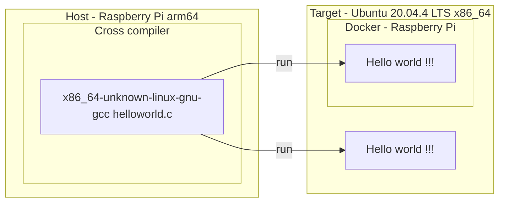

[](https://github.com/lankahsu520/CrossCompilationX)
[![GitHub license][license-image]][license-url]
[![GitHub stars][stars-image]][stars-url]
[![GitHub forks][forks-image]][forks-url]
[![GitHub issues][issues-image]][issues-image]


[license-image]: https://img.shields.io/github/license/lankahsu520/CrossCompilationX.svg
[license-url]: https://github.com/lankahsu520/CrossCompilationX/blob/master/LICENSE
[stars-image]: https://img.shields.io/github/stars/lankahsu520/CrossCompilationX.svg
[stars-url]: https://github.com/lankahsu520/CrossCompilationX/stargazers
[forks-image]: https://img.shields.io/github/forks/lankahsu520/CrossCompilationX.svg
[forks-url]: https://github.com/lankahsu520/CrossCompilationX/network
[issues-image]: https://img.shields.io/github/issues/lankahsu520/CrossCompilationX.svg
[issues-url]: https://github.com/lankahsu520/CrossCompilationX/issues

# 1. Overview

>[Crosstool-NG](https://crosstool-ng.github.io/) is a versatile (cross) toolchain generator. It supports many architectures and components and has a simple yet powerful menuconfig-style interface. Please read the [introduction](https://crosstool-ng.github.io/docs/introduction/) and refer to the [documentation](https://crosstool-ng.github.io/docs/) for more information.

> 簡單來說就是產出 toolchain，幫助軟體工程師開發軟體，並利於執行在不同平台上。

# 2. x86_64-unknown-linux-gnu on PI

>本篇主要希望在 Raspberry Pi上，利用 toolchain 產出 Helloworld (x86_64)，然後將 Helloworld  放至 Ubuntu 20.04.4 LTS x86_64上執行。因此透過 Crosstool-NG 建立 toolchain。
>
>不過由於 Raspberry Pi 的執行效能較差，將會很浪費時間。

>Host: Raspberry Pi3
>
>Target: Ubuntu 20.04 x86_64



## 2.1. Generate toolchain

#### A. Update Pi

> 安裝必要的軟體套件

```bash
sudo apt-get install -y libtool-bin 
sudo apt-get install -y help2man
sudo apt-get install -y flex texinfo
sudo apt-get install -y gawk
sudo apt-get install -y libncurses5-dev

sudo apt-get install -y bison
sudo apt-get install -y byacc
```

#### B. Install crosstool-ng

> 進行安裝 crosstool-ng

```bash
$ git clone https://github.com/crosstool-ng/crosstool-ng.git
or
$ wget https://github.com/crosstool-ng/crosstool-ng/archive/refs/tags/crosstool-ng-1.25.0.tar.gz
$ tar -zxvf crosstool-ng-1.25.0.tar.gz

$ cd crosstool-ng-crosstool-ng-1.25.0
$ ./bootstrap
$ ./configure --prefix=/work/codebase/toolchainSDK/crosstool-ng
$ make; make install

```
#### C. Select x86_64-unknown-linux-gnu

```bash
$ unset LD_LIBRARY_PATH
$ export PATH=/work/codebase/toolchainSDK/crosstool-ng/bin:$PATH

$ ct-ng list-samples
$ ct-ng show-x86_64-unknown-linux-gnu

```
#### D. Working Folder

```bash
$ mkdir -p /work/codebase/x86_64; cd /work/codebase/x86_64
$ ct-ng x86_64-unknown-linux-gnu

# 如何選擇 glibc 版本，請見 II.3
$ ct-ng menuconfig
Paths and misc options  --->
	[*] Debug crosstool-NG
	[*]   Save intermediate steps
	[*]     gzip saved states (NEW)
	(${CT_TOP_DIR}/.build) Working directory
	    *** Paths ***
	(${CT_PREFIX:-${HOME}/x-tools}/${CT_HOST:+HOST-${CT_HOST}/}${CT_TARGET}) Prefix directory
	(0) Number of parallel jobs
Target options  --->
Toolchain options  --->
	(unknown) Tuple's vendor string
C-library  --->
	Version of glibc (2.31)  --->
```

```bash
# if change .config
$ vi .config
$ ct-ng oldconfig
```

##### .config

> 這邊可以修改，保留相關 tarballs

```bash
CT_LOCAL_TARBALLS_DIR="/work/codebase/toolchainSDK/tarballs"

(${CT_PREFIX:-${CT_TOP_DIR}/}/${CT_HOST:+HOST-${CT_HOST}/}${CT_TARGET}) Prefix directory

CT_TARGET_VENDOR="lanka"
```

#### E. Build

```bash
$ ct-ng build
```

##### E.1. Building log

##### - PI3

>Host: PI3
>
>Target: x86_64

```bash
[INFO ]  Performing some trivial sanity checks
[WARN ]  Number of open files 1024 may not be sufficient to build the toolchain; increasing to 2048
[INFO ]  Build started 20220826.204623
[INFO ]  Building environment variables
[WARN ]  Directory '/home/pi/src' does not exist.
[WARN ]  Will not save downloaded tarballs to local storage.
[EXTRA]  Preparing working directories
[EXTRA]  Installing user-supplied crosstool-NG configuration
[EXTRA]  =================================================================
[EXTRA]  Dumping internal crosstool-NG configuration
[EXTRA]    Building a toolchain for:
[EXTRA]      build  = armv7l-unknown-linux-gnueabihf
[EXTRA]      host   = armv7l-unknown-linux-gnueabihf
[EXTRA]      target = x86_64-unknown-linux-gnu
[EXTRA]  Dumping internal crosstool-NG configuration: done in 8.79s (at 11:40)
[INFO ]  =================================================================
[INFO ]  Retrieving needed toolchain components' tarballs
[INFO ]  Retrieving needed toolchain components' tarballs: done in 7.51s (at 11:48)
[INFO ]  =================================================================
[INFO ]  Extracting and patching toolchain components
[INFO ]  Extracting and patching toolchain components: done in 8.43s (at 11:56)
[INFO ]  Saving state to restart at step 'companion_tools_for_build'...
[INFO ]  Saving state to restart at step 'companion_libs_for_build'...
[INFO ]  =================================================================
[INFO ]  Installing ncurses for build
[EXTRA]    Configuring ncurses
[EXTRA]    Building ncurses
[EXTRA]    Installing ncurses
[INFO ]  Installing ncurses for build: done in 225.90s (at 15:45)
[INFO ]  Saving state to restart at step 'binutils_for_build'...
[INFO ]  Saving state to restart at step 'companion_tools_for_host'...
[INFO ]  Saving state to restart at step 'companion_libs_for_host'...
[INFO ]  =================================================================
[INFO ]  Installing zlib for host
[EXTRA]    Configuring zlib
[EXTRA]    Building zlib
[EXTRA]    Installing zlib
[INFO ]  Installing zlib for host: done in 21.87s (at 16:12)
[INFO ]  =================================================================
[INFO ]  Installing GMP for host
[EXTRA]    Configuring GMP
[EXTRA]    Building GMP
[EXTRA]    Installing GMP
[INFO ]  Installing GMP for host: done in 659.19s (at 27:12)
[INFO ]  =================================================================
[INFO ]  Installing MPFR for host
[EXTRA]    Configuring MPFR
[EXTRA]    Building MPFR
[EXTRA]    Installing MPFR
[INFO ]  Installing MPFR for host: done in 349.29s (at 33:01)
[INFO ]  =================================================================
[INFO ]  Installing ISL for host
[EXTRA]    Configuring ISL
[EXTRA]    Building ISL
[EXTRA]    Installing ISL
[INFO ]  Installing ISL for host: done in 348.67s (at 38:50)
[INFO ]  =================================================================
[INFO ]  Installing MPC for host
[EXTRA]    Configuring MPC
[EXTRA]    Building MPC
[EXTRA]    Installing MPC
[INFO ]  Installing MPC for host: done in 137.69s (at 41:08)
[INFO ]  =================================================================
[INFO ]  Installing expat for host
[EXTRA]    Configuring expat
[EXTRA]    Building expat
[EXTRA]    Installing expat
[INFO ]  Installing expat for host: done in 221.18s (at 44:49)
[INFO ]  =================================================================
[INFO ]  Installing ncurses for host
[EXTRA]    Configuring ncurses
[EXTRA]    Building ncurses
[EXTRA]    Installing ncurses
[INFO ]  Installing ncurses for host: done in 304.56s (at 49:53)
[INFO ]  =================================================================
[INFO ]  Installing libiconv for host
[EXTRA]    Skipping (included in GNU C library)
[INFO ]  Installing libiconv for host: done in 0.21s (at 49:54)
[INFO ]  =================================================================
[INFO ]  Installing gettext for host
[EXTRA]    Skipping (included in GNU C library)
[INFO ]  Installing gettext for host: done in 0.19s (at 49:54)
[INFO ]  Saving state to restart at step 'binutils_for_host'...
[INFO ]  =================================================================
[INFO ]  Installing binutils for host
[EXTRA]    Configuring binutils
[EXTRA]    Building binutils
[EXTRA]    Installing binutils
[EXTRA]    Installing ld wrapper
[INFO ]  Installing binutils for host: done in 4913.90s (at 132:04)
[INFO ]  Saving state to restart at step 'libc_headers'...
[INFO ]  Saving state to restart at step 'kernel_headers'...
[INFO ]  =================================================================
[INFO ]  Installing kernel headers
[EXTRA]    Installing kernel headers
[EXTRA]    Checking installed headers
[INFO ]  Installing kernel headers: done in 369.97s (at 140:22)
[INFO ]  Saving state to restart at step 'cc_core'...
[INFO ]  =================================================================
[INFO ]  Installing core C gcc compiler
[EXTRA]    Configuring core C gcc compiler
[EXTRA]    Building gcc
[EXTRA]    Installing gcc
[EXTRA]    Housekeeping for core gcc compiler
[EXTRA]       '' --> lib (gcc)   lib64 (os)
[INFO ]  Installing core C gcc compiler: done in 16565.30s (at 417:46)
[INFO ]  Saving state to restart at step 'libc_main'...
[INFO ]  =================================================================
[INFO ]  Installing C library
[INFO ]    =================================================================
[INFO ]    Building for multilib 1/1: ''
[EXTRA]      Configuring C library
[EXTRA]      Building C library
[EXTRA]      Installing C library
[INFO ]    Building for multilib 1/1: '': done in 6735.80s (at 535:00)
[INFO ]  Installing C library: done in 6737.20s (at 535:00)
[INFO ]  Saving state to restart at step 'cc_for_build'...
[INFO ]  Saving state to restart at step 'cc_for_host'...
[INFO ]  =================================================================
[INFO ]  Installing final gcc compiler
[EXTRA]    Configuring final gcc compiler
[EXTRA]    Building final gcc compiler
[EXTRA]    Installing final gcc compiler
[EXTRA]    Housekeeping for final gcc compiler
[EXTRA]       '' --> lib (gcc)   lib64 (os)
[INFO ]  Installing final gcc compiler: done in 20695.56s (at 362:01)
[INFO ]  Saving state to restart at step 'libc_post_cc'...
[INFO ]  Saving state to restart at step 'companion_libs_for_target'...
[INFO ]  Saving state to restart at step 'binutils_for_target'...
[INFO ]  Saving state to restart at step 'debug'...
[INFO ]  =================================================================
[INFO ]  Installing cross-gdb
[EXTRA]    Configuring cross gdb
[EXTRA]    Building cross gdb
[EXTRA]    Installing cross gdb
[EXTRA]    Installing '.gdbinit' template
[INFO ]  Installing cross-gdb: done in 3311.65s (at 449:59)
[INFO ]  =================================================================
[INFO ]  Installing gdb server
[EXTRA]    Configuring native gdb
[EXTRA]    Building native gdb
[EXTRA]    Installing native gdb
[INFO ]  Installing gdb server: done in 839.45s (at 463:58)
[INFO ]  Saving state to restart at step 'test_suite'...
[INFO ]  Saving state to restart at step 'finish'...
[INFO ]  =================================================================
[INFO ]  Finalizing the toolchain's directory
[INFO ]    Stripping all toolchain executables
[EXTRA]    Installing the populate helper
[EXTRA]    Installing a cross-ldd helper
[EXTRA]    Creating toolchain aliases
[EXTRA]    Removing installed documentation
[EXTRA]    Collect license information from: /tmp/sdk/x86_64/.build/x86_64-unknown-linux-gnu/src
[EXTRA]    Put the license information to: /home/pi/x-tools/x86_64-unknown-linux-gnu/share/licenses
[INFO ]  Finalizing the toolchain's directory: done in 573.96s (at 491:11)
[INFO ]  Build completed at 20220827.161713
[INFO ]  (elapsed: 1170:50.55)
[INFO ]  Finishing installation (may take a few seconds)...

```

##### - PI4

> Host: PI4
>
> Target: x86_64

```bash
[INFO ]  Performing some trivial sanity checks
[WARN ]  Number of open files 1024 may not be sufficient to build the toolchain; increasing to 2048
[INFO ]  Build started 20220823.144114
[INFO ]  Building environment variables
[WARN ]  Directory '/home/pi/src' does not exist.
[WARN ]  Will not save downloaded tarballs to local storage.
[EXTRA]  Preparing working directories
[EXTRA]  Installing user-supplied crosstool-NG configuration
[EXTRA]  =================================================================
[EXTRA]  Dumping internal crosstool-NG configuration
[EXTRA]    Building a toolchain for:
[EXTRA]      build  = aarch64-unknown-linux-gnu
[EXTRA]      host   = aarch64-unknown-linux-gnu
[EXTRA]      target = x86_64-unknown-linux-gnu
[EXTRA]  Dumping internal crosstool-NG configuration: done in 0.24s (at 00:05)
[INFO ]  =================================================================
[INFO ]  Retrieving needed toolchain components' tarballs
[INFO ]  Retrieving needed toolchain components' tarballs: done in 1.61s (at 00:07)
[INFO ]  =================================================================
[INFO ]  Extracting and patching toolchain components
[INFO ]  Extracting and patching toolchain components: done in 1.77s (at 00:09)
[INFO ]  =================================================================
[INFO ]  Installing ncurses for build
[EXTRA]    Configuring ncurses
[EXTRA]    Building ncurses
[EXTRA]    Installing ncurses
[INFO ]  Installing ncurses for build: done in 61.80s (at 01:11)
[INFO ]  =================================================================
[INFO ]  Installing zlib for host
[EXTRA]    Configuring zlib
[EXTRA]    Building zlib
[EXTRA]    Installing zlib
[INFO ]  Installing zlib for host: done in 6.06s (at 01:17)
[INFO ]  =================================================================
[INFO ]  Installing GMP for host
[EXTRA]    Configuring GMP
[EXTRA]    Building GMP
[EXTRA]    Installing GMP
[INFO ]  Installing GMP for host: done in 105.77s (at 03:02)
[INFO ]  =================================================================
[INFO ]  Installing MPFR for host
[EXTRA]    Configuring MPFR
[EXTRA]    Building MPFR
[EXTRA]    Installing MPFR
[INFO ]  Installing MPFR for host: done in 63.25s (at 04:06)
[INFO ]  =================================================================
[INFO ]  Installing ISL for host
[EXTRA]    Configuring ISL
[EXTRA]    Building ISL
[EXTRA]    Installing ISL
[INFO ]  Installing ISL for host: done in 103.09s (at 05:49)
[INFO ]  =================================================================
[INFO ]  Installing MPC for host
[EXTRA]    Configuring MPC
[EXTRA]    Building MPC
[EXTRA]    Installing MPC
[INFO ]  Installing MPC for host: done in 21.25s (at 06:10)
[INFO ]  =================================================================
[INFO ]  Installing expat for host
[EXTRA]    Configuring expat
[EXTRA]    Building expat
[EXTRA]    Installing expat
[INFO ]  Installing expat for host: done in 26.54s (at 06:37)
[INFO ]  =================================================================
[INFO ]  Installing ncurses for host
[EXTRA]    Configuring ncurses
[EXTRA]    Building ncurses
[EXTRA]    Installing ncurses
[INFO ]  Installing ncurses for host: done in 58.99s (at 07:36)
[INFO ]  =================================================================
[INFO ]  Installing libiconv for host
[EXTRA]    Skipping (included in GNU C library)
[INFO ]  Installing libiconv for host: done in 0.03s (at 07:36)
[INFO ]  =================================================================
[INFO ]  Installing gettext for host
[EXTRA]    Skipping (included in GNU C library)
[INFO ]  Installing gettext for host: done in 0.03s (at 07:36)
[INFO ]  =================================================================
[INFO ]  Installing binutils for host
[EXTRA]    Configuring binutils
[EXTRA]    Building binutils
[EXTRA]    Installing binutils
[EXTRA]    Installing ld wrapper
[INFO ]  Installing binutils for host: done in 1636.02s (at 34:52)
[INFO ]  =================================================================
[INFO ]  Installing kernel headers
[EXTRA]    Installing kernel headers
[EXTRA]    Checking installed headers
[INFO ]  Installing kernel headers: done in 36.70s (at 35:29)
[INFO ]  =================================================================
[INFO ]  Installing core C gcc compiler
[EXTRA]    Configuring core C gcc compiler
[EXTRA]    Building gcc
[EXTRA]    Installing gcc
[EXTRA]    Housekeeping for core gcc compiler
[EXTRA]       '' --> lib (gcc)   lib64 (os)
[INFO ]  Installing core C gcc compiler: done in 2842.99s (at 82:52)
[INFO ]  =================================================================
[INFO ]  Installing C library
[INFO ]    =================================================================
[INFO ]    Building for multilib 1/1: ''
[EXTRA]      Configuring C library
[EXTRA]      Building C library
[EXTRA]      Installing C library
[INFO ]    Building for multilib 1/1: '': done in 963.85s (at 98:56)
[INFO ]  Installing C library: done in 964.07s (at 98:56)
[INFO ]  =================================================================
[INFO ]  Installing final gcc compiler
[EXTRA]    Configuring final gcc compiler
[EXTRA]    Building final gcc compiler
[EXTRA]    Installing final gcc compiler
[EXTRA]    Housekeeping for final gcc compiler
[EXTRA]       '' --> lib (gcc)   lib64 (os)
[INFO ]  Installing final gcc compiler: done in 3781.51s (at 161:58)
[INFO ]  =================================================================
[INFO ]  Installing cross-gdb
[EXTRA]    Configuring cross gdb
[EXTRA]    Building cross gdb
[EXTRA]    Installing cross gdb
[EXTRA]    Installing '.gdbinit' template
[INFO ]  Installing cross-gdb: done in 1127.05s (at 180:45)
[INFO ]  =================================================================
[INFO ]  Installing gdb server
[EXTRA]    Configuring native gdb
[EXTRA]    Building native gdb
[EXTRA]    Installing native gdb
[INFO ]  Installing gdb server: done in 177.82s (at 183:43)
[INFO ]  =================================================================
[INFO ]  Finalizing the toolchain's directory
[INFO ]    Stripping all toolchain executables
[EXTRA]    Installing the populate helper
[EXTRA]    Installing a cross-ldd helper
[EXTRA]    Creating toolchain aliases
[EXTRA]    Removing installed documentation
[EXTRA]    Collect license information from: /work/codebase/x86_64-unknown-linux-gnu/.build/x86_64-unknown-linux-gnu/src
[EXTRA]    Put the license information to: /home/pi/x-tools/x86_64-unknown-linux-gnu/share/licenses
[INFO ]  Finalizing the toolchain's directory: done in 27.44s (at 184:10)
[INFO ]  Build completed at 20220823.174522
[INFO ]  (elapsed: 184:08.63)
[INFO ]  Finishing installation (may take a few seconds)...
[184:10] / 

```

##### E.2. Continue

> 因為編譯有時會中斷，延續其結果繼續執行

```bash
$ ct-ng list-steps
Available build steps, in order:
  - companion_tools_for_build
  - companion_libs_for_build
  - binutils_for_build
  - companion_tools_for_host
  - companion_libs_for_host
  - binutils_for_host
  - libc_headers
  - kernel_headers
  - cc_core
  - libc_main
  - cc_for_build
  - cc_for_host
  - libc_post_cc
  - companion_libs_for_target
  - binutils_for_target
  - debug
  - test_suite
  - finish
Use "<step>" as action to execute only that step.
Use "+<step>" as action to execute up to that step.
Use "<step>+" as action to execute from that step onward.
$ ct-ng libc_main+

$ ct-ng build RESTART=cc_core
```

## 2.2. Build Helloworld on Pi

> 如果沒有另行設定，基本都會放在 ~/x-tools/x86_64-unknown-linux-gnu

```bash
$ export PATH=~/x-tools/x86_64-unknown-linux-gnu/bin:$PATH
$ cd /tmp
$ vi helloworld.c 
#include <stdio.h>

int main(int argc, char *argv[])
{

	printf("Hello World !!!\n");
	return 0;
}

$ x86_64-unknown-linux-gnu-gcc helloworld.c -o helloworld
```

# 3. Run Helloworld on Ubuntu x86_64

```bash
# Please scp helloworld from Pi -> Ubuntu 
$ helloworld
Hello world !!!
```

# Appendix

# I. Study

## I.1. [Raspberry PI + cross compile & build kernel](https://hackmd.io/@0p3Xnj8xQ66lEl0EHA_2RQ/HJRXge9FO)

## I.2. [Crosstool-NG 紀錄](https://www.eebreakdown.com/2015/05/crosstool-ng.html)

## I.3. [crosstool-ng的配置参数详解](https://www.crifan.com/files/doc/docbook/crosstool_ng/release/htmls/crosstool_ng_config_para.html)

## I.4. [Using the toolchain](https://crosstool-ng.github.io/docs/toolchain-usage/)

## I.5. [Crosstool-NG for Raspberry Pi 3 with Ubuntu 18.04 初新者的筆記](https://i-am-neet.github.io/embedded/Crosstool-NG-for-Raspi3/)

# II. Debug

## II.1. C++: fatal error: Killed signal terminated program cc1plus

```bash
mkdir /work/codebase/swap
dd if=/dev/zero of=/work/codebase/swap/swap0 bs=64M count=64
chmod 0600 /work/codebase/swap/swap0
mkswap /work/codebase/swap/swap0
sudo swapon /work/codebase/swap/swap0
swapon -s


sudo swapoff /work/codebase/swap/swap0
sudo rm /work/codebase/swap/swap0
sudo swapoff -a

```

## II.2. fatal error: cannot execute 'cc1': execvp: No such file or directory

```bash
If you got the error at compile time, please make sure your gcc is in $PATH.

```

## II.3. ./helloworld: /lib/x86_64-linux-gnu/libc.so.6: version `GLIBC_2.34' not found (required by ./helloworld)

>Please check libc version on your target machine !!!
>
>Host: Raspberry Pi 3
>
>Target: Ubuntu 20.04 

```bash
# 些處為 Ubuntu 20.04
$ ll /lib/x86_64-linux-gnu/libc.so.6
lrwxrwxrwx 1 root root 12  四   7 09:24 /lib/x86_64-linux-gnu/libc.so.6 -> libc-2.31.so*
$ ldd --version
ldd (Ubuntu GLIBC 2.31-0ubuntu9.9) 2.31
Copyright (C) 2020 Free Software Foundation, Inc.
This is free software; see the source for copying conditions.  There is NO
warranty; not even for MERCHANTABILITY or FITNESS FOR A PARTICULAR PURPOSE.
Written by Roland McGrath and Ulrich Drepper.

```

## II.4. mp-divrem_1.s:130: Error: selected processor does not support `mls r1,r4,r8,r11' in ARM mode

```bash
$ vi .config
#https://github.com/crosstool-ng/crosstool-ng/issues/1248
CT_EXTRA_CFLAGS_FOR_HOST="-march=armv7-a -mfloat-abi=hard -mtune=cortex-a5"
$ ct-ng oldconfig

```

## II.5. [ERROR]      ../sysdeps/nptl/pthread.h:719:47: error: argument 1 of type 'struct __jmp_buf_tag *' declared as a pointer [-Werror=array-parameter=]

```bash
$ vi .config
#https://github.com/crosstool-ng/crosstool-ng/issues/1712
# CT_GLIBC_ENABLE_WERROR is not set

```


# Author

Created and designed by [Lanka Hsu](lankahsu@gmail.com).

# License

[CrossCompilationX](https://github.com/lankahsu520/CrossCompilationX) is available under the BSD-3-Clause license. See the LICENSE file for more info.

