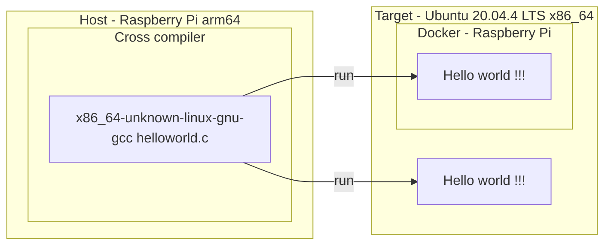

[](https://github.com/lankahsu520/CrossCompilationX)
[![GitHub license][license-image]][license-url]
[![GitHub stars][stars-image]][stars-url]
[![GitHub forks][forks-image]][forks-url]
[![GitHub issues][issues-image]][issues-image]


[license-image]: https://img.shields.io/github/license/lankahsu520/CrossCompilationX.svg
[license-url]: https://github.com/lankahsu520/CrossCompilationX/blob/master/LICENSE
[stars-image]: https://img.shields.io/github/stars/lankahsu520/CrossCompilationX.svg
[stars-url]: https://github.com/lankahsu520/CrossCompilationX/stargazers
[forks-image]: https://img.shields.io/github/forks/lankahsu520/CrossCompilationX.svg
[forks-url]: https://github.com/lankahsu520/CrossCompilationX/network
[issues-image]: https://img.shields.io/github/issues/lankahsu520/CrossCompilationX.svg
[issues-url]: https://github.com/lankahsu520/CrossCompilationX/issues

# 1. Overview

>[Crosstool-NG](https://crosstool-ng.github.io/) is a versatile (cross) toolchain generator. It supports many architectures and components and has a simple yet powerful menuconfig-style interface. Please read the [introduction](https://crosstool-ng.github.io/docs/introduction/) and refer to the [documentation](https://crosstool-ng.github.io/docs/) for more information.

> 簡單來說就是產出 toolchain，幫助軟體工程師開發軟體，並利於執行在不同平台上。

# 2. x86_64-unknown-linux-gnu on PI

>本篇主要希望在 Raspberry Pi上，利用 toolchain 產出 Helloworld (x86_64)，然後將 Helloworld  放至 Ubuntu 20.04.4 LTS x86_64上執行。因此透過 Crosstool-NG 建立 toolchain。
>
>不過由於 Raspberry Pi 的執行效能較差，將會很浪費時間。

>Host: Raspberry Pi3
>
>Target: Ubuntu 20.04 x86_64



## 2.1. Generate toolchain

#### A. Update Pi

> 安裝必要的軟體套件

```bash
sudo apt-get install -y libtool-bin 
sudo apt-get install -y help2man
sudo apt-get install -y flex texinfo
sudo apt-get install -y gawk
sudo apt-get install -y libncurses5-dev

sudo apt-get install -y bison
sudo apt-get install -y byacc
```

#### B. Install crosstool-ng

> 進行安裝 crosstool-ng

```bash
$ git clone https://github.com/crosstool-ng/crosstool-ng.git
or
$ wget https://github.com/crosstool-ng/crosstool-ng/archive/refs/tags/crosstool-ng-1.25.0.tar.gz
$ tar -zxvf crosstool-ng-1.25.0.tar.gz

$ cd crosstool-ng-crosstool-ng-1.25.0
$ ./bootstrap
$ ./configure --prefix=/work/codebase/toolchainSDK/crosstool-ng
$ make; make install

```
##### B.1. Add Linux kernel

> 以下是示範增加一個 Linux kernel
>
> add 2.6.38.8

```bash
$ cp -avr packages/linux/2.6.32.71 packages/linux/2.6.38.8

$ cat packages/linux/2.6.38.8/version.desc
# Not obsolete: used by CentOS6.x, EOL 11/2020
archive_formats='.tar.xz .tar.gz'

$ vi packages/linux/2.6.38.8/chksum
md5 linux-2.6.38.8.tar.xz a63222398ee4051fde722ba711d3233b
sha1 linux-2.6.38.8.tar.xz af1237ced36321158ff20d0e8a9f30ae03fcc4f4
sha256 linux-2.6.38.8.tar.xz c300486b30d28ae34c587a4f1aa8e98916a0616dad91a394b0e1352a9c7a8256
sha512 linux-2.6.38.8.tar.xz d3c25b89f34852d56cda07a34d8cb2af61aec7674bbf935d9e63e1d4d15fc9707b54f2904576c3fdd475358ea1b22
md5 linux-2.6.38.8.tar.gz f779b3991fcf0e4573a5d5167a60a26b
sha1 linux-2.6.38.8.tar.gz 1c292a3797360f4631be8e8228493afa54f1beb4
sha256 linux-2.6.38.8.tar.gz d6fe007d8afb87fa198f7c037d4d376e8e7936ba6c57f73bc5a8f4ee04f80456
sha512 linux-2.6.38.8.tar.gz e78c5e2443676eaa8349ccacf9b7bda1ff6aac7bf8858f435809eb2f8dc2ed813878431ddb87c16fc5cf43777e429

$ vi crosstool-ng-crosstool-ng-1.25.0/config/version/linux.in
# add
config LINUX_V_2_6_38
...
config LINUX_NO_VERSIONS
...
    default n if LINUX_V_2_6_38
...
config LINUX_VERSION
...
    default "2.6.38.8" if LINUX_V_2_6_38
```

#### C. Select x86_64-unknown-linux-gnu

```bash
$ unset LD_LIBRARY_PATH
$ export PATH=/work/codebase/toolchainSDK/crosstool-ng/bin:$PATH

$ ct-ng list-samples
$ ct-ng show-x86_64-unknown-linux-gnu
```
#### D. Working Folder

```bash
$ mkdir -p /work/codebase/toolchainSDK/crosstool-ng-x86_64-linux
$ cd /work/codebase/toolchainSDK/crosstool-ng-x86_64-linux
$ ct-ng x86_64-unknown-linux-gnu

# 如何選擇 glibc 版本，請見 II.3
$ ct-ng menuconfig
Paths and misc options  --->
	[*] Use obsolete features
	[*] Debug crosstool-NG
	[*]   Save intermediate steps
	[*]     gzip saved states (NEW)
	(${CT_TOP_DIR}/.build) Working directory
	    *** Paths ***
	(${CT_PREFIX:-${HOME}/x-tools}/${CT_HOST:+HOST-${CT_HOST}/}${CT_TARGET}) Prefix directory
	(0) Number of parallel jobs
Target options  ---> 
	Target Architecture (x86)  --->
	Bitness: (64-bit)  --->
Toolchain options  --->
	(unknown) Tuple's vendor string
Operating System  --->
	Version of linux (5.16.9)  --->
Binary utilities  --->
	Version of binutils (2.38)  --->
C-library  --->
	Version of glibc (2.31)  --->
C compiler  --->
	Version of gcc (11.2.0)  --->
```

```bash
# if change .config
$ vi .config
$ ct-ng oldconfig
```

##### .config

> 這邊可以修改，保留相關 tarballs

```bash
CT_LOCAL_TARBALLS_DIR="/work/codebase/toolchainSDK/tarballs"

(${CT_PREFIX:-${CT_TOP_DIR}/}/${CT_HOST:+HOST-${CT_HOST}/}${CT_TARGET}) Prefix directory

CT_TARGET_VENDOR="lanka"
```

#### E. Build

```bash
$ ct-ng build
```

##### E.1. Building log 

>Host: PI3 / PI4 
>
>Target: x86_64

> [PI3-x86_64-unknown-linux-gnu.log](https://github.com/lankahsu520/CrossCompilationX/blob/master/crosstool-ng/PI3-x86_64-unknown-linux-gnu.log)
>
> [PI4-x86_64-unknown-linux-gnu.log](https://github.com/lankahsu520/CrossCompilationX/blob/master/crosstool-ng/PI4-x86_64-unknown-linux-gnu.log)

##### E.2. Continue

> 因為編譯有時會中斷，延續其結果繼續執行

```bash
$ ct-ng list-steps
Available build steps, in order:
  - companion_tools_for_build
  - companion_libs_for_build
  - binutils_for_build
  - companion_tools_for_host
  - companion_libs_for_host
  - binutils_for_host
  - libc_headers
  - kernel_headers
  - cc_core
  - libc_main
  - cc_for_build
  - cc_for_host
  - libc_post_cc
  - companion_libs_for_target
  - binutils_for_target
  - debug
  - test_suite
  - finish
Use "<step>" as action to execute only that step.
Use "+<step>" as action to execute up to that step.
Use "<step>+" as action to execute from that step onward.
$ ct-ng libc_main+

$ ct-ng build RESTART=cc_core
```

## 2.2. Build Helloworld on Pi

> 如果沒有另行設定，基本都會放在 ~/x-tools/x86_64-unknown-linux-gnu

```bash
$ export PATH=~/x-tools/x86_64-unknown-linux-gnu/bin:$PATH
$ cd /tmp
$ vi helloworld.c 
#include <stdio.h>

int main(int argc, char *argv[])
{

	printf("Hello World !!!\n");
	return 0;
}

$ x86_64-unknown-linux-gnu-gcc helloworld.c -o helloworld
```

# 3. Run Helloworld on Ubuntu x86_64

```bash
# Please scp helloworld from Pi -> Ubuntu 
$ helloworld
Hello world !!!
```

# Appendix

# I. Study

## I.1. [Raspberry PI + cross compile & build kernel](https://hackmd.io/@0p3Xnj8xQ66lEl0EHA_2RQ/HJRXge9FO)

## I.2. [Crosstool-NG 紀錄](https://www.eebreakdown.com/2015/05/crosstool-ng.html)

## I.3. [crosstool-ng的配置参数详解](https://www.crifan.com/files/doc/docbook/crosstool_ng/release/htmls/crosstool_ng_config_para.html)

## I.4. [Using the toolchain](https://crosstool-ng.github.io/docs/toolchain-usage/)

## I.5. [Crosstool-NG for Raspberry Pi 3 with Ubuntu 18.04 初新者的筆記](https://i-am-neet.github.io/embedded/Crosstool-NG-for-Raspi3/)

# II. Debug

## II.1. C++: fatal error: Killed signal terminated program cc1plus

```bash
mkdir /work/codebase/swap
dd if=/dev/zero of=/work/codebase/swap/swap0 bs=64M count=64
chmod 0600 /work/codebase/swap/swap0
mkswap /work/codebase/swap/swap0
sudo swapon /work/codebase/swap/swap0
swapon -s


sudo swapoff /work/codebase/swap/swap0
sudo rm /work/codebase/swap/swap0
sudo swapoff -a

```

## II.2. fatal error: cannot execute 'cc1': execvp: No such file or directory

```bash
If you got the error at compile time, please make sure your gcc is in $PATH.

```

## II.3. ./helloworld: /lib/x86_64-linux-gnu/libc.so.6: version `GLIBC_2.34' not found (required by ./helloworld)

>Please check libc version on your target machine !!!
>
>Host: Raspberry Pi 3
>
>Target: Ubuntu 20.04 

```bash
# 些處為 Ubuntu 20.04
$ ll /lib/x86_64-linux-gnu/libc.so.6
lrwxrwxrwx 1 root root 12  四   7 09:24 /lib/x86_64-linux-gnu/libc.so.6 -> libc-2.31.so*
$ ldd --version
ldd (Ubuntu GLIBC 2.31-0ubuntu9.9) 2.31
Copyright (C) 2020 Free Software Foundation, Inc.
This is free software; see the source for copying conditions.  There is NO
warranty; not even for MERCHANTABILITY or FITNESS FOR A PARTICULAR PURPOSE.
Written by Roland McGrath and Ulrich Drepper.

```

## II.4. mp-divrem_1.s:130: Error: selected processor does not support `mls r1,r4,r8,r11' in ARM mode

```bash
$ vi .config
#https://github.com/crosstool-ng/crosstool-ng/issues/1248
CT_EXTRA_CFLAGS_FOR_HOST="-march=armv7-a -mfloat-abi=hard -mtune=cortex-a5"
$ ct-ng oldconfig

```

## II.5. [ERROR]      ../sysdeps/nptl/pthread.h:719:47: error: argument 1 of type 'struct __jmp_buf_tag *' declared as a pointer [-Werror=array-parameter=]

```bash
$ vi .config
#https://github.com/crosstool-ng/crosstool-ng/issues/1712
# CT_GLIBC_ENABLE_WERROR is not set

```

## II.6. stubs.h:7:11: fatal error: gnu/stubs-32.h: No such file or directory

```bash
$ ct-ng menuconfig
Target options  ---> 
	Target Architecture (x86)  --->
	[*] Build a multilib toolchain (READ HELP!!!) 
```

# Author

Created and designed by [Lanka Hsu](lankahsu@gmail.com).

# License

[CrossCompilationX](https://github.com/lankahsu520/CrossCompilationX) is available under the BSD-3-Clause license. See the LICENSE file for more info.

